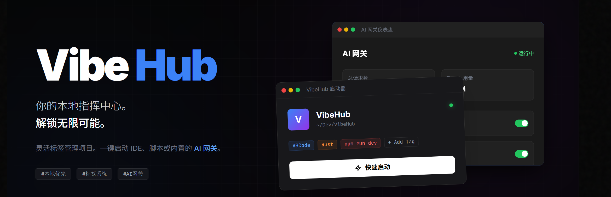

# VibeHub

[English](README_EN.md) | [简体中文](README.md) | [繁體中文](README_TC.md)

你的本地指挥中心。解锁无限可能。灵活标签管理项目，一键启动 IDE、脚本或 AI 网关。专为 VibeCoding 打造。


## ✨ 特性

- 🤖 **AI 网关集成**: 内置高性能 AI 网关，无缝连接未来开发体验
- 🚀 **快速启动**: 一键启动 VSCode、CLI 工具等，VibeCoding 友好
- 📁 **本地多项目管理**: 自动扫描和管理本地项目，支持多种语言和框架
- 🏷️ **标签系统**: 灵活的项目分类和过滤
- 💾 **Portable 模式**: 绿色便携，配置随行
- 🎨 **现代 UI**: Notion 风格的简约设计，支持深色模式
- 🔄 **Git 集成**: 显示分支和更改状态
- ⚡ **性能优化**: 基于 Rust 和 Tauri，快速且轻量

## 📦 下载

前往 [Releases]() 页面下载最新版本 (v1.2.0)：

- **Windows**: `VibeHub-Windows-Portable.zip` (推荐) 或 `.msi` 安装包
- **macOS**: `.dmg` 或 `.app.tar.gz`
- **Linux**: `.deb` 或 `.AppImage`

## 🚀 快速开始

### Portable 版本（Windows）

1. 下载 `VibeHub-Windows-Portable.zip`
2. 解压到任意目录
3. 运行 `vibehub.exe`
4. 所有配置自动保存在 `data` 文件夹

### 安装版本

1. 下载对应平台的安装包
2. 按照提示安装
3. 启动应用

## 🛠️ 开发

### 前置要求

- Node.js 18+
- Rust 1.70+
- 平台特定依赖：
  - Windows: Visual Studio Build Tools
  - macOS: Xcode Command Line Tools
  - Linux: `libwebkit2gtk-4.1-dev libappindicator3-dev librsvg2-dev`

### 本地运行

```bash
# 克隆仓库
git clone https://github.com/VibeCoding/VibeHub.git
cd VibeHub

# 安装依赖
npm install

# 开发模式运行
npm run tauri dev

# 构建
npm run tauri build
```

### 项目结构

```
VibeHub/
├── src/                    # 前端代码 (React + TypeScript)
├── src-tauri/              # 后端代码 (Rust)
│   ├── src/
│   │   ├── main.rs        # 主入口
│   │   ├── commands.rs    # Tauri 命令
│   │   ├── scanner.rs     # 项目扫描
│   │   ├── launcher.rs    # 启动器
│   │   ├── storage.rs     # 数据存储
│   │   └── models.rs      # 数据模型
│   └── Cargo.toml
└── package.json
```

## 📝 功能说明

### 工作区管理

- 添加工作区目录
- 自动扫描识别项目类型
- 支持项目类型：Node.js、Rust、Python、Java、Go、.NET 等

### 项目配置

- 名称和描述
- 自定义标签
- 收藏/星标
- 自定义图标

### 启动配置

支持配置各种工具：
- IDE（VSCode、IntelliJ IDEA 等）
- CLI 工具（Claude Code、Gemini CLI、AntiGravity 等）
- 终端
- 自定义程序

### 标签系统

内置标签分类：
- 工作区分组
- IDE 工具
- CLI 工具
- 环境配置
- 自定义标签

## 🤝 贡献

欢迎贡献！请查看 [CONTRIBUTING.md](CONTRIBUTING.md)

## 📄 许可证

Apache License 2.0 - 详见 [LICENSE](LICENSE)

## 🙏 致谢

- [Tauri](https://tauri.app/) - 跨平台应用框架
- [React](https://react.dev/) - UI 框架
- [TailwindCSS](https://tailwindcss.com/) - CSS 框架
