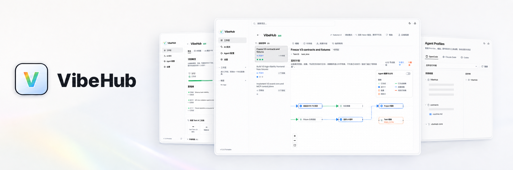
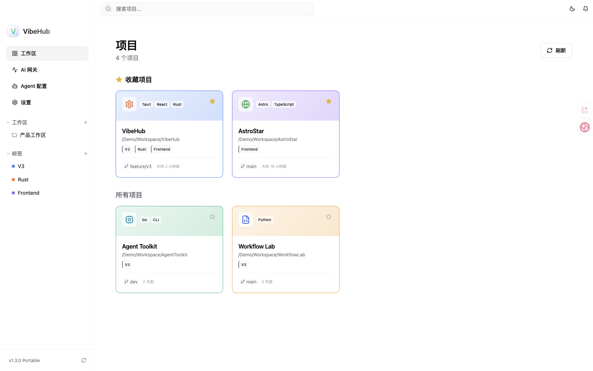
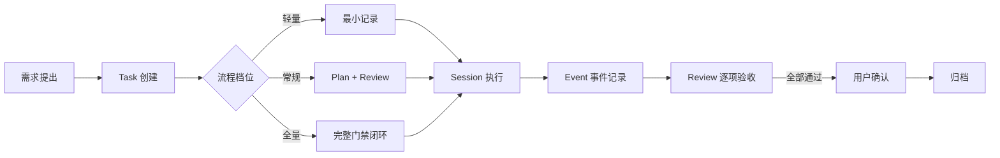
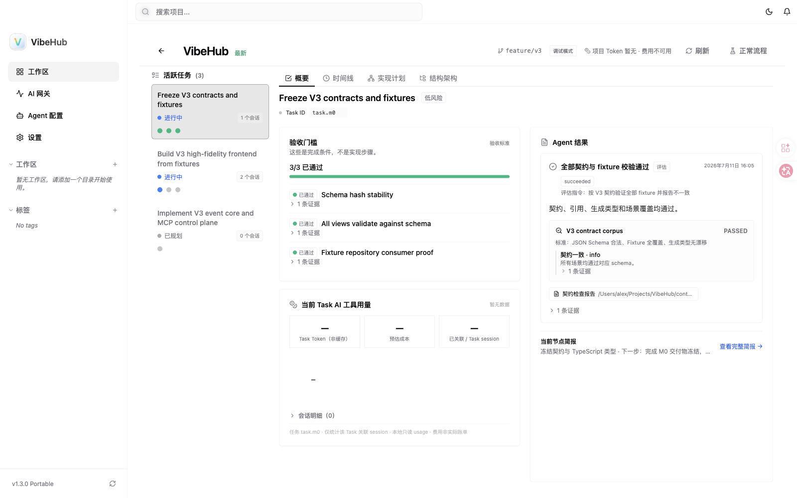
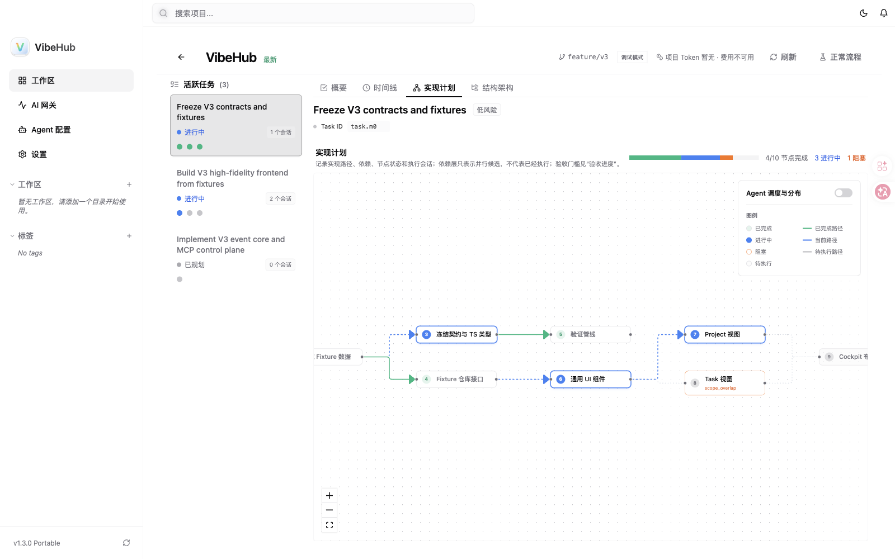
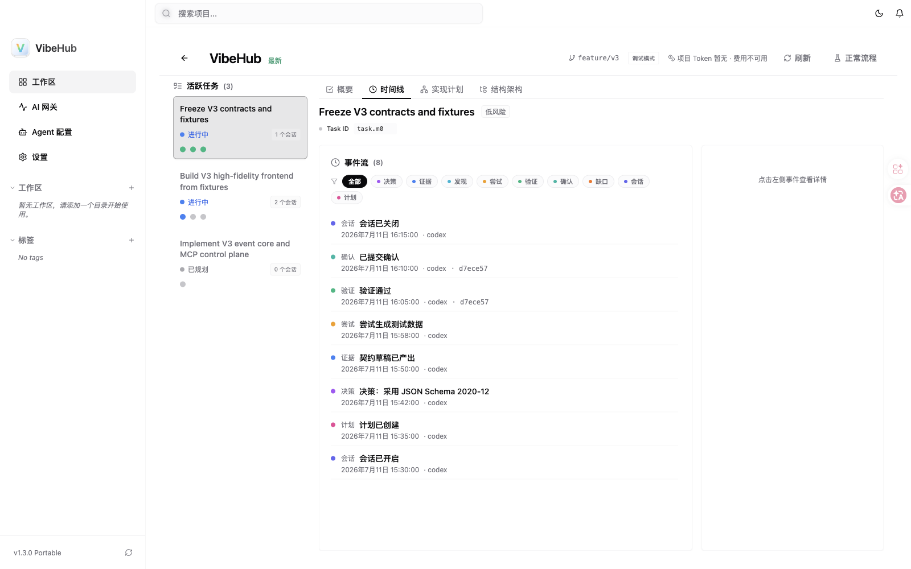
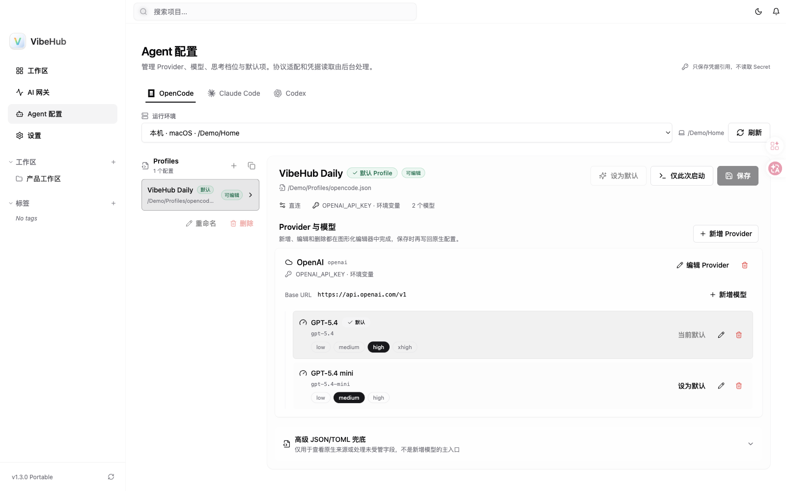

<div align="center">

<h1 align="center" style="margin: 0;">
  <picture>
    <source media="(prefers-color-scheme: dark)" srcset="assets/readme/vibehub-readme-header-dark.png">
    <source media="(prefers-color-scheme: light)" srcset="assets/readme/vibehub-readme-header.png">
    
  </picture>
</h1>

[](https://github.com/ChenM0M/VibeHub/releases)


[更新日志](CHANGELOG.md) · [功能介绍](#功能介绍) · [快速上手](#快速上手) · [开发须知](#开发须知) · [未来发展](#未来发展)

[English](README_EN.md) · [繁體中文](README_TC.md)

</div>


<div align="center">

<!-- 图片占位符 ①：主视觉横幅 -->
<!-- 建议放置：VibeHub 桌面端主界面全景截图，或产品 Logo + 界面合成的 Banner -->
<!-- 尺寸建议：1600×400 左右，宽幅横图 -->
<!-- 可复用现有素材：assets/readme/vibehub-hero-banner.png -->
<!-- 如该图信息密度不够，建议重新制作一张包含 Logo + Cockpit 界面 + 核心 Slogan 的合成横幅 -->


</div>


## 特色与核心理念

VibeHub 是一个围绕 Agent 工作流体验打造的 All-in-One 工具平台。

它源于个人 Vibe 开发过程中的真实痛点：Agent 干活时的计划拆解、进度推进、验收与阻塞缺少可见、可追溯的载体。VibeHub 用任务 / 计划 / 会话 / 事件驱动的工作流引擎，把这些"看不见的过程"变成可视化的看板与计划图。它不绑定任何特定的 Agent Harness —— 只要能读取仓库里的工作流编排说明，并能调用标准 MCP 工具，你的 Agent 就能接入同一套工作流。

桌面端用可视化 Cockpit 降低使用门槛，而内核本质上是一个独立的 CLI，可以拆出去单独使用或 Fork 改造。

## 功能介绍

### 本地项目管理

高可自定义的卡片式多工作区管理，自动检索本地项目目录并按卡片形式呈现，支持快速检索定位。

- 自动扫描并识别 Node.js / Rust / Python / Java / Go / .NET 等项目类型
- 标签分类（IDE、CLI、环境等）与拖拽排序，点击即可用对应工具打开项目；也支持"自定义启动"填入任意命令
- 打开的项目以标签页常驻，顺序持久化保存
- 卡片上直接显示当前分支和变更状态
- 深色模式跟随系统或手动切换；界面支持简体中文 / 繁體中文 / English

<!-- 图片占位符 ②：项目工作台 -->
<!-- 建议放置：项目工作台主界面截图，展示卡片列表、标签筛选、分支状态 -->
<!-- 可复用现有素材：assets/readme/project-workspace.png -->
<!-- 如果原图角度或信息不够丰富，可补充一张带有标签分类与自定义启动按钮的特写 -->


### ⭐ 工作流优化（V3）

V3 是 VibeHub 的核心特色。它通过**工作流约束 + 可视化中台**的方式，让你在 Vibe 过程中对项目推进与 Agent 进度拥有实际的掌握感。理论上，任何工作内容都可以在多种模型、多种 Harness 下无缝衔接 —— Agent 通过配套 MCP 工具快速了解当前进度，无需人工手动总结、反复干预或传递大量上下文信息。

#### 核心抽象概念

V3 工作流围绕以下几个核心概念运转：

- **Task（任务）** — 将单次需求抽象为一个 Task，Agent 根据体量自动选择 **轻量（Lightweight）**、**常规（Standard）** 或 **全量（Full）** 三种流程档位，匹配对应的工作流程
- **Plan（计划）** — 规划阶段，Agent 编辑验收标准（Criteria）和实现计划（DAG 有向无环图），明确"做什么"和"怎么验证"
- **Session（会话）** — 执行阶段，Agent 根据 DAG 图依序完成开发，全过程记录事件流（Event Stream），在关键节点提交结果（Agent Result）
- **Review（验收）** — 验收阶段，Agent 依据验收标准逐项核验，收集对应证据，标记为 passed / failed / blocked
- **Project Memory（项目记忆）** — 长期上下文只经 typed command 写入；disputed / stale / secret 默认不注入，确保注入内容始终作为参考而非指令

#### 工作流全景


```mermaid
graph LR
    A[需求提出] --> B[Task 创建]
    B --> C{流程档位}
    C -->|轻量| D[最小记录]
    C -->|常规| E[Plan + Review]
    C -->|全量| F[完整门禁闭环]
    D & E & F --> G[Session 执行]
    G --> H[Event 事件记录]
    H --> I[Review 逐项验收]
    I -->|全部通过| J[用户确认]
    J --> K[归档]
```

#### V3 Cockpit 可视化

V3 Cockpit 是工作流的可视化入口，将计划图、节点详情、验收进度、阻塞面板与 AI 用量面板一站式呈现。

<!-- 图片占位符 ④：V3 Cockpit 验收总览 -->
<!-- 建议放置：验收总览界面，展示验收标准列表与 Agent 结果 -->
<!-- 可复用现有素材：assets/readme/v3-acceptance.png -->


<!-- 图片占位符 ⑤：V3 Cockpit 实现计划 DAG -->
<!-- 建议放置：计划 DAG 图，展示节点依赖关系与执行状态 -->
<!-- 可复用现有素材：assets/readme/v3-plan.png -->


<!-- 图片占位符 ⑥：V3 Cockpit 事件流 -->
<!-- 建议放置：事件流时间线，展示 progress / risk 事件记录 -->
<!-- 可复用现有素材：assets/readme/v3-event-stream.png -->


### Agent 配置与模型网关

- **Agent Profiles** — 以图形化界面统一管理多个 Agent 档案，涵盖提供商、模型、思考深度等各主流 Harness 的常用配置（目前支持 Codex、Claude Code、OpenCode）。协议能力自动诊断（直连 / 适配 / 不可用），凭据只接受环境变量或系统 Secret Store 引用，从不读取 auth 文件
- **AI 网关** — 内置本地代理服务，以图形化界面管理多个提供商的 API，本地完成模型映射与协议转换；支持多供应商负载均衡，默认只监听本机回环地址 `127.0.0.1`
- **AI 用量统计** — 本地只读汇总 Claude Code / Codex / OpenCode 的 token 记录，费用由真实 token 数推导；异常数据 fail-closed

<!-- 图片占位符 ⑦：Agent 配置界面 -->
<!-- 建议放置：Agent Profiles 配置面板，展示 Provider、模型选择、思考档位等 -->
<!-- 可复用现有素材：assets/readme/agent-profiles.png -->


<!-- 图片占位符 ⑧：AI 网关配置界面 -->
<!-- 建议放置：AI 网关管理界面，展示多供应商配置、模型映射规则、协议转换选项 -->
<!-- 现有素材是否满足：不满足，需要新截图 -->
<!-- 说明：当前仓库中缺少 AI 网关界面的独立截图。如果网关功能已较为完善，建议补充一张能展示负载均衡策略或模型映射规则的截图；如果网关功能尚在迭代中，可暂不放置 -->

## 快速上手

### 如何安装

#### macOS：Homebrew（推荐）

```bash
brew install --cask chenm0m/vibehub/vibehub
```

更新：

```bash
brew update
brew upgrade --cask vibehub
```

Homebrew tap 仓库为 `ChenM0M/homebrew-vibehub`。每次 GitHub Release（含预览版）发布后，CI 会根据 Apple Silicon 和 Intel 两个 DMG 产物自动更新 cask。

#### 手动下载

[→ Releases 页面](https://github.com/ChenM0M/VibeHub/releases)

| 平台 | 格式 |
|------|------|
| Windows | `.exe` 安装包 / `Portable.zip` 便携版 |
| macOS | `.dmg` (Apple Silicon & Intel) |
| Linux | `.deb` / `.AppImage` |

Windows / Linux Portable 版解压即用。macOS 安装版的配置和 AI 网关数据写入系统应用数据目录：

```text
~/Library/Application Support/VibeHub
```

如果需要便携模式，可以用 `VIBEHUB_PORTABLE=1` 启动，配置会写到可执行文件旁边的 `data/` 目录。普通 macOS `.app` / DMG / Homebrew 安装不建议使用便携模式，因为应用包内部通常不可写。

> **关于 Linux**：Linux 版本理论上可以运行，但不保证所有功能正常工作。由于缺少 Linux 开发设备且精力有限，项目未对 Linux 做针对性维护与测试。如果你在 Linux 上遇到问题，欢迎提 Issue，但修复优先级可能较低。

### 使用方式

安装完成后打开 VibeHub，你会看到项目工作台界面。以下是核心功能的 GUI 使用流程。

#### 添加与管理项目

打开 VibeHub 后，指定你的工作区目录，应用会自动扫描并识别目录下的项目（支持 Node.js / Rust / Python / Java / Go / .NET 等）。识别出的项目以卡片形式呈现，支持：

- **快速检索**：在搜索框中输入关键词即可过滤项目
- **标签分类**：为项目关联标签（IDE、CLI、环境等），点击标签即可用对应工具启动
- **拖拽排序**：按你的习惯调整卡片排列顺序
- **自定义启动**：不想用预设标签，可以直接填入任意启动命令

打开的项目以标签页常驻在顶部，方便在多个项目间快速切换。

#### ⭐ V3 工作流：在 Cockpit 中跟踪 Agent 进度

V3 工作流是 VibeHub 的核心。你不需要手动执行任何命令 —— Agent 会通过 MCP 工具自动与工作流引擎交互。你只需要在 Cockpit 中观察和决策。

**1. 提出需求**

在 Agent 对话中直接说出你的需求，Agent 会根据需求体量创建 Task，并选择合适的流程档位：

- **轻量（Lightweight）** — 小改动，如修改文案、调整样式，只记录最小执行信息
- **常规（Standard）** — 中等需求，包含计划编排与审查
- **全量（Full）** — 复杂需求，完整门禁闭环，逐项验收

你通常不需要手动选择档位，Agent 会自动判断；你也可以在对话中明确指定。

**2. 查看计划**

进入 V3 Cockpit 的任务视图，你可以看到 Agent 编写的实现计划——一张 DAG（有向无环图），标注了各节点的依赖关系和执行顺序。点击节点可以展开查看详细描述、涉及文件和验收标准。

**3. 跟踪执行进度**

Agent 开始执行后，Cockpit 会实时更新：

- **计划图**：节点状态实时变化（待执行 → 进行中 → 已完成），可以直观看到整体推进到哪里了
- **事件流**：每个里程碑的 progress 记录、遇到的 risk 标记都会出现在时间线中
- **节点抽屉**：点击任意节点查看该节点的详细执行记录和产出

**4. 验收与确认**

Agent 完成所有节点后，会进入验收阶段。Cockpit 中可以看到每条验收标准的核验状态：

- **passed** — 已验证通过，附带证据
- **failed** — 验证未通过，附带原因
- **blocked** — 无法验证，附带原因、影响和修复建议

所有标准通过后，Agent 会请求你确认。确认后 Task 归档，完整的过程记录保留可查。

#### Agent 配置与 AI 网关

进入 Agent Profiles 页面，可以图形化管理各个 Agent Harness 的配置：

- 添加 / 编辑 Profile，填写提供商、Base URL、API Key、模型选择、思考档位等
- 支持「检测模型」：按当前 Base URL 和 API Key 列出上游可用模型，勾选导入
- 凭据安全：API Key 存储在系统 Secret Store 中，不会明文出现在配置文件中
- 支持一键复制当前 Profile 的终端启动指令

进入 AI 网关页面，可以管理多供应商的代理配置：

- 添加多个提供商，配置 API 地址与密钥
- 设置模型映射规则与协议转换
- 配置负载均衡策略
- 网关默认只监听本机回环地址 `127.0.0.1`，不会暴露到局域网

#### 与 Agent 协作的建议

- **说清楚需求边界**：告诉 Agent 你想要的最终效果、涉及的模块、有没有特别的技术约束。需求越清晰，Plan 越准确
- **善用流程档位**：小改动走轻量模式，中等需求走常规模式，涉及多模块或需要完整验收的走全量模式
- **验收标准提前对齐**：在 Cockpit 中查看 Plan 时，确认验收标准是否符合你的预期
- **关注 risk 事件**：事件流中出现 risk 标记时，及时查看原因并决定是修复、调整范围还是接受

## 开发须知

### 开发理念

VibeHub 的内核是一个独立的 CLI（`vibehub`），桌面端的可视化 Cockpit 只是它的前端入口。这种分层设计意味着：

- **CLI 是唯一事实来源** — 所有工作流状态变更都通过 CLI 的 typed commands 完成，前端只负责展示和触发
- **MCP 是 Agent 接入的标准接口** — Agent 不直接调用 CLI，而是通过 MCP server（`vibehub mcp-stdio`）与工作流引擎交互
- **事件溯源驱动** — 任务、计划、会话、事件全部以不可变事件流的形式持久化，投影（Projection）从事件流中派生出当前状态，保证全程可回溯
- **凭据安全** — Agent 配置中的 API Key 等敏感信息只接受环境变量或系统 Secret Store 引用，从不读取 auth 文件

### 项目结构

```
VibeHub/
├── src/                     # React + TypeScript 前端
│   ├── pages/               # Home / AgentProfiles / Gateway / Settings / About
│   ├── v3/                  # V3 Cockpit（计划图、验收进度、blocker、AI 用量面板）
│   └── legacy-v2/           # 旧协议入口（只读归档与迁移）
├── src-tauri/               # Tauri 桌面壳与 Rust 命令（扫描器、启动器、网关、Agent Profiles、用量读取）
├── crates/
│   ├── vibehub-core/        # V3 领域核心（事件存储、投影、验证器）
│   └── vibehub-cli/         # vibehub CLI 与 MCP server
├── contracts/v3/            # V3 视图与命令 JSON Schema 契约
├── docs/v3/                 # V3 交付、流程与迁移文档
├── scripts/                 # 契约生成、门禁与发布检查脚本
└── .vibehub/                # 项目内 V3 工作流状态目录（事件、投影、任务）
```

### 从源码构建

需要 Node.js 20+ 和 Rust 1.77.2+。

```bash
git clone https://github.com/ChenM0M/VibeHub.git
cd VibeHub
npm install
npm run tauri dev
```

macOS 可以直接跑环境检查和开发启动脚本：

```bash
./start-dev.sh --check
./start-dev.sh
```

构建发行版：

```bash
npm run tauri build
```

只构建 V3 CLI（可独立分发）：

```bash
cargo build --locked -p vibehub-cli --bin vibehub
```

### 二次开发 / Fork

如果你只想用 CLI 内核：

```bash
cargo build --locked -p vibehub-cli --bin vibehub
# 产物在 target/debug/vibehub 或 target/release/vibehub
```

CLI 完全独立于 Tauri 前端，可以在任何有 Rust 工具链的机器上编译使用。

如果你想改造前端或整体架构：

1. 前端是 React + TypeScript + TailwindCSS，状态管理走 Zustand
2. 前后端通信通过 Tauri IPC（Rust 命令），新增功能通常需要在 `src-tauri/src/` 中添加对应 command
3. V3 工作流的核心逻辑在 `crates/vibehub-core/` 中，遵循事件溯源模式；修改前建议先阅读 `contracts/v3/` 中的 JSON Schema 契约
4. 质量门禁：`npm run release:check` 校验版本一致性，`npm run v3:contracts:check` 校验契约与 fixtures

### CLI 与 MCP

V3 内核是一个独立 CLI（也提供同名 MCP server），可以在任意项目目录直接使用：

```bash
# 检查 / 初始化 / 迁移一个项目的 V3 布局
vibehub v3 <project> doctor
vibehub v3 <project> init
vibehub v3 <project> migrate

# 创建任务并查看任务与计划
vibehub v3 <project> task-create <request.json>
vibehub v3 <project> task-view <task_id>
vibehub v3 <project> task-lifecycle . <task_id>

# 会话与验收
vibehub v3 <project> session-open ...   # 开工前打开会话
vibehub v3 <project> event-log ...      # 里程碑 progress / 风险 risk
vibehub v3 <project> criterion-review ...  # 逐项验收
vibehub v3 <project> task-completion-propose ...  # 请求用户确认完成
```

接入 Agent 只需两步：让 Agent 读取仓库里的工作流编排说明（`AGENTS.md`），并给它配置 V3 MCP server：

```json
{
  "mcpServers": {
    "vibehub": {
      "command": "vibehub",
      "args": ["mcp-stdio", "/path/to/your/project"]
    }
  }
}
```

所有命令输出 JSON。更多细节见：

- [`docs/v3/agent-release-process.md`](docs/v3/agent-release-process.md) — Agent 工作与发布验收的强制流程
- [`docs/v3/migration-guide.md`](docs/v3/migration-guide.md) — V2 → V3 迁移与布局状态
- [`docs/v3/agent-profiles.md`](docs/v3/agent-profiles.md) — Agent Profiles 支持矩阵与 Secret 模型
- [`docs/v3/usage-source-capabilities.md`](docs/v3/usage-source-capabilities.md) — AI 用量数据源能力边界
- [`contracts/v3/`](contracts/v3/README.md) — 视图与命令 JSON Schema 契约

### 发布流程

1. 版本修改后运行 `npm run release:check`，确保 `package.json`、lockfile、两个 V3 crate、Tauri Cargo 与 `tauri.conf.json` 版本一致；校验 tag 可用 `RELEASE_TAG=v3.3.3 npm run release:check`
2. 创建版本标签（例如 `v3.3.3`；含 `-` 的标签为预览版）
3. `Release` workflow 构建 Windows、Linux、macOS Apple Silicon、macOS Intel 产物，创建草稿 Release 并附各平台 SHA-256 清单
4. 发布后调用可复用的 `Update Homebrew Cask` workflow，用实际发布资产的 DMG 与 SHA-256 更新 `ChenM0M/homebrew-vibehub`
5. Apple / Windows 代码签名是可选增强：凭据完整时启用正式签名，缺失时产物为 macOS ad-hoc / Windows unsigned
6. Windows 原生手测项（`A07`、`E07`、`F07–F10`、`G05`）必须在发布后，使用同一版本正式 Release 的 Windows artifact 与真实 SHA-256 在 Windows 主机完成

详见 [`docs/v3/agent-release-process.md`](docs/v3/agent-release-process.md)。

## 未来发展

因为项目的出发点是为了解决个人痛点，并且是在摸索学习中逐步迭代的，此前没有较完整、系统的工程设计经验，所以项目中可能仍存在不少不足之处，望大家谅解。我会持续更新，一方面继续解决开发中的痛点，另一方面也在实践中积累经验。欢迎大家多提 Issue 与 PR，你们的建议对我真的很重要！
以下是我关于未来优化方向的一些展望：

### 更加放心脱手

- 单次交互即可处理复杂需求，自动拆分为多任务
- 单 Task 多阶段可匹配多 Session，并行推进提高效率
- 单 Task 内多阶段的多 Session 上下文传递机制
- 项目级 / Task 级的重要上下文注入系统（如相关成熟解决方案、对应的详细文档）

### 交互易用性提升

- 审查、验收中需要人工手动完成的环节单独划分，模型提前了解自己是否有能力获取相关证据，减少不必要的阻塞堆积
- 节点详细视图优化，兼顾快速阅览与详细记录
- 活跃 Task 视图与归档 Task 视图切换
- 事件流升级，兼顾快速阅览与详细记录并保持轻量
- 证据系统升级，显示风格兼顾快速阅览与详细记录
- Agent 与 VibeHub 的交互流程更加具体化、流程化，防止"先提交后遗忘"（如未实际操作就提交证据、通过审查或更新事件流）
- 更加方便易用的过程检索（关键词关联）
- Task 基本结束时展示整体 Walkthrough，归档时也以这种形式呈现

### 审查效果更加精确

- 确保审查不会出现"自认为通过"的情况

### 经济与审计

- Token 效率测试脚本，提升整体 Token 使用效率
- 科学的工作流评估测试集，判断当前工作流是否真正达到经济、高自由度、流程可溯源等目标
- DAG 节点图 Session 系统完善
- Task 下的 Session 相关数据统计完善

### 多端同步与多人协作

- 多端同步 Session、VibeHub Tasks 等信息
- 待探索更多协作场景

### 个人偏好与成长

- 个人偏好设定
- 辅助个人成长，构建规划、架构、设计能力（以经历为教材，以实践为阶，随使用巩固能力、拓展边界）

## 贡献

PR 和 Issue 都欢迎。

## 许可证

[Apache License 2.0](LICENSE)

## 致谢

- [Tauri](https://tauri.app/) — 跨平台桌面应用框架
- [React](https://react.dev/) + [TailwindCSS](https://tailwindcss.com/) — 前端
- [b4u2cc](https://github.com/CassiopeiaCode/b4u2cc) — Claude Code 协议转换参考
