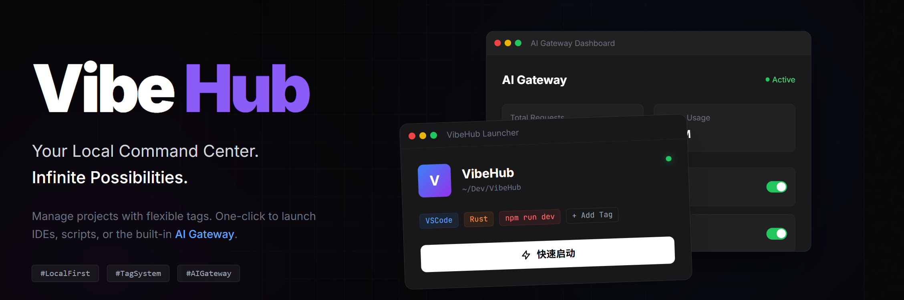

# VibeHub

[English](README_EN.md) | [简体中文](README.md) | [繁體中文](README_TC.md)

Your Local Command Center. Infinite Possibilities. Manage projects with flexible tags. One-click to launch IDEs, scripts, or AI gateways. Built for VibeCoding.


## ✨ Features

- 🤖 **AI Gateway Integration**: Built-in high-performance AI gateway, seamlessly connecting future development experiences
- 🚀 **Quick Launch**: One-click launch for VSCode, CLI tools, etc., VibeCoding friendly
- 📁 **Local Multi-Project Management**: Automatically scan and manage local projects, supporting multiple languages and frameworks
- 🏷️ **Tag System**: Flexible project categorization and filtering
- 💾 **Portable Mode**: Green and portable, configuration follows you
- 🎨 **Modern UI**: Notion-style minimalist design, supporting dark mode
- 🔄 **Git Integration**: Display branch and change status
- ⚡ **Performance Optimization**: Based on Rust and Tauri, fast and lightweight

## 📦 Download

Go to the [Releases]() page to download the latest version (v1.2.0):

- **Windows**: `VibeHub-Windows-Portable.zip` (Recommended) or `.msi` installer
- **macOS**: `.dmg` or `.app.tar.gz`
- **Linux**: `.deb` or `.AppImage`

## 🚀 Quick Start

### Portable Version (Windows)

1. Download `VibeHub-Windows-Portable.zip`
2. Unzip to any directory
3. Run `vibehub.exe`
4. All configurations are automatically saved in the `data` folder

### Installed Version

1. Download the installer for your platform
2. Follow the prompts to install
3. Launch the application

## 🛠️ Development

### Prerequisites

- Node.js 18+
- Rust 1.70+
- Platform-specific dependencies:
  - Windows: Visual Studio Build Tools
  - macOS: Xcode Command Line Tools
  - Linux: `libwebkit2gtk-4.1-dev libappindicator3-dev librsvg2-dev`

### Run Locally

```bash
# Clone repository
git clone https://github.com/VibeCoding/VibeHub.git
cd VibeHub

# Install dependencies
npm install

# Run in development mode
npm run tauri dev

# Build
npm run tauri build
```

### Project Structure

```
VibeHub/
├── src/                    # Frontend code (React + TypeScript)
├── src-tauri/              # Backend code (Rust)
│   ├── src/
│   │   ├── main.rs        # Main entry
│   │   ├── commands.rs    # Tauri commands
│   │   ├── scanner.rs     # Project scanner
│   │   ├── launcher.rs    # Launcher
│   │   ├── storage.rs     # Data storage
│   │   └── models.rs      # Data models
│   └── Cargo.toml
└── package.json
```

## 📝 Function Description

### Workspace Management

- Add workspace directory
- Automatically scan and identify project types
- Supported project types: Node.js, Rust, Python, Java, Go, .NET, etc.

### Project Configuration

- Name and description
- Custom tags
- Favorite/Star
- Custom icon

### Launch Configuration

Support configuration for various tools:
- IDE (VSCode, IntelliJ IDEA, etc.)
- CLI Tools (Claude Code, Gemini CLI, AntiGravity, etc.)
- Terminal
- Custom programs

### Tag System

Built-in tag categories:
- Workspace grouping
- IDE tools
- CLI tools
- Environment configuration
- Custom tags

## 🤝 Contribution

Contributions are welcome! Please see [CONTRIBUTING.md](CONTRIBUTING.md)

## 📄 License

Apache License 2.0 - See [LICENSE](LICENSE) for details

## 🙏 Acknowledgements

- [Tauri](https://tauri.app/) - Cross-platform application framework
- [React](https://react.dev/) - UI framework
- [TailwindCSS](https://tailwindcss.com/) - CSS framework
