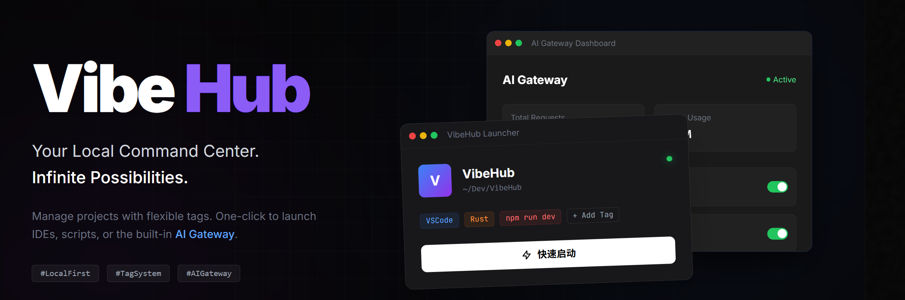

# VibeHub

[English](README_EN.md) | [简体中文](README.md) | [繁體中文](README_TC.md)



> Manage your local dev projects in one place. Tag them, launch your favorite IDE or CLI with one click.
> Comes with a built-in AI gateway for proxying and load-balancing AI requests.


## What it does

- **Project management** — Point it at your workspace directories, it auto-detects Node.js / Rust / Python / Java / Go / .NET projects
- **Tags + Launch** — Tag projects with tools (IDE, CLI, env, etc.) and launch them with a click
- **AI Gateway** — Built-in proxy with multi-provider load balancing, model mapping, and Claude Code protocol conversion
- **Drag & drop sorting** — Reorder project cards by dragging, order is persisted
- **Portable** — No install required, config lives in a `data` folder next to the binary
- **Git info** — Shows current branch and change status on each card
- **Dark mode** — System-follow or manual toggle

## Download

[→ Releases page](https://github.com/ChenM0M/VibeHub/releases)

| Platform | Format |
|----------|--------|
| Windows | `.exe` installer / `Portable.zip` |
| macOS | `.dmg` (Intel & Apple Silicon) |
| Linux | `.deb` / `.AppImage` |

The portable version is extract-and-run. Config is saved under `data/` — delete the folder for a clean uninstall.

## Build from source

Requires Node.js 18+ and Rust 1.70+.

```bash
git clone https://github.com/ChenM0M/VibeHub.git
cd VibeHub
npm install
npm run tauri dev
```

Production build:

```bash
npm run tauri build
```

Platform deps:
- Windows → Visual Studio Build Tools
- macOS → Xcode Command Line Tools
- Linux → `libwebkit2gtk-4.1-dev libappindicator3-dev librsvg2-dev`

## Project structure

```
VibeHub/
├── src/                 # React + TypeScript frontend
├── src-tauri/           # Rust backend
│   └── src/
│       ├── main.rs      # Entry point
│       ├── commands.rs  # Tauri commands
│       ├── scanner.rs   # Project scanner
│       ├── launcher.rs  # Launcher
│       ├── storage.rs   # Config I/O
│       └── models.rs    # Data models
└── package.json
```

## How tags and launching work

The core concept is **tags**. Each tag can carry a launch config (executable + args + env vars) and a category (IDE, CLI, environment, etc.).

When you associate tags with a project and hit launch, VibeHub runs them according to category — IDE tags pass the project path as an argument, CLI tags open a new window in the project directory.

You can also skip tags entirely and use "Custom Launch" to run any command you want.

## Contributing

PRs and issues are welcome.

## License

[Apache License 2.0](LICENSE)

## Credits

- [Tauri](https://tauri.app/) — Cross-platform desktop app framework
- [React](https://react.dev/) + [TailwindCSS](https://tailwindcss.com/) — Frontend
- [b4u2cc](https://github.com/CassiopeiaCode/b4u2cc) — Claude Code protocol conversion reference
