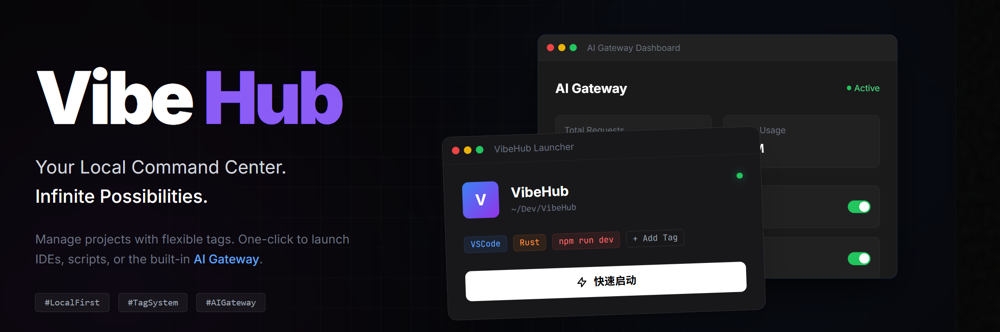

# VibeHub

[English](README_EN.md) | [简体中文](README.md) | [繁體中文](README_TC.md)



> Manage your local dev projects in one place. Tag them, launch your favorite IDE or CLI with one click.
> Comes with a built-in AI gateway for proxying and load-balancing AI requests.


## What it does

- **Project management** — Point it at your workspace directories, it auto-detects Node.js / Rust / Python / Java / Go / .NET projects
- **Tags + Launch** — Tag projects with tools (IDE, CLI, env, etc.) and launch them with a click
- **AI Gateway** — Built-in proxy with multi-provider load balancing, model mapping, and Claude Code protocol conversion
- **Drag & drop sorting** — Reorder project cards by dragging, order is persisted
- **Portable** — No install required, config lives in a `data` folder next to the binary
- **Git info** — Shows current branch and change status on each card
- **Dark mode** — System-follow or manual toggle

## Install and Download

### macOS: Homebrew

Homebrew is the recommended install path for macOS:

```bash
brew install --cask chenm0m/vibehub/vibehub
```

Update:

```bash
brew update
brew upgrade --cask vibehub
```

The tap repository is expected to be `ChenM0M/homebrew-vibehub`. After each GitHub Release draft is published, CI downloads the Apple Silicon and Intel DMG assets, calculates their SHA256 checksums, and updates `Casks/vibehub.rb` in the tap. Preview / prerelease builds use the same cask update flow and point to the current published preview DMG.

### Manual Download

[→ Releases page](https://github.com/ChenM0M/VibeHub/releases)

| Platform | Format |
|----------|--------|
| Windows | `.exe` installer / portable executable |
| macOS | `.dmg` (Intel & Apple Silicon) |
| Linux | `.deb` / `.AppImage` |

Windows / Linux portable builds are extract-and-run. On installed macOS builds, including DMG and Homebrew installs, configuration and AI gateway data are stored under:

```text
~/Library/Application Support/VibeHub
```

If you really need portable mode, launch with `VIBEHUB_PORTABLE=1`; data will be written next to the executable under `data/`. Normal macOS `.app` / DMG / Homebrew installs should not use portable mode because app bundles are usually not writable.

The AI gateway listens on the local loopback address `127.0.0.1` by default and is not exposed to the LAN.

## Build from source

Requires Node.js 18+ and Rust 1.70+.

```bash
git clone https://github.com/ChenM0M/VibeHub.git
cd VibeHub
npm install
npm run tauri dev
```

On macOS, you can run the environment check and dev helper directly:

```bash
./start-dev.sh --check
./start-dev.sh
```

Production build:

```bash
npm run tauri build
```

Platform deps:
- Windows → Visual Studio Build Tools
- macOS → Xcode Command Line Tools
- Linux → `libwebkit2gtk-4.1-dev libappindicator3-dev librsvg2-dev`

## Release Flow

1. Create a version tag, for example `v2.0.0`.
2. The `Release` workflow builds Windows, Linux, macOS Apple Silicon, and macOS Intel artifacts, then creates a draft GitHub Release.
3. Test both macOS DMGs from the draft release and confirm first launch, project opening, CLI/IDE launch, and AI gateway configuration saving.
4. Publish the draft release.
5. The `Update Homebrew Cask` workflow downloads the public DMGs, calculates SHA256 checksums, and updates `ChenM0M/homebrew-vibehub` with the actual published asset filenames.

Homebrew automation requires the `ChenM0M/homebrew-vibehub` repository and a `HOMEBREW_TAP_TOKEN` secret with write access to that tap. For macOS users to open the app normally by double-clicking, the release workflow also needs Apple signing/notarization secrets: `APPLE_CERTIFICATE`, `APPLE_CERTIFICATE_PASSWORD`, `APPLE_SIGNING_IDENTITY`, `APPLE_ID`, `APPLE_PASSWORD`, and `APPLE_TEAM_ID`.

## Project structure

```
VibeHub/
├── src/                 # React + TypeScript frontend
├── src-tauri/           # Rust backend
│   └── src/
│       ├── main.rs      # Entry point
│       ├── commands.rs  # Tauri commands
│       ├── scanner.rs   # Project scanner
│       ├── launcher.rs  # Launcher
│       ├── storage.rs   # Config I/O
│       └── models.rs    # Data models
└── package.json
```

## How tags and launching work

The core concept is **tags**. Each tag can carry a launch config (executable + args + env vars) and a category (IDE, CLI, environment, etc.).

When you associate tags with a project and hit launch, VibeHub runs them according to category — IDE tags pass the project path as an argument, CLI tags open a new window in the project directory.

You can also skip tags entirely and use "Custom Launch" to run any command you want.

## Contributing

PRs and issues are welcome.

## License

[Apache License 2.0](LICENSE)

## Credits

- [Tauri](https://tauri.app/) — Cross-platform desktop app framework
- [React](https://react.dev/) + [TailwindCSS](https://tailwindcss.com/) — Frontend
- [b4u2cc](https://github.com/CassiopeiaCode/b4u2cc) — Claude Code protocol conversion reference
