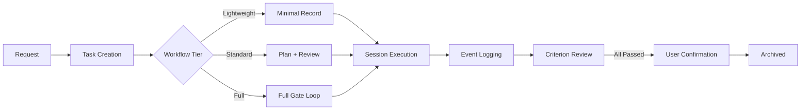

<!-- Header: badges + VibeHub (Unsloth-style README) -->

<div align="center">

# VibeHub

[](https://github.com/ChenM0M/VibeHub/releases)


[Changelog](CHANGELOG.md) · [Features](#features) · [Getting Started](#getting-started) · [Development](#development) · [Roadmap](#roadmap)

[简体中文](README.md) · [繁體中文](README_TC.md)

</div>

---

<div align="center">

<!-- Image placeholder 1: Hero banner -->
<!-- Suggested: A panoramic screenshot of the VibeHub desktop main interface, or a composite banner with product logo + UI + core slogan -->
<!-- Recommended size: ~1600x400, wide landscape -->
<!-- Reusable asset: assets/readme/vibehub-hero-banner.png -->
<!-- If the existing image lacks information density, consider remaking a composite banner with Logo + Cockpit UI + core Slogan -->


</div>

---

## Vision & Core Concepts

VibeHub is an all-in-one tool platform built around the Agent workflow experience.

It grew out of real pain points during personal Vibe development: the planning, progress tracking, acceptance, and blocker management of Agent work lacked a visible, traceable medium. VibeHub uses a task / plan / session / event-driven workflow engine to turn these "invisible processes" into visual Kanban boards and plan graphs. It is not tied to any specific Agent harness — as long as your Agent can read the workflow orchestration spec in the repository and call standard MCP tools, it can join the same workflow.

The desktop app lowers the barrier with a visual Cockpit, while the core is essentially a standalone CLI that can be extracted and used independently, or forked and modified.

## Features

### Local Project Management

Highly customizable card-based multi-workspace management that automatically scans local project directories and presents them as cards, with quick search support.

- Automatically scans and identifies Node.js / Rust / Python / Java / Go / .NET and other project types
- Tag-based categorization (IDE, CLI, environment, etc.) with drag-and-drop sorting; click to open projects with the corresponding tool, or use "custom launch" to enter any command
- Opened projects stay as persistent tabs with ordering saved across sessions
- Cards display the current branch and change status directly
- Dark mode follows system settings or can be toggled manually; UI supports Simplified Chinese / Traditional Chinese / English

<!-- Image placeholder 2: Project workspace -->
<!-- Suggested: Screenshot of the project workspace showing card list, tag filtering, and branch status -->
<!-- Reusable asset: assets/readme/project-workspace.png -->
<!-- If the original angle lacks richness, consider adding a close-up with tag categories and custom launch buttons -->


### ⭐ Workflow Optimization (V3)

V3 is the core feature of VibeHub. Through a **workflow constraint + visual hub** approach, it gives you a real sense of control over project progress and Agent status during the Vibe process. Theoretically, any work can seamlessly transition across multiple models and harnesses — the Agent quickly understands current progress through companion MCP tools, eliminating the need for manual summarization, repeated intervention, or passing large amounts of context information.

#### Core Abstractions

V3 workflow revolves around the following core concepts:

- **Task** — Abstracts a single request into a Task; the Agent automatically selects from **Lightweight**, **Standard**, or **Full** workflow tiers based on scope
- **Plan** — Planning phase where the Agent edits acceptance criteria (Criteria) and the implementation plan (DAG — Directed Acyclic Graph), clarifying "what to do" and "how to verify"
- **Session** — Execution phase where the Agent completes development node by node according to the DAG, recording the full event stream (Event Stream) and submitting results (Agent Result) at key milestones
- **Review** — Acceptance phase where the Agent verifies each criterion one by one, collects supporting evidence, and marks them as passed / failed / blocked
- **Project Memory** — Long-term context is only written through typed commands; disputed / stale / secret entries are not injected by default, ensuring injected content always serves as reference rather than instructions

#### Workflow Overview


```mermaid
graph LR
    A[Request] --> B[Task Creation]
    B --> C{Workflow Tier}
    C -->|Lightweight| D[Minimal Record]
    C -->|Standard| E[Plan + Review]
    C -->|Full| F[Full Gate Loop]
    D & E & F --> G[Session Execution]
    G --> H[Event Logging]
    H --> I[Criterion Review]
    I -->|All Passed| J[User Confirmation]
    J --> K[Archived]
```

#### V3 Cockpit Visualization

The V3 Cockpit is the visual entry point for the workflow, presenting plan graphs, node details, acceptance progress, blocker panels, and AI usage dashboards all in one place.

<!-- Image placeholder 4: V3 Cockpit acceptance overview -->
<!-- Suggested: Acceptance overview screen showing the criteria list and Agent results -->
<!-- Reusable asset: assets/readme/v3-acceptance.png -->


<!-- Image placeholder 5: V3 Cockpit implementation plan DAG -->
<!-- Suggested: Plan DAG diagram showing node dependencies and execution status -->
<!-- Reusable asset: assets/readme/v3-plan.png -->


<!-- Image placeholder 6: V3 Cockpit event stream -->
<!-- Suggested: Event stream timeline showing progress / risk event records -->
<!-- Reusable asset: assets/readme/v3-event-stream.png -->


### Agent Configuration & Model Gateway

- **Agent Profiles** — Manage multiple Agent profiles through a unified graphical interface, covering provider, model, reasoning depth, and other common configurations for mainstream harnesses (currently supports Codex, Claude Code, OpenCode). Protocol capabilities are auto-diagnosed (direct / adapted / unavailable); credentials only accept environment variables or system Secret Store references, never reading auth files
- **AI Gateway** — Built-in local proxy service with a graphical interface for managing multiple provider APIs, handling model mapping and protocol conversion locally; supports multi-provider load balancing, listening only on the loopback address `127.0.0.1` by default
- **AI Usage Stats** — Read-only local aggregation of token records from Claude Code / Codex / OpenCode; costs are derived from actual token counts; anomalous data triggers fail-closed

<!-- Image placeholder 7: Agent configuration screen -->
<!-- Suggested: Agent Profiles configuration panel showing provider, model selection, reasoning tier, etc. -->
<!-- Reusable asset: assets/readme/agent-profiles.png -->


<!-- Image placeholder 8: AI Gateway configuration screen -->
<!-- Suggested: AI Gateway management interface showing multi-provider config, model mapping rules, protocol conversion options -->
<!-- Existing asset availability: Not satisfied, new screenshot needed -->
<!-- Note: The repository currently lacks a standalone screenshot of the AI Gateway interface. If the gateway feature is mature enough, consider adding a screenshot showcasing load balancing strategy or model mapping rules; if still in early iteration, this can be temporarily omitted -->
<!--  -->

## Getting Started

### Installation

#### macOS: Homebrew (Recommended)

```bash
brew install --cask chenm0m/vibehub/vibehub
```

To update:

```bash
brew update
brew upgrade --cask vibehub
```

The Homebrew tap repository is `ChenM0M/homebrew-vibehub`. After each GitHub Release (including pre-releases), CI automatically updates the cask based on the Apple Silicon and Intel DMG artifacts.

#### Manual Download

[→ Releases Page](https://github.com/ChenM0M/VibeHub/releases)

| Platform | Format |
|----------|--------|
| Windows | `.exe` installer / `Portable.zip` portable version |
| macOS | `.dmg` (Apple Silicon & Intel) |
| Linux | `.deb` / `.AppImage` |

Windows / Linux Portable versions work after extraction. The macOS installed version writes configuration and AI Gateway data to the system application data directory:

```text
~/Library/Application Support/VibeHub
```

If you need portable mode, launch with `VIBEHUB_PORTABLE=1` — configuration will be written to a `data/` directory next to the executable. Portable mode is not recommended for regular macOS `.app` / DMG / Homebrew installations, as the app bundle is typically not writable.

> **About Linux**: The Linux version can theoretically run, but not all features are guaranteed to work correctly. Due to the lack of Linux development devices and limited resources, the project has not been specifically maintained or tested for Linux. If you encounter issues on Linux, feel free to open an Issue, but fix priority may be lower.

### Usage

After installation, open VibeHub to see the project workspace interface. Below is the GUI usage flow for the core features.

#### Adding & Managing Projects

After opening VibeHub, specify your workspace directory and the app will automatically scan and identify projects in the directory (supports Node.js / Rust / Python / Java / Go / .NET, etc.). Identified projects are presented as cards, supporting:

- **Quick Search**: Type keywords in the search box to filter projects
- **Tag Categories**: Associate tags with projects (IDE, CLI, environment, etc.); click a tag to launch with the corresponding tool
- **Drag & Drop Sorting**: Arrange cards in your preferred order
- **Custom Launch**: Skip preset tags and enter any launch command directly

Opened projects stay as tabs at the top for quick switching between multiple projects.

#### ⭐ V3 Workflow: Tracking Agent Progress in Cockpit

V3 workflow is the core of VibeHub. You don't need to execute any commands manually — the Agent automatically interacts with the workflow engine through MCP tools. You just observe and make decisions in the Cockpit.

**1. Submit a Request**

Tell the Agent your request directly in the conversation. The Agent will create a Task based on the request scope and select the appropriate workflow tier:

- **Lightweight** — Small changes like text edits or style adjustments; only minimal execution info is recorded
- **Standard** — Medium requests including plan orchestration and review
- **Full** — Complex requests with a complete gate loop and item-by-item acceptance

You usually don't need to manually select the tier — the Agent judges automatically; you can also specify it explicitly in the conversation.

**2. View the Plan**

Enter the task view in the V3 Cockpit to see the Agent's implementation plan — a DAG (Directed Acyclic Graph) that annotates each node's dependencies and execution order. Click a node to expand its detailed description, involved files, and acceptance criteria.

**3. Track Execution Progress**

Once the Agent starts executing, the Cockpit updates in real time:

- **Plan Graph**: Node status changes in real time (pending → in progress → completed), giving you an intuitive view of overall progress
- **Event Stream**: Progress records and risk markers from each milestone appear in the timeline
- **Node Drawer**: Click any node to view its detailed execution records and outputs

**4. Acceptance & Confirmation**

After the Agent completes all nodes, it enters the acceptance phase. In the Cockpit, you can see the verification status of each acceptance criterion:

- **passed** — Verified with supporting evidence
- **failed** — Verification failed with reasons provided
- **blocked** — Cannot be verified, with reasons, impact, and fix suggestions provided

After all criteria pass, the Agent will ask for your confirmation. Once confirmed, the Task is archived with the complete process record preserved for reference.

#### Agent Configuration & AI Gateway

Enter the Agent Profiles page to graphically manage configurations for each Agent harness:

- Add / edit profiles, fill in provider, Base URL, API Key, model selection, reasoning tier, etc.
- Supports "Detect Models": list upstream available models based on the current Base URL and API Key, select and import
- Credential security: API Keys are stored in the system Secret Store and never appear in plaintext in configuration files
- One-click copy of the terminal launch command for the current profile

Enter the AI Gateway page to manage multi-provider proxy configurations:

- Add multiple providers, configure API endpoints and keys
- Set model mapping rules and protocol conversion
- Configure load balancing strategies
- The gateway only listens on the loopback address `127.0.0.1` by default and is never exposed to the LAN

#### Tips for Collaborating with Agents

- **Clarify requirement boundaries**: Tell the Agent the desired outcome, involved modules, and any special technical constraints. The clearer the requirements, the more accurate the Plan
- **Use workflow tiers wisely**: Small changes go lightweight, medium requests go standard, multi-module or full-acceptance needs go full
- **Align on acceptance criteria early**: When reviewing the Plan in the Cockpit, confirm that acceptance criteria match your expectations
- **Watch for risk events**: When risk markers appear in the event stream, check the reason promptly and decide whether to fix, adjust scope, or accept

## Development

### Development Philosophy

The core of VibeHub is a standalone CLI (`vibehub`); the desktop visual Cockpit is just its frontend entry point. This layered design means:

- **CLI is the single source of truth** — All workflow state changes go through CLI typed commands; the frontend is only responsible for display and triggering
- **MCP is the standard interface for Agent access** — Agents don't call the CLI directly; they interact with the workflow engine through the MCP server (`vibehub mcp-stdio`)
- **Event-sourcing driven** — Tasks, plans, sessions, and events are all persisted as immutable event streams; projections derive current state from the event stream, ensuring full traceability
- **Credential security** — Sensitive information such as API Keys in Agent configurations only accept environment variable or system Secret Store references, never reading auth files

### Project Structure

```
VibeHub/
├── src/                     # React + TypeScript frontend
│   ├── pages/               # Home / AgentProfiles / Gateway / Settings / About
│   ├── v3/                  # V3 Cockpit (plan graph, acceptance progress, blockers, AI usage panel)
│   └── legacy-v2/           # Legacy protocol entry (read-only archive & migration)
├── src-tauri/               # Tauri desktop shell & Rust commands (scanner, launcher, gateway, Agent Profiles, usage reader)
├── crates/
│   ├── vibehub-core/        # V3 domain core (event store, projection, validators)
│   └── vibehub-cli/         # vibehub CLI & MCP server
├── contracts/v3/            # V3 view & command JSON Schema contracts
├── docs/v3/                 # V3 delivery, process & migration docs
├── scripts/                 # Contract generation, gates & release check scripts
└── .vibehub/                # In-project V3 workflow state directory (events, projections, tasks)
```

### Building from Source

Requires Node.js 20+ and Rust 1.77.2+.

```bash
git clone https://github.com/ChenM0M/VibeHub.git
cd VibeHub
npm install
npm run tauri dev
```

macOS can also use the environment check and dev launch scripts:

```bash
./start-dev.sh --check
./start-dev.sh
```

Build the release version:

```bash
npm run tauri build
```

Build only the V3 CLI (independently distributable):

```bash
cargo build --locked -p vibehub-cli --bin vibehub
```

### Secondary Development / Fork

If you only want to use the CLI core:

```bash
cargo build --locked -p vibehub-cli --bin vibehub
# Output at target/debug/vibehub or target/release/vibehub
```

The CLI is completely independent of the Tauri frontend and can be compiled and used on any machine with a Rust toolchain.

If you want to modify the frontend or overall architecture:

1. The frontend is React + TypeScript + TailwindCSS, with Zustand for state management
2. Frontend-backend communication goes through Tauri IPC (Rust commands); new features typically require adding corresponding commands in `src-tauri/src/`
3. The core V3 workflow logic lives in `crates/vibehub-core/`, following the event-sourcing pattern; it's recommended to read the JSON Schema contracts in `contracts/v3/` before making changes
4. Quality gates: `npm run release:check` validates version consistency; `npm run v3:contracts:check` validates contracts and fixtures

### CLI & MCP

The V3 core is a standalone CLI (also provides a same-named MCP server) that can be used directly in any project directory:

```bash
# Check / initialize / migrate a project's V3 layout
vibehub v3 <project> doctor
vibehub v3 <project> init
vibehub v3 <project> migrate

# Create tasks and view tasks & plans
vibehub v3 <project> task-create <request.json>
vibehub v3 <project> task-view <task_id>
vibehub v3 <project> task-lifecycle . <task_id>

# Session & acceptance
vibehub v3 <project> session-open ...   # Open session before starting work
vibehub v3 <project> event-log ...      # Milestone progress / risk events
vibehub v3 <project> criterion-review ...  # Item-by-item acceptance
vibehub v3 <project> task-completion-propose ...  # Request user confirmation for completion
```

Connecting an Agent takes just two steps: let the Agent read the workflow orchestration spec in the repository (`AGENTS.md`), and configure the V3 MCP server for it:

```json
{
  "mcpServers": {
    "vibehub": {
      "command": "vibehub",
      "args": ["mcp-stdio", "/path/to/your/project"]
    }
  }
}
```

All commands output JSON. For more details, see:

- [`docs/v3/agent-release-process.md`](docs/v3/agent-release-process.md) — Mandatory process for Agent work and release acceptance
- [`docs/v3/migration-guide.md`](docs/v3/migration-guide.md) — V2 → V3 migration and layout status
- [`docs/v3/agent-profiles.md`](docs/v3/agent-profiles.md) — Agent Profiles support matrix and Secret model
- [`docs/v3/usage-source-capabilities.md`](docs/v3/usage-source-capabilities.md) — AI usage data source capability boundaries
- [`contracts/v3/`](contracts/v3/README.md) — View and command JSON Schema contracts

### Release Process

1. After version changes, run `npm run release:check` to ensure `package.json`, lockfile, both V3 crates, Tauri Cargo, and `tauri.conf.json` versions are consistent; validate tags with `RELEASE_TAG=v3.3.3 npm run release:check`
2. Create a version tag (e.g., `v3.3.3`; tags containing `-` are pre-releases)
3. The `Release` workflow builds Windows, Linux, macOS Apple Silicon, and macOS Intel artifacts, creates a draft Release with per-platform SHA-256 checksums
4. After release, call the reusable `Update Homebrew Cask` workflow to update `ChenM0M/homebrew-vibehub` with the actual release DMG and SHA-256
5. Apple / Windows code signing is an optional enhancement: formal signing is enabled when credentials are complete; otherwise artifacts are macOS ad-hoc / Windows unsigned
6. Windows native manual test items (`A07`, `E07`, `F07–F10`, `G05`) must be completed on a Windows machine after release, using the same version's official Release Windows artifact and real SHA-256

See [`docs/v3/agent-release-process.md`](docs/v3/agent-release-process.md) for details.

## Roadmap

The project started as a solution to personal pain points and was developed iteratively while learning. Without prior systematic software engineering experience, there may still be many shortcomings — your understanding is appreciated. I will keep updating: continuing to solve development pain points while accumulating practical experience. Issues and PRs are very welcome — your feedback truly matters to me!

### More Hands-Off Automation

- Handle complex requests in a single interaction, automatically splitting into multiple tasks
- Single Task with multiple phases can match multiple Sessions, advancing in parallel for efficiency
- Multi-Session context passing mechanism within a single Task's multiple phases
- Project-level / Task-level important context injection system (e.g., relevant mature solutions, corresponding detailed documentation)

### Usability Improvements

- Separate out review and acceptance steps that require manual human completion; the model should know in advance whether it can obtain the relevant evidence, reducing unnecessary blocker accumulation
- Optimized node detail view balancing quick browsing and detailed records
- Toggle between active Task view and archived Task view
- Upgraded event stream balancing quick browsing and detailed records while staying lightweight
- Upgraded evidence system with display styles balancing quick browsing and detailed records
- More concrete and streamlined Agent-VibeHub interaction flow to prevent "submit-then-forget" scenarios (e.g., submitting evidence, passing reviews, or updating event streams without actually doing the work)
- More convenient process search (keyword-based)
- Task walkthrough display upon near-completion; archives also presented in this format (similar to Anti-Gravity style)

### More Accurate Reviews

- Ensure reviews don't pass simply because the model "thinks it's good enough"

### Economy & Auditing

- Token efficiency test scripts to improve overall token usage efficiency
- Scientific workflow evaluation test suite to determine whether the current workflow truly achieves economy, high freedom, and traceability
- DAG node graph Session system improvements
- More complete Session-related data statistics under Tasks

### Multi-Device Sync & Collaboration

- Multi-device sync of Session, VibeHub Tasks, and other information
- More collaboration scenarios to be explored

### Personal Preferences & Growth

- Personal preference settings
- Assist personal growth in building planning, architecture, and design capabilities (using experience as textbook, practice as ladder — consolidating abilities and expanding boundaries through use)

## Contributing

PRs and Issues are welcome.

## License

[Apache License 2.0](LICENSE)

## Acknowledgments

- [Tauri](https://tauri.app/) — Cross-platform desktop application framework
- [React](https://react.dev/) + [TailwindCSS](https://tailwindcss.com/) — Frontend
- [b4u2cc](https://github.com/CassiopeiaCode/b4u2cc) — Claude Code protocol conversion reference
