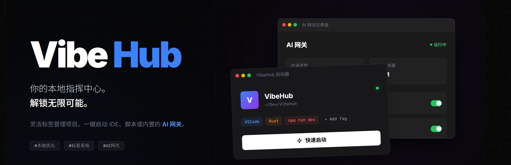

# VibeHub

[English](README_EN.md) | [简体中文](README.md) | [繁體中文](README_TC.md)



> 把散落各處的專案集中管理，用標籤分類，一鍵啟動常用的 IDE 和 CLI 工具。
> 還內建了 AI 閘道，幫你代理和分發 AI 請求。


## 它能做什麼

- **專案管理** — 指定工作區目錄，自動掃描並識別 Node.js / Rust / Python / Java / Go / .NET 等專案
- **標籤 + 啟動** — 給專案打標籤（IDE、CLI、環境等），點一下就能用對應工具開啟專案
- **AI 閘道** — 內建代理服務，支援多供應商負載均衡、模型映射、Claude Code 協議轉換
- **拖曳排序** — 專案卡片支援拖曳排列，順序會持久化儲存
- **Portable** — 綠色免安裝，設定檔就放在程式旁邊的 `data` 目錄
- **Git 資訊** — 卡片上直接顯示目前分支和變更狀態
- **深色模式** — 跟隨系統或手動切換

## 下載

[→ Releases 頁面](https://github.com/ChenM0M/VibeHub/releases)

| 平台 | 格式 |
|------|------|
| Windows | `.exe` 安裝包 / `Portable.zip` 便攜版 |
| macOS | `.dmg` (Intel & Apple Silicon) |
| Linux | `.deb` / `.AppImage` |

Portable 版解壓即用，設定自動存在 `data/` 下，刪掉資料夾就是乾淨移除。

## 從原始碼執行

需要 Node.js 18+ 和 Rust 1.70+。

```bash
git clone https://github.com/ChenM0M/VibeHub.git
cd VibeHub
npm install
npm run tauri dev
```

建置發行版：

```bash
npm run tauri build
```

平台相依套件：
- Windows → Visual Studio Build Tools
- macOS → Xcode Command Line Tools
- Linux → `libwebkit2gtk-4.1-dev libappindicator3-dev librsvg2-dev`

## 專案結構

```
VibeHub/
├── src/                 # React + TypeScript 前端
├── src-tauri/           # Rust 後端
│   └── src/
│       ├── main.rs      # 入口
│       ├── commands.rs  # Tauri 命令
│       ├── scanner.rs   # 專案掃描器
│       ├── launcher.rs  # 啟動器
│       ├── storage.rs   # 設定讀寫
│       └── models.rs    # 資料結構
└── package.json
```

## 標籤和啟動是怎麼運作的

VibeHub 的核心概念是**標籤**。每個標籤可以綁定一組啟動設定（可執行檔 + 參數 + 環境變數），分類為 IDE、CLI、環境等。

給專案關聯標籤後，點選啟動會依標籤類型執行對應操作 —— IDE 類會把專案路徑作為參數傳入，CLI 類會在專案目錄下開啟新視窗。

也可以跳過標籤，直接用「自訂啟動」填入任意命令。

## 貢獻

PR 和 Issue 都歡迎。

## 授權

[Apache License 2.0](LICENSE)

## 致謝

- [Tauri](https://tauri.app/) — 跨平台桌面應用框架
- [React](https://react.dev/) + [TailwindCSS](https://tailwindcss.com/) — 前端
- [b4u2cc](https://github.com/CassiopeiaCode/b4u2cc) — Claude Code 協議轉換參考
