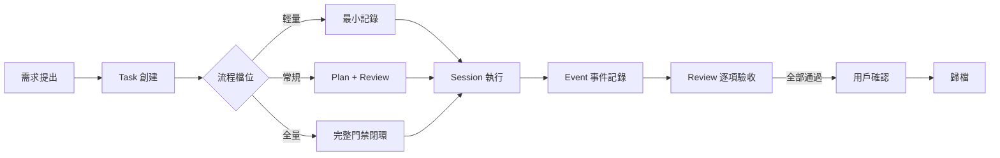

<!-- 標題欄：徽章 + VibeHub（類 unsloth 的 README） -->

<div align="center">

# VibeHub

[](https://github.com/ChenM0M/VibeHub/releases)


[更新日誌](CHANGELOG.md) · [功能介紹](#功能介紹) · [快速上手](#快速上手) · [開發須知](#開發須知) · [未來發展](#未來發展)

[English](README_EN.md) · [简体中文](README.md)

</div>

---

<div align="center">

<!-- 圖片占位符 ①：主視覺橫幅 -->
<!-- 建議放置：VibeHub 桌面端主介面全景截圖，或產品 Logo + 介面合成的 Banner -->
<!-- 尺寸建議：1600×400 左右，寬幅橫圖 -->
<!-- 可複用現有素材：assets/readme/vibehub-hero-banner.png -->
<!-- 如該圖資訊密度不夠，建議重新製作一張包含 Logo + Cockpit 介面 + 核心 Slogan 的合成橫幅 -->


</div>

---

## 特色與核心理念

VibeHub 是一個圍繞 Agent 工作流體驗打造的 All-in-One 工具平台。

它源於個人 Vibe 開發過程中的真實痛點：Agent 幹活時的計畫拆解、進度推進、驗收與阻塞缺少可見、可追溯的載體。VibeHub 用任務 / 計畫 / 會話 / 事件驅動的工作流引擎，把這些「看不見的過程」變成視覺化的看板與計畫圖。它不綁定任何特定的 Agent Harness —— 只要能讀取倉庫裡的工作流編排說明，並能呼叫標準 MCP 工具，你的 Agent 就能接入同一套工作流。

桌面端用視覺化 Cockpit 降低使用門檻，而核心本質上是一個獨立的 CLI，可以拆出去單獨使用或 Fork 改造。

## 功能介紹

### 本地專案管理

高可自訂的卡片式多工作區管理，自動檢索本地專案目錄並以卡片形式呈現，支援快速檢索定位。

- 自動掃描並辨識 Node.js / Rust / Python / Java / Go / .NET 等專案類型
- 標籤分類（IDE、CLI、環境等）與拖曳排序，點擊即可用對應工具開啟專案；也支援「自訂啟動」填入任意命令
- 開啟的專案以標籤頁常駐，順序持久化儲存
- 卡片上直接顯示目前分支和變更狀態
- 深色模式跟隨系統或手動切換；介面支援簡體中文 / 繁體中文 / English

<!-- 圖片占位符 ②：專案工作台 -->
<!-- 建議放置：專案工作台主介面截圖，展示卡片列表、標籤篩選、分支狀態 -->
<!-- 可複用現有素材：assets/readme/project-workspace.png -->
<!-- 如果原圖角度或資訊不夠豐富，可補充一張帶有標籤分類與自訂啟動按鈕的特寫 -->


### ⭐ 工作流最佳化（V3）

V3 是 VibeHub 的核心特色。它透過**工作流約束 + 視覺化中台**的方式，讓你在 Vibe 過程中對專案推進與 Agent 進度擁有實際的掌握感。理論上，任何工作內容都可以在多種模型、多種 Harness 下無縫銜接 —— Agent 透過配套 MCP 工具快速了解目前進度，無需人工手動總結、反覆干預或傳遞大量上下文資訊。

#### 核心抽象概念

V3 工作流圍繞以下幾個核心概念運轉：

- **Task（任務）** — 將單次需求抽象為一個 Task，Agent 根據體量自動選擇 **輕量（Lightweight）**、**常規（Standard）** 或 **全量（Full）** 三種流程檔位，匹配對應的工作流程
- **Plan（計畫）** — 規劃階段，Agent 編輯驗收標準（Criteria）和實作計畫（DAG 有向無環圖），明確「做什麼」和「怎麼驗證」
- **Session（會話）** — 執行階段，Agent 根據 DAG 圖依序完成開發，全過程記錄事件流（Event Stream），在關鍵節點提交結果（Agent Result）
- **Review（驗收）** — 驗收階段，Agent 依據驗收標準逐項核驗，收集對應證據，標記為 passed / failed / blocked
- **Project Memory（專案記憶）** — 長期上下文只經 typed command 寫入；disputed / stale / secret 預設不注入，確保注入內容始終作為參考而非指令

#### 工作流全景


```mermaid
graph LR
    A[需求提出] --> B[Task 創建]
    B --> C{流程檔位}
    C -->|輕量| D[最小記錄]
    C -->|常規| E[Plan + Review]
    C -->|全量| F[完整門禁閉環]
    D & E & F --> G[Session 執行]
    G --> H[Event 事件記錄]
    H --> I[Review 逐項驗收]
    I -->|全部通過| J[用戶確認]
    J --> K[歸檔]
```

#### V3 Cockpit 視覺化

V3 Cockpit 是工作流的視覺化入口，將計畫圖、節點詳情、驗收進度、阻塞面板與 AI 用量面板一站式呈現。

<!-- 圖片占位符 ④：V3 Cockpit 驗收總覽 -->
<!-- 建議放置：驗收總覽介面，展示驗收標準列表與 Agent 結果 -->
<!-- 可複用現有素材：assets/readme/v3-acceptance.png -->


<!-- 圖片占位符 ⑤：V3 Cockpit 實作計畫 DAG -->
<!-- 建議放置：計畫 DAG 圖，展示節點依賴關係與執行狀態 -->
<!-- 可複用現有素材：assets/readme/v3-plan.png -->


<!-- 圖片占位符 ⑥：V3 Cockpit 事件流 -->
<!-- 建議放置：事件流時間線，展示 progress / risk 事件記錄 -->
<!-- 可複用現有素材：assets/readme/v3-event-stream.png -->


### Agent 設定與模型閘道

- **Agent Profiles** — 以圖形化介面統一管理多個 Agent 檔案，涵蓋提供商、模型、思考深度等各主流 Harness 的常用設定（目前支援 Codex、Claude Code、OpenCode）。協定能力自動診斷（直連 / 適配 / 不可用），憑證只接受環境變數或系統 Secret Store 引用，從不讀取 auth 檔案
- **AI 閘道** — 內建本地代理服務，以圖形化介面管理多個提供商的 API，本地完成模型映射與協定轉換；支援多供應商負載均衡，預設只監聽本機回環地址 `127.0.0.1`
- **AI 用量統計** — 本地唯讀彙總 Claude Code / Codex / OpenCode 的 token 記錄，費用由真實 token 數推導；異常資料 fail-closed

<!-- 圖片占位符 ⑦：Agent 設定介面 -->
<!-- 建議放置：Agent Profiles 設定面板，展示 Provider、模型選擇、思考檔位等 -->
<!-- 可複用現有素材：assets/readme/agent-profiles.png -->


<!-- 圖片占位符 ⑧：AI 閘道設定介面 -->
<!-- 建議放置：AI 閘道管理介面，展示多供應商設定、模型映射規則、協定轉換選項 -->
<!-- 現有素材是否滿足：不滿足，需要新截圖 -->
<!-- 說明：目前倉庫中缺少 AI 閘道介面的獨立截圖。如果閘道功能已較為完善，建議補充一張能展示負載均衡策略或模型映射規則的截圖；如果閘道功能尚在迭代中，可暫不放置 -->
<!--  -->

## 快速上手

### 如何安裝

#### macOS：Homebrew（推薦）

```bash
brew install --cask chenm0m/vibehub/vibehub
```

更新：

```bash
brew update
brew upgrade --cask vibehub
```

Homebrew tap 倉庫為 `ChenM0M/homebrew-vibehub`。每次 GitHub Release（含預覽版）發佈後，CI 會根據 Apple Silicon 和 Intel 兩個 DMG 產物自動更新 cask。

#### 手動下載

[→ Releases 頁面](https://github.com/ChenM0M/VibeHub/releases)

| 平台 | 格式 |
|------|------|
| Windows | `.exe` 安裝包 / `Portable.zip` 便攜版 |
| macOS | `.dmg` (Apple Silicon & Intel) |
| Linux | `.deb` / `.AppImage` |

Windows / Linux Portable 版解壓即用。macOS 安裝版的設定和 AI 閘道資料寫入系統應用資料目錄：

```text
~/Library/Application Support/VibeHub
```

如果需要便攜模式，可以用 `VIBEHUB_PORTABLE=1` 啟動，設定會寫到可執行檔旁邊的 `data/` 目錄。普通 macOS `.app` / DMG / Homebrew 安裝不建議使用便攜模式，因為應用程式包內部通常不可寫。

> **關於 Linux**：Linux 版本理論上可以執行，但不保證所有功能正常運作。由於缺少 Linux 開發設備且精力有限，專案未對 Linux 做針對性維護與測試。如果你在 Linux 上遇到問題，歡迎提 Issue，但修復優先順序可能較低。

### 使用方式

安裝完成後開啟 VibeHub，你會看到專案工作台介面。以下是核心功能的 GUI 使用流程。

#### 新增與管理專案

開啟 VibeHub 後，指定你的工作區目錄，應用程式會自動掃描並辨識目錄下的專案（支援 Node.js / Rust / Python / Java / Go / .NET 等）。辨識出的專案以卡片形式呈現，支援：

- **快速檢索**：在搜尋框中輸入關鍵字即可過濾專案
- **標籤分類**：為專案關聯標籤（IDE、CLI、環境等），點擊標籤即可用對應工具啟動
- **拖曳排序**：按你的習慣調整卡片排列順序
- **自訂啟動**：不想用預設標籤，可以直接填入任意啟動命令

開啟的專案以標籤頁常駐在頂部，方便在多個專案間快速切換。

#### ⭐ V3 工作流：在 Cockpit 中追蹤 Agent 進度

V3 工作流是 VibeHub 的核心。你不需要手動執行任何命令 —— Agent 會透過 MCP 工具自動與工作流引擎互動。你只需要在 Cockpit 中觀察和決策。

**1. 提出需求**

在 Agent 對話中直接說出你的需求，Agent 會根據需求體量建立 Task，並選擇合適的流程檔位：

- **輕量（Lightweight）** — 小改動，如修改文案、調整樣式，只記錄最小執行資訊
- **常規（Standard）** — 中等需求，包含計畫編排與審查
- **全量（Full）** — 複雜需求，完整門禁閉環，逐項驗收

你通常不需要手動選擇檔位，Agent 會自動判斷；你也可以在對話中明確指定。

**2. 查看計畫**

進入 V3 Cockpit 的任務檢視，你可以看到 Agent 編寫的實作計畫——一張 DAG（有向無環圖），標註了各節點的依賴關係和執行順序。點擊節點可以展開查看詳細描述、涉及檔案和驗收標準。

**3. 追蹤執行進度**

Agent 開始執行後，Cockpit 會即時更新：

- **計畫圖**：節點狀態即時變化（待執行 → 進行中 → 已完成），可以直觀看到整體推進到哪裡了
- **事件流**：每個里程碑的 progress 記錄、遇到的 risk 標記都會出現在時間線中
- **節點抽屜**：點擊任意節點查看該節點的詳細執行記錄和產出

**4. 驗收與確認**

Agent 完成所有節點後，會進入驗收階段。Cockpit 中可以看到每條驗收標準的核驗狀態：

- **passed** — 已驗證通過，附帶證據
- **failed** — 驗證未通過，附帶原因
- **blocked** — 無法驗證，附帶原因、影響和修復建議

所有標準通過後，Agent 會請求你確認。確認後 Task 歸檔，完整的過程記錄保留可查。

#### Agent 設定與 AI 閘道

進入 Agent Profiles 頁面，可以圖形化管理各個 Agent Harness 的設定：

- 新增 / 編輯 Profile，填寫提供商、Base URL、API Key、模型選擇、思考檔位等
- 支援「偵測模型」：按目前 Base URL 和 API Key 列出上游可用模型，勾選匯入
- 憑證安全：API Key 儲存在系統 Secret Store 中，不會明文出現在設定檔中
- 支援一鍵複製目前 Profile 的終端機啟動指令

進入 AI 閘道頁面，可以管理多供應商的代理設定：

- 新增多個提供商，設定 API 位址與金鑰
- 設定模型映射規則與協定轉換
- 設定負載均衡策略
- 閘道預設只監聽本機回環地址 `127.0.0.1`，不會暴露到區域網路

#### 與 Agent 協作的建議

- **說清楚需求邊界**：告訴 Agent 你想要的最終效果、涉及的模組、有沒有特別的技術約束。需求越清晰，Plan 越準確
- **善用流程檔位**：小改動走輕量模式，中等需求走常規模式，涉及多模組或需要完整驗收的走全量模式
- **驗收標準提前對齊**：在 Cockpit 中查看 Plan 時，確認驗收標準是否符合你的預期
- **關注 risk 事件**：事件流中出現 risk 標記時，及時查看原因並決定是修復、調整範圍還是接受

## 開發須知

### 開發理念

VibeHub 的核心是一個獨立的 CLI（`vibehub`），桌面端的視覺化 Cockpit 只是它的前端入口。這種分層設計意味著：

- **CLI 是唯一事實來源** — 所有工作流狀態變更都透過 CLI 的 typed commands 完成，前端只負責展示和觸發
- **MCP 是 Agent 接入的標準介面** — Agent 不直接呼叫 CLI，而是透過 MCP server（`vibehub mcp-stdio`）與工作流引擎互動
- **事件溯源驅動** — 任務、計畫、會話、事件全部以不可變事件流的形式持久化，投影（Projection）從事件流中派生出目前狀態，保證全程可回溯
- **憑證安全** — Agent 設定中的 API Key 等敏感資訊只接受環境變數或系統 Secret Store 引用，從不讀取 auth 檔案

### 專案結構

```
VibeHub/
├── src/                     # React + TypeScript 前端
│   ├── pages/               # Home / AgentProfiles / Gateway / Settings / About
│   ├── v3/                  # V3 Cockpit（計畫圖、驗收進度、blocker、AI 用量面板）
│   └── legacy-v2/           # 舊協定入口（唯讀歸檔與遷移）
├── src-tauri/               # Tauri 桌面殼與 Rust 命令（掃描器、啟動器、閘道、Agent Profiles、用量讀取）
├── crates/
│   ├── vibehub-core/        # V3 領域核心（事件儲存、投影、驗證器）
│   └── vibehub-cli/         # vibehub CLI 與 MCP server
├── contracts/v3/            # V3 視圖與命令 JSON Schema 契約
├── docs/v3/                 # V3 交付、流程與遷移文件
├── scripts/                 # 契約產生、門禁與發佈檢查腳本
└── .vibehub/                # 專案內 V3 工作流狀態目錄（事件、投影、任務）
```

### 從原始碼建置

需要 Node.js 20+ 和 Rust 1.77.2+。

```bash
git clone https://github.com/ChenM0M/VibeHub.git
cd VibeHub
npm install
npm run tauri dev
```

macOS 可以直接執行環境檢查和開發啟動腳本：

```bash
./start-dev.sh --check
./start-dev.sh
```

建置發行版：

```bash
npm run tauri build
```

只建置 V3 CLI（可獨立散佈）：

```bash
cargo build --locked -p vibehub-cli --bin vibehub
```

### 二次開發 / Fork

如果你只想用 CLI 核心：

```bash
cargo build --locked -p vibehub-cli --bin vibehub
# 產物在 target/debug/vibehub 或 target/release/vibehub
```

CLI 完全獨立於 Tauri 前端，可以在任何有 Rust 工具鏈的機器上編譯使用。

如果你想改造前端或整體架構：

1. 前端是 React + TypeScript + TailwindCSS，狀態管理走 Zustand
2. 前後端通訊透過 Tauri IPC（Rust 命令），新增功能通常需要在 `src-tauri/src/` 中新增對應 command
3. V3 工作流的核心邏輯在 `crates/vibehub-core/` 中，遵循事件溯源模式；修改前建議先閱讀 `contracts/v3/` 中的 JSON Schema 契約
4. 品質門禁：`npm run release:check` 校驗版本一致性，`npm run v3:contracts:check` 校驗契約與 fixtures

### CLI 與 MCP

V3 核心是一個獨立 CLI（也提供同名 MCP server），可以在任意專案目錄直接使用：

```bash
# 檢查 / 初始化 / 遷移一個專案的 V3 布局
vibehub v3 <project> doctor
vibehub v3 <project> init
vibehub v3 <project> migrate

# 建立任務並查看任務與計畫
vibehub v3 <project> task-create <request.json>
vibehub v3 <project> task-view <task_id>
vibehub v3 <project> task-lifecycle . <task_id>

# 會話與驗收
vibehub v3 <project> session-open ...   # 開工前開啟會話
vibehub v3 <project> event-log ...      # 里程碑 progress / 風險 risk
vibehub v3 <project> criterion-review ...  # 逐項驗收
vibehub v3 <project> task-completion-propose ...  # 請求用戶確認完成
```

接入 Agent 只需兩步：讓 Agent 讀取倉庫裡的工作流編排說明（`AGENTS.md`），並給它設定 V3 MCP server：

```json
{
  "mcpServers": {
    "vibehub": {
      "command": "vibehub",
      "args": ["mcp-stdio", "/path/to/your/project"]
    }
  }
}
```

所有命令輸出 JSON。更多細節見：

- [`docs/v3/agent-release-process.md`](docs/v3/agent-release-process.md) — Agent 工作與發佈驗收的強制流程
- [`docs/v3/migration-guide.md`](docs/v3/migration-guide.md) — V2 → V3 遷移與布局狀態
- [`docs/v3/agent-profiles.md`](docs/v3/agent-profiles.md) — Agent Profiles 支援矩陣與 Secret 模型
- [`docs/v3/usage-source-capabilities.md`](docs/v3/usage-source-capabilities.md) — AI 用量資料源能力邊界
- [`contracts/v3/`](contracts/v3/README.md) — 視圖與命令 JSON Schema 契約

### 發佈流程

1. 版本修改後執行 `npm run release:check`，確保 `package.json`、lockfile、兩個 V3 crate、Tauri Cargo 與 `tauri.conf.json` 版本一致；校驗 tag 可用 `RELEASE_TAG=v3.3.3 npm run release:check`
2. 建立版本標籤（例如 `v3.3.3`；含 `-` 的標籤為預覽版）
3. `Release` workflow 建置 Windows、Linux、macOS Apple Silicon、macOS Intel 產物，建立草稿 Release 並附各平台 SHA-256 清單
4. 發佈後呼叫可複用的 `Update Homebrew Cask` workflow，用實際發佈資產的 DMG 與 SHA-256 更新 `ChenM0M/homebrew-vibehub`
5. Apple / Windows 程式碼簽章是可選增強：憑證完整時啟用正式簽章，缺失時產物為 macOS ad-hoc / Windows unsigned
6. Windows 原生手測項（`A07`、`E07`、`F07–F10`、`G05`）必須在發佈後，使用同一版本正式 Release 的 Windows artifact 與真實 SHA-256 在 Windows 主機完成

詳見 [`docs/v3/agent-release-process.md`](docs/v3/agent-release-process.md)。

## 未來發展

因為專案的出發點是為了解決個人痛點，並且是在摸索學習中逐步迭代的，此前沒有較完整、系統的工程設計經驗，所以專案中可能仍存在不少不足之處，望大家諒解。我會持續更新，一方面繼續解決開發中的痛點，另一方面也在實踐中積累經驗。歡迎大家多提 Issue 與 PR，你們的建議對我真的很重要！

### 更加放心脫手

- 單次互動即可處理複雜需求，自動拆分為多任務
- 單 Task 多階段可匹配多 Session，並行推進提高效率
- 單 Task 內多階段的多 Session 上下文傳遞機制
- 專案級 / Task 級的重要上下文注入系統（如相關成熟解決方案、對應的詳細文件）

### 互動易用性提升

- 審查、驗收中需要人工手動完成的環節單獨劃分，模型提前了解自己是否有能力取得相關證據，減少不必要的阻塞堆積
- 節點詳細檢視最佳化，兼顧快速閱覽與詳細記錄
- 活躍 Task 檢視與歸檔 Task 檢視切換
- 事件流升級，兼顧快速閱覽與詳細記錄並保持輕量
- 證據系統升級，顯示風格兼顧快速閱覽與詳細記錄
- Agent 與 VibeHub 的互動流程更加具體化、流程化，防止「先提交後遺忘」（如未實際操作就提交證據、通過審查或更新事件流）
- 更加方便易用的過程檢索（關鍵字關聯）
- Task 基本結束時展示整體 Walkthrough，歸檔時也以這種形式呈現

### 審查效果更加精確

- 確保審查不會出現「自認為通過」的情況

### 經濟與稽核

- Token 效率測試腳本，提升整體 Token 使用效率
- 科學的工作流評估測試集，判斷目前工作流是否真正達到經濟、高自由度、流程可溯源等目標
- DAG 節點圖 Session 系統完善
- Task 下的 Session 相關資料統計完善

### 多端同步與多人協作

- 多端同步 Session、VibeHub Tasks 等資訊
- 待探索更多協作場景

### 個人偏好與成長

- 個人偏好設定
- 輔助個人成長，建構規劃、架構、設計能力（以經歷為教材，以實踐為階，隨使用鞏固能力、拓展邊界）

## 貢獻

PR 和 Issue 都歡迎。

## 許可證

[Apache License 2.0](LICENSE)

## 致謝

- [Tauri](https://tauri.app/) — 跨平台桌面應用程式框架
- [React](https://react.dev/) + [TailwindCSS](https://tailwindcss.com/) — 前端
- [b4u2cc](https://github.com/CassiopeiaCode/b4u2cc) — Claude Code 協定轉換參考
