# VibeHub Harness Loop 结构与反思、改进策略

> **文档性质**: 工程审视 + 架构反思 + 改进路线图
> **审视范围**: vibehub-core（39 模块, 30,176 行 Rust）、CLI 入口、Tauri 后端、React 前端
> **数据来源**: 源码实际阅读 + 文件系统度量（.vibehub 目录 262 文件 / 82 目录 / 2.4MB）
> **日期**: 2026-06-18

---

## 第一部分：现状结构图

### 1.1 系统总体架构层次

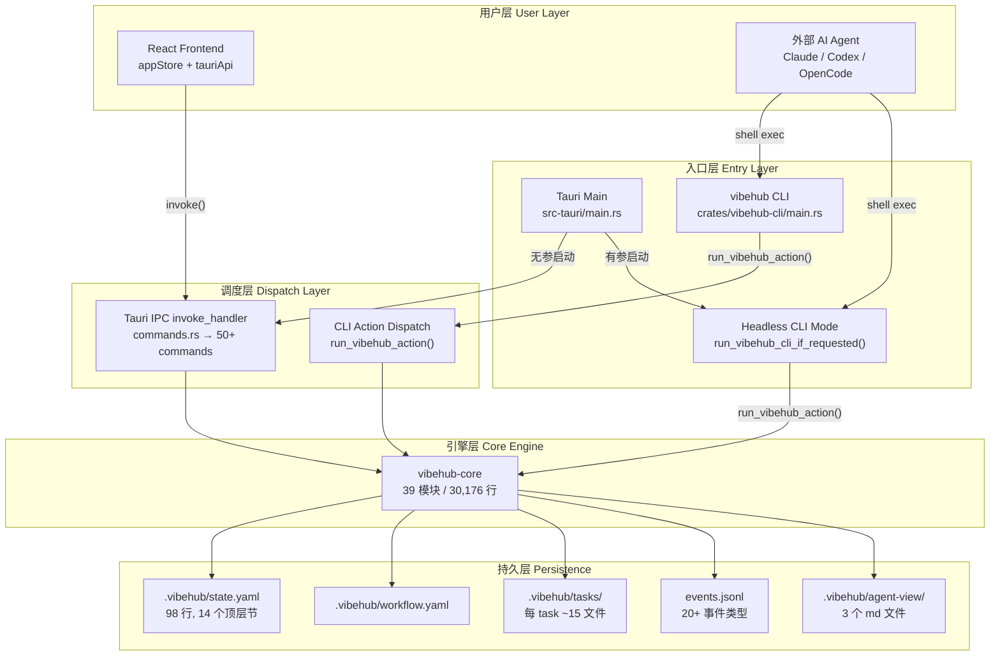

### 1.2 应用启动 Harness（Tauri main.rs 双模式）

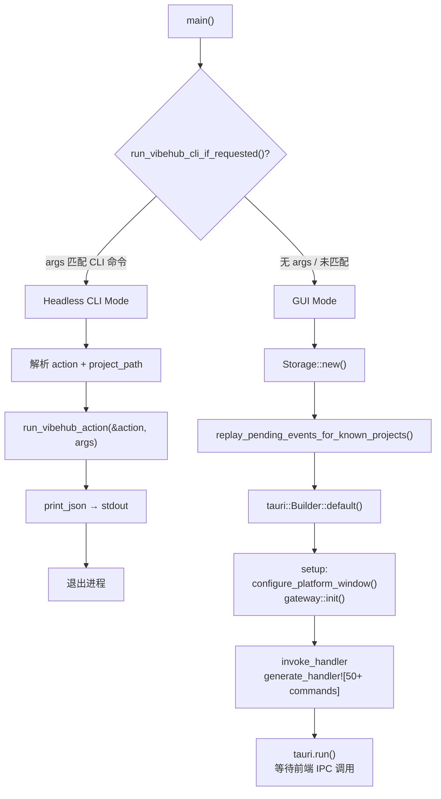

### 1.3 工作流模式与阶段状态机

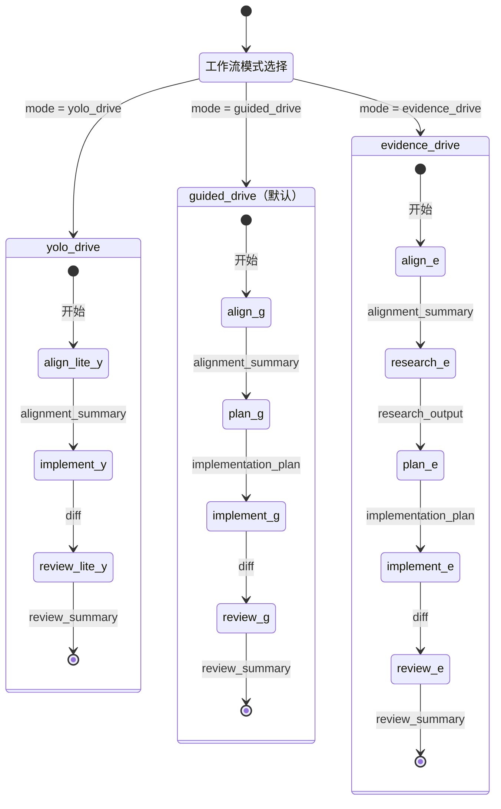

### 1.4 单阶段（Phase）生命周期

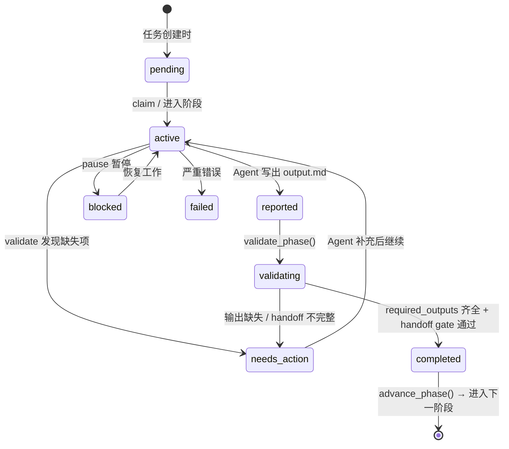

### 1.5 任务完整生命周期

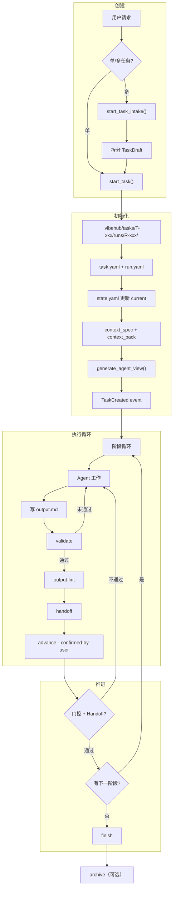

### 1.6 Agent 操作循环

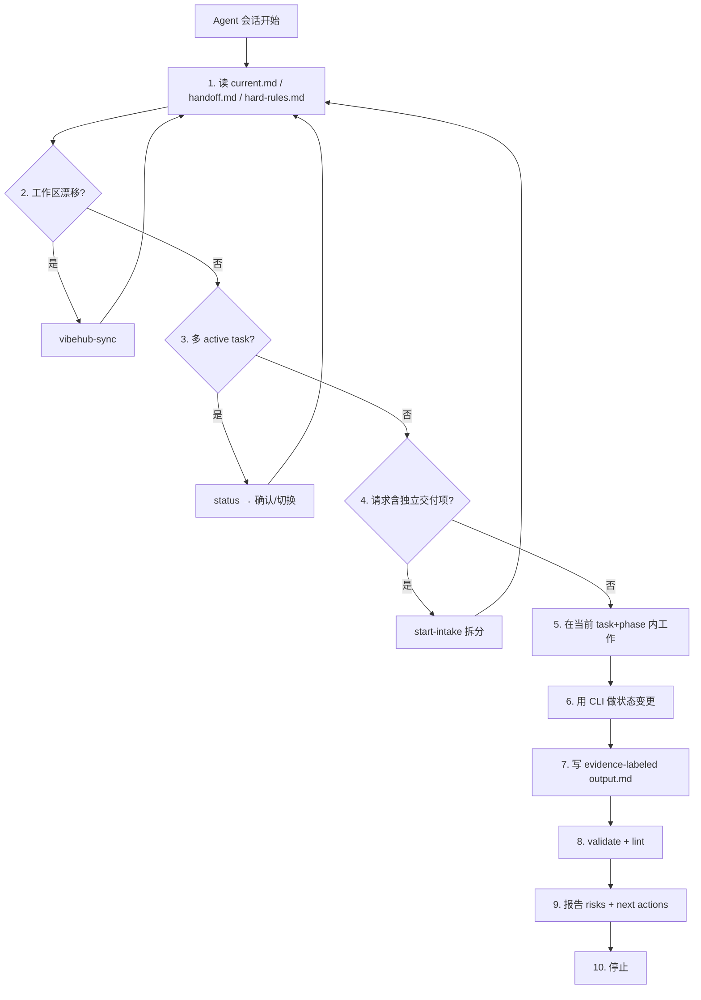

### 1.7 next-action 路由引擎

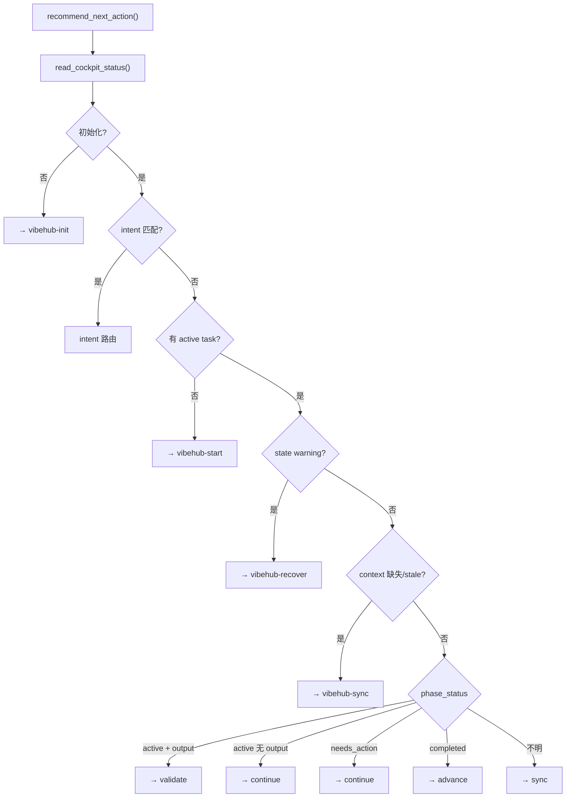

### 1.8 事件系统与数据流

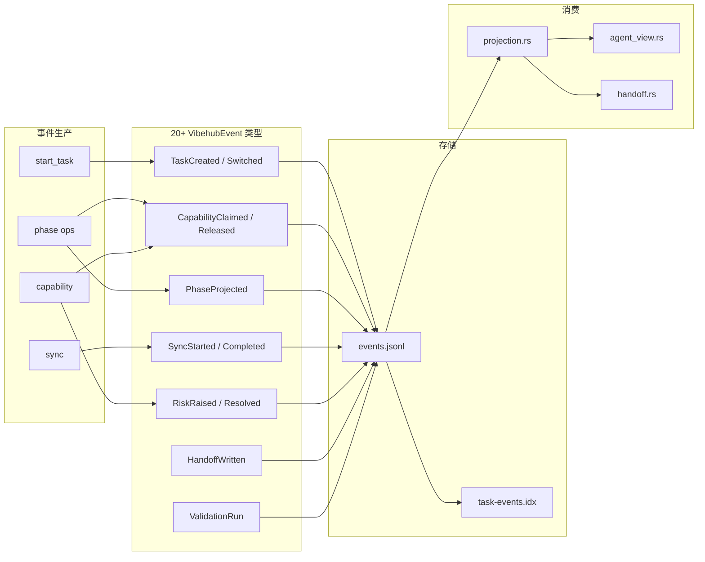

### 1.9 门控系统

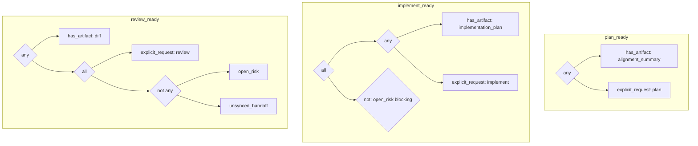

### 1.10 Core 模块职责表

| 模块 | 行数 | 职责 |
|------|------|------|
| agent_adapter | 2,349 | Agent 工具文件同步（SKILL.md 等） |
| review | 2,337 | Review 证据生成 |
| events | 1,891 | 事件追加、回放、20+ 结构化事件类型 |
| phase | 1,795 | 阶段验证、推进、暂停、完成 |
| start_task | 1,675 | 创建任务 + 批量拆分 intake |
| handoff | 1,615 | 会话交接文档生成 |
| sync | 1,179 | 工作区同步、漂移检测 |
| archive | 1,103 | 任务归档 |
| schema_check | 1,090 | 能力输出 schema 验证 |
| workflow | 997 | 工作流配置解析 |
| capability | 990 | 能力声明/释放、门控评估 |
| context | 990 | 上下文包构建 |
| agent_view | 825 | Agent 可读状态摘要生成 |
| status | 774 | Cockpit 状态聚合 |
| overview | 625 | 一次性聚合全部面板数据 |
| projection | 549 | 从事件流投影当前状态 |
| drift | 520 | Git/workspace 漂移检测 |
| ownership | 700 | 文件所有权分类 |
| **其余 21 模块** | ~6,000 | current, init, journal, knowledge, locale, neighbors, notes, fitness, policy, prompts, research, state_migration, task_switch, util, ... |
| **合计** | **30,176** | |

---

## 第二部分：工程审视与问题诊断

### 2.1 核心矛盾：手段与目的倒置

> **你的直觉完全正确**：目前的系统存在"为了维护 VibeHub 文件结构而维护"的倾向，偏离了"为项目工程服务"的正确目标。

具体表现：

```
用户的一次 CLI 操作：vibehub start . guided_drive "修个bug"

实际触发的文件写入：
  .vibehub/tasks/T-xxx/task.yaml          ← 任务描述
  .vibehub/tasks/T-xxx/runs/R-xxx/run.yaml    ← run 描述
  .vibehub/tasks/T-xxx/runs/current       ← 符号链接 / pointer
  .vibehub/tasks/current                  ← 符号链接 / pointer
  .vibehub/tasks/T-xxx/context/align.yaml     ← 上下文 spec
  .vibehub/tasks/T-xxx/runs/R-xxx/context-packs/align.md      ← 上下文包
  .vibehub/tasks/T-xxx/runs/R-xxx/context-packs/align.manifest.yaml  ← 清单
  .vibehub/tasks/T-xxx/runs/R-xxx/events.jsonl    ← 事件日志
  .vibehub/state.yaml                     ← 全局状态（大规模更新）
  .vibehub/derivation_trace.yaml          ← 推导追踪
  .vibehub/agent-view/current.md          ← Agent 视图
  .vibehub/agent-view/current-context.md  ← Agent 上下文视图
  .vibehub/agent-view/handoff.md          ← 交接视图
  .vibehub/index/task-events.idx          ← 事件索引
```

**一次"修个 bug"的 start 操作，产生 14 个文件的写入。** 这些文件中，真正对用户/Agent 有直接价值的只有 3-4 个。

### 2.2 量化的复杂度负担

| 维度 | 数值 | 评价 |
|------|------|------|
| Core 模块数 | 39 个 .rs 文件 | ⚠️ 模块划分过细，单一职责过度拆分 |
| Core 代码行数 | 30,176 行 | ⚠️ 对一个"项目状态管理"系统偏重 |
| .vibehub 文件总数 | 262 文件 | 🔴 仅 8 个 task 就产生 262 文件 |
| .vibehub 目录总数 | 82 目录 | 🔴 目录层级最深 6 层 |
| .vibehub 总大小 | 2.4 MB | ⚠️ 纯文本状态元数据占 2.4MB |
| state.yaml 字段数 | 14 个顶层节、98 行 | ⚠️ 状态模型过于复杂 |
| events 事件类型 | 20+ 种 | ⚠️ 事件粒度过细 |
| Cockpit UI 文件 | 4,014 行 / 193KB 单文件 | 🔴 严重的 God Component |
| Tauri IPC 命令数 | 50+ 个 | ⚠️ API 表面积过大 |
| 每 task 文件数 | ~15 文件（含所有 phase） | ⚠️ 结构膨胀 |

### 2.3 八大问题详析

#### 问题一：State.yaml 成为"万能对象"

state.yaml 有 14 个顶层节，将完全不同关注点的数据混在一起：

```yaml
# 这些信息确实需要：
current: { task_id, run_id, phase, phase_status, mode }
flow: { align: active, plan: pending, ... }

# 这些信息是"衍生数据"，不应存储：
derived: { current: { phase: true }, flow: true }  # ← 存储"衍生了什么"
metrics: { events: { write_per_minute: 120000.0 } } # ← 运行时指标持久化
loop_detection: { status: warning, warnings: [...] }  # ← 应该是查询结果

# 这些信息存在耦合但应解耦：
git: { dirty: true, changed_files_count: 56 }  # ← Git 状态是短暂的
sync: { questions: [...] }                       # ← 问题是临时的
```

**问题本质**：把"快照"、"配置"、"衍生数据"、"运行时指标"混进一个文件，导致：
- 每次操作都要读写整个 state.yaml
- Agent 看到大量无关信息
- 状态膨胀后 YAML 序列化/反序列化开销增大

#### 问题二：Event Sourcing 的成本大于收益

```
当前 events.jsonl 中的事件类型：
TaskCreated, TaskIntakePlanned, TaskSwitched, TaskCancelled,
CapabilityClaimed, CapabilityReleased, CapabilityPackBuilt,
TaskPackRebuilt, PackOversize, EvidenceAdded, PlanDrafted,
DiffObserved, FileOwnershipUpdated, NeighborConflictDetected,
ValidationRun, RiskRaised, RiskResolved, HandoffWritten,
PhaseProjected, SyncStarted, SyncCompleted, ...
```

Event Sourcing 在分布式系统中很有价值，但在 VibeHub 这种**单机、单用户、本地文件系统**场景中：

- **写入放大**：每个操作先写事件，再通过 `projection.rs` 重建状态，再写 state.yaml —— 三次 IO
- **投影复杂度**：`fold_events()` 需要遍历全部事件来重建状态，随事件积累性能退化
- **调试困难**：排查问题需要在 events.jsonl + state.yaml + derivation_trace.yaml 三处交叉验证
- **几乎没有回放需求**：实际使用中用户从未需要"重放事件"来恢复状态

#### 问题三：Agent View 层的冗余

```
数据流：state.yaml → projection.rs → agent_view.rs → current.md
                                                     → current-context.md
                                                     → handoff.md
```

三个 agent-view markdown 文件本质是 state.yaml 的**人类可读渲染**。但：

- 每次状态变更后必须重新生成，增加写入开销
- Agent 读取 current.md 后仍然经常需要再读 state.yaml 获取细节
- handoff.md 是从 output.md 派生的，信息重复

**真正的需求**：Agent 需要一个入口知道"我现在该做什么"——一个文件即可。

#### 问题四：上下文包系统过度工程

每个 phase 产生一对文件：

```
context-packs/align.md              ← 上下文包内容（实际文件拼接）
context-packs/align.manifest.yaml   ← 清单（included/missing/excluded + budget）
```

加上上下文 spec：
```
context/align.yaml                  ← 声明需要哪些文件
```

三个文件做的事情是："告诉 Agent 读哪些文件"。但现代 Agent（Claude、Codex、Antigravity）都有自己的上下文管理能力，会自行搜索和读取需要的文件。这套机制的实际利用率值得质疑。

#### 问题五：4,000 行 God Component

`VibehubCockpitDialog.tsx`（193KB, 4,014 行）将**所有**驾驶舱功能塞进一个组件：
- Status、Phase、Git、Activity、Context、Output、Handoff、Review、Research、Evidence、Preview、Adapters、Settings、Structure、Archive —— **15 个面板**
- 以及嵌套的 FlowDetail、EventTimeline、TaskList、PromptRenderer 等子视图

这不仅是代码组织问题，更是**信息过载**的体现——用户打开驾驶舱后面对 15 个 tab，每个 tab 展示大量技术细节，难以快速获取关键信息。

#### 问题六：门控系统的理想与现实

workflow.yaml 定义了声明式门控（plan_ready, implement_ready 等），这是一个优雅的设计理念。但实际使用中：

- Agent 几乎不通过门控来决定行为，而是通过 `next-action` 路由
- 门控评估需要读取多个文件（artifacts、risks、handoff 状态），成本不低
- 用户很少感知到门控的存在——它更多是内部约束而非用户可见的价值

#### 问题七：所有权系统的模糊地带

`ownership.rs`（700 行）试图追踪哪些文件属于哪个 task，但：

- Git 本身已经追踪了文件变更
- 多 task 并行时的所有权冲突检测（`NeighborConflictDetected` 事件）在实践中很少有用
- state.yaml 中 `git.changed_files_count: 56` 这样的数字经常过期

#### 问题八：Fitness/Metrics 的价值不明

```rust
pub struct FitnessMetrics {
    pub tasks: TaskMetrics,         // active_count: u64
    pub capabilities: CapabilityMetrics, // active_count: u64
    pub sync: SyncMetrics,          // avg_duration_ms, last_mode
    pub pack: PackMetrics,          // avg_size_tokens, oversize_count
    pub schema: SchemaMetrics,      // validation_failure_rate
    pub events: EventMetrics,       // write_per_minute
    pub subagent: SubAgentMetrics,  // timeout_count
}
```

这些指标持久化到 state.yaml 的 `metrics` 字段中，但：
- 没有任何 UI 展示这些指标
- Agent 不使用这些指标做决策
- `write_per_minute: 120000.0` 这样的数值没有实际意义

---

## 第三部分：改进策略

### 3.1 指导原则

> **核心原则：VibeHub 的存在是为了让项目工程更顺畅，不是为了维护自己的文件系统。**

具体推导出三条设计原则：

| 原则 | 含义 | 检验标准 |
|------|------|---------|
| **P1: 每个文件必须有明确的人类消费者** | 如果一个文件只被程序中间处理，它不应该存在于文件系统中 | 删掉这个文件后，谁会注意到？ |
| **P2: 状态不复制，只索引** | 衍生数据不持久化，需要时计算 | 同一信息是否出现在 2 个以上文件中？ |
| **P3: GUI 是过滤器，不是翻译器** | GUI 的价值在于帮用户忽略 90% 的细节，聚焦 10% 的决策点 | 用户打开界面 3 秒内能否知道下一步做什么？ |

### 3.2 改进路线图（由浅到深）

#### Phase 1：减脂瘦身（不改架构，删减冗余）

##### 1a. 精简 state.yaml

```yaml
# 改进后的 state.yaml（目标 < 30 行）
schema_version: 5
project: { id: VBdingHome, root: "." }
current:
  task_id: T-20260616062024-a8e8bdc2
  run_id: R-20260616062024-6b02149c
  mode: guided_drive
  phase: align
  phase_status: active
flow:
  align: active
  plan: pending
  implement: pending
  review: pending
locale: zh-CN
last_updated: 2026-06-16T06:59:41Z
```

**删除的字段及理由**：

| 删除字段 | 理由 |
|---------|------|
| `derived` | 元数据的元数据，纯粹自引用 |
| `metrics` | 运行时指标，需要时计算，不必持久化 |
| `loop_detection` | 应是查询时的检查结果，不是状态 |
| `git` | Git 状态是瞬态的，每次读取时查询即可 |
| `sync.questions` | 临时数据，不属于持久状态 |
| `pointers` | 指针路径是约定的，不需要记录 |
| `observability` | 配置，应放 workflow.yaml |
| `autonomy` | 配置，应放 workflow.yaml |
| `research` | 可从 task.yaml + phase 推断 |
| `context` | 路径是约定的，stale 可按需计算 |
| `agent_report` | 从 output.md 是否存在即可推断 |
| `handoff` | 从 handoff.md 是否存在即可推断 |
| `resume_hint` | 固定值，不需要存储 |

##### 1b. 合并 Agent View 为单文件

```markdown
# VibeHub 状态摘要（for Agent）

任务: T-xxx | 阶段: align (active) | 模式: guided_drive

## 下一步
→ 在 align 阶段工作，写 output.md

## 上下文入口
- .vibehub/tasks/T-xxx/runs/R-xxx/context-packs/align.md

## 邻居任务（可能冲突）
- T-xxx2: implement 阶段，共享文件: []

## 约束
- 不编辑 state.yaml
- 写 evidence-labeled output
```

从 3 个文件合并为 1 个，且内容**极度精简**。Agent 只需一个文件即可知道全部必要信息。

##### 1c. 废弃 derivation_trace.yaml

这个文件记录"state.yaml 中哪些字段是从事件投影来的"。这是调试辅助，不是运行时需要。改为仅在 `debug-dump` 时按需生成。

##### 1d. 合并 Context Spec + Manifest

将 `context/align.yaml`（spec）和 `context-packs/align.manifest.yaml`（manifest）合并为一个清单：

```yaml
# context-packs/align.yaml（合并后）
phase: align
entries:
  - path: src-tauri/src/main.rs
    included: true
    reason: "Tauri 入口文件"
  - path: src/missing-file.ts
    included: false
    reason: "文件不存在"
budget: { estimated_tokens: 8000, max: 12000 }
```

消除每个 phase 3 个文件 → 2 个文件的冗余。

#### Phase 2：重构状态引擎（Event Sourcing → Direct State）

##### 2a. 用直接状态更新替代事件投影

```
当前：操作 → 写 event → fold_events() → 写 state.yaml → 写 agent_view
改进：操作 → 写 state.yaml → 写 agent_view（可选异步）
```

保留 events.jsonl 作为**审计日志**（append-only log），但不再从它重建状态。状态变更直接写入 state.yaml。

**好处**：
- 消除 `projection.rs` 的 fold 开销
- 减少每次操作 1-2 次文件 IO
- 状态总是最新的，无需 `replay_pending_events`
- 简化调试：state.yaml 就是真实状态

##### 2b. 简化事件类型

从 20+ 种减少到 5 种核心事件：

```rust
enum VibehubAuditEvent {
    TaskLifecycle { action: String, task_id: String },    // created/switched/cancelled/archived
    PhaseTransition { from: String, to: String },          // pending→active→completed
    AgentOutput { phase: String, output_path: String },    // output.md 写入
    Warning { severity: String, message: String },         // 风险/漂移
    UserAction { action: String, details: Value },         // 用户确认操作
}
```

#### Phase 3：GUI 信息分层（渲染即过滤）

这是你提到的"不是只是单纯渲染然后所有信息全部糊脸"的核心改进。

##### 3a. 三层信息架构

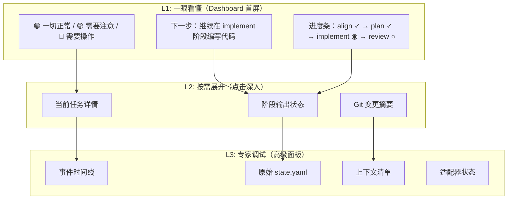

##### 3b. Dashboard 首屏设计原则

用户打开驾驶舱后**只看到**：

1. **信号灯**：绿/黄/红 —— 项目整体健康度
2. **下一步建议**：一句话，来自 `next-action` 引擎
3. **进度条**：当前 workflow 模式的阶段进度
4. **快捷操作按钮**：最多 3 个（如 "继续工作"、"验证输出"、"推进阶段"）

**不在首屏出现的**：事件时间线、适配器状态、上下文清单、原始 YAML、证据标签详情。

##### 3c. 拆解 God Component

```
VibehubCockpitDialog.tsx (4,014 行)
  ↓ 拆解为：

VibehubDashboard.tsx          (~200 行) ← L1 信号灯 + 进度 + 下一步
VibehubTaskPanel.tsx          (~300 行) ← L2 任务列表与切换
VibehubPhasePanel.tsx         (~300 行) ← L2 阶段详情与验证
VibehubGitPanel.tsx           (~200 行) ← L2 Git 变更摘要
VibehubTimelinePanel.tsx      (~300 行) ← L3 事件时间线
VibehubContextPanel.tsx       (~200 行) ← L3 上下文清单
VibehubAdapterPanel.tsx       (~200 行) ← L3 适配器管理
VibehubSettingsPanel.tsx      (~200 行) ← L3 设置
VibehubArchivePanel.tsx       (~200 行) ← L3 归档
```

#### Phase 4：核心模块精简

##### 4a. 模块合并建议

```
当前 39 个模块 → 目标 ~20 个模块

合并方案：
  status.rs + cockpit.rs + overview.rs → dashboard.rs   (状态聚合)
  phase.rs + capability.rs → lifecycle.rs               (生命周期管理)
  events.rs + projection.rs + fitness.rs → audit.rs     (审计日志)
  context.rs + notes.rs → context.rs                    (上下文)
  drift.rs + sync.rs → sync.rs                          (同步)
  ownership.rs + neighbors.rs → scope.rs                (作用域)
  journal.rs + knowledge.rs → memory.rs                 (知识记忆)
  current.rs + task_switch.rs → routing.rs              (任务路由)

删除候选：
  fitness.rs        → 指标不持久化，按需计算
  derivation_trace  → 仅 debug-dump 时生成
  policy.rs         → 合入 workflow.rs
  branches.rs       → 合入 sync.rs
  project_structure → 可选功能，不是核心路径
```

##### 4b. 每 Task 文件精简

```
当前每个 task + 1 run + 1 phase：
  task.yaml                           ← 保留
  context/align.yaml                  ← 删除（合入 context-pack）
  runs/current                        ← 删除（从 state.yaml 获取）
  runs/R-xxx/run.yaml                 ← 保留
  runs/R-xxx/events.jsonl             ← 保留（精简事件类型）
  runs/R-xxx/context-packs/align.md   ← 保留
  runs/R-xxx/context-packs/align.manifest.yaml  ← 合入 align.yaml
  runs/R-xxx/outputs/output.md        ← 保留
  runs/R-xxx/sync/sync-*.md           ← 最多保留最近 1 个

目标：每 task + 1 run + 1 phase → 5-6 个文件（现在是 ~15 个）
```

### 3.3 优先级排序

| 优先级 | 改进项 | 工作量 | 收益 | 风险 |
|--------|--------|--------|------|------|
| **P0** | 精简 state.yaml | 小 | 高：减少 IO + 提高可读性 | 低：向后兼容，旧字段保留但不再更新 |
| **P0** | GUI 信号灯首屏 | 中 | 高：用户体验根本改善 | 低：新增组件，不改后端 |
| **P1** | 拆解 CockpitDialog | 中 | 高：可维护性 + UX 信息分层 | 低：纯前端重构 |
| **P1** | 合并 Agent View 为单文件 | 小 | 中：减少文件数 + Agent 效率 | 中：需更新 Agent 协议 |
| **P2** | Event Sourcing → Direct State | 大 | 中：简化架构 + 性能提升 | 中：影响 projection + replay |
| **P2** | 模块合并 | 大 | 中：降低认知负担 | 中：大范围重构 |
| **P3** | 精简事件类型 | 小 | 低：减少噪声 | 低：只影响审计 |
| **P3** | 删除 fitness/metrics 持久化 | 小 | 低：减少复杂度 | 低：无外部依赖 |

### 3.4 改进后的理想架构

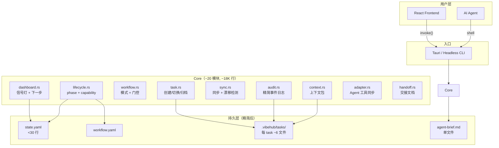

### 3.5 GUI 信息渲染策略（JSON → 人类可读）

这是你特别关注的点。改进的核心理念：**GUI 不是 JSON viewer，是决策辅助器**。

| 后端原始数据 | 当前渲染 | 改进后渲染 |
|-------------|---------|----------|
| `phase_status: "needs_action"` | 文本标签 | 🟡 + "阶段输出不完整，缺少：changed_files, test_results" |
| `flow: {align: completed, plan: active, implement: pending}` | 列表 | 横向进度条，已完成打钩，当前高亮，未来灰色 |
| `events.jsonl` 20+ 条事件 | 时间线列表（全部） | 只显示最近 3 条关键事件，可展开 |
| `context-packs/align.manifest.yaml` | YAML 原文 | "上下文包含 5 个文件，8K tokens，无缺失" |
| `git.changed_files_count: 56` | 数字 | "⚠️ 56 个文件变更，可能包含非任务文件" + 展开查看列表 |
| `warnings: [...]` | 警告列表 | 合并为单条信号：🟡 "2 个注意事项" → 点击展开 |
| `neighbor_tasks: [...]` | 任务列表 | 仅在存在文件冲突时显示，否则隐藏 |
| `active_capabilities: ["implement"]` | 文本 | 融入进度条，不单独展示 |

**关键设计**：
- **默认隐藏 > 默认展示**：先假设用户不需要看到某个信息，除非有明确理由
- **信号而非数据**：用颜色/图标传递状态，而非数字
- **渐进式披露**：首屏信号灯 → 点击展开摘要 → 再点击查看原始数据

---

## 第四部分：总结

### 现状一句话

VibeHub 构建了一套功能完备但**过度工程化**的项目状态管理系统。它的文件结构精度达到了"学术级"水平，但对用户的实际价值产出率不高——大量 IO、文件和代码服务于系统自身的"完备性"，而非用户的"效率"。

### 改进一句话

**砍掉 40% 的文件、合并 50% 的模块、让 GUI 展示 10% 的关键信号**——让 VibeHub 从"项目状态的百科全书"变成"项目推进的仪表盘"。

### 改进后的期望指标

| 指标 | 当前 | 目标 |
|------|------|------|
| state.yaml 行数 | 98 | < 30 |
| Agent View 文件数 | 3 | 1 |
| 每 task 文件数 | ~15 | ~6 |
| Core 模块数 | 39 | ~20 |
| Core 代码行数 | 30,176 | ~18,000 |
| CockpitDialog 行数 | 4,014 | ~200（Dashboard）+ 按需面板 |
| 事件类型数 | 20+ | 5 |
| 用户到"下一步"的时间 | 打开 15 tab 面板 | 首屏 3 秒可见 |
