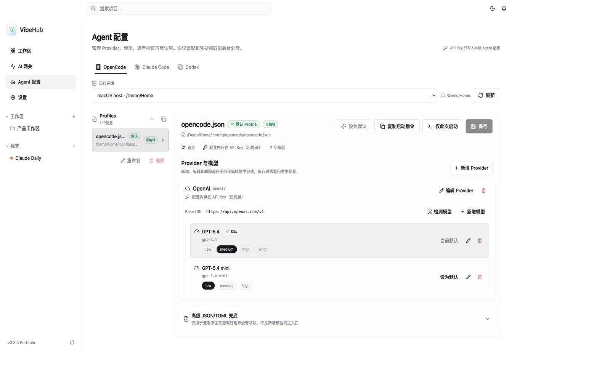
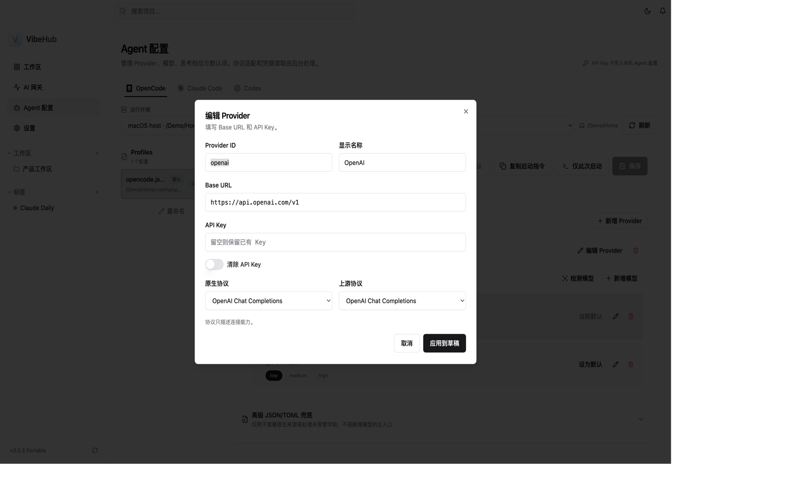
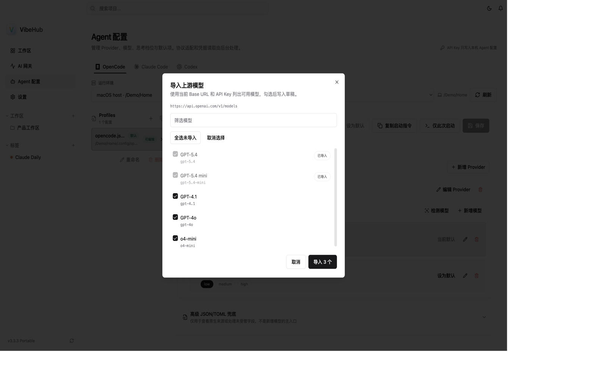
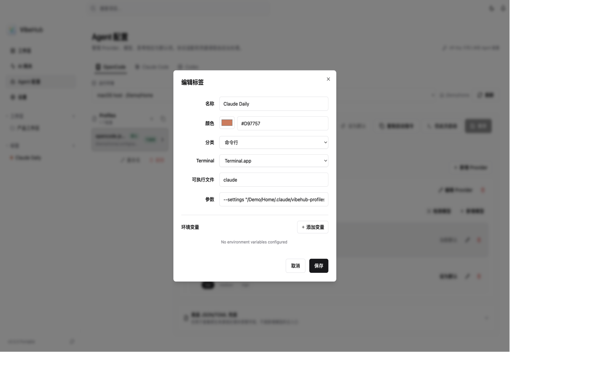

# VibeHub 3.3.3

Save a Base URL and API Key, then start. Detect upstream models and import the ones you want. Tag launch now understands quoted commands.

填写 Base URL 和 API Key 就能启动。上游模型可以检测后勾选导入。标签启动会正确拆分带引号的命令。

## Agent 配置

保存时把 API Key 写入本机 Agent 配置：Claude Code 使用 `ANTHROPIC_AUTH_TOKEN`，OpenCode 使用 `options.apiKey`，Codex 使用 `experimental_bearer_token`。Claude Code 仅此次启动改为 `--setting-sources "" --settings`，避免用户级 settings 盖住当前 Profile。

编辑 Provider 时可以直接填写 API Key；留空则保留已有密钥，不会在界面回显原文。

「检测模型」按当前 Base URL 和 API Key 列出上游模型，复选后写入草稿，仍需点保存才会落盘。

## 标签启动

可启动分类必须填写可执行文件。粘贴带引号的 `claude --settings "/path with space.json"` 会正确拆成 executable 和参数；纯展示标签不再参与启动。

## 完整变更

- Agent 配置保存时把 API Key 写入本机 Agent 配置，填好 Base URL、Key 和模型后即可启动。
- Claude Code 临时启动隔离用户级 settings。
- Agent 配置新增「检测模型」，勾选后导入草稿。
- 修复标签启动的引号解析、可执行文件校验，以及纯展示标签误参与启动。

**Full Changelog**: https://github.com/ChenM0M/VibeHub/compare/v3.3.2...v3.3.3
