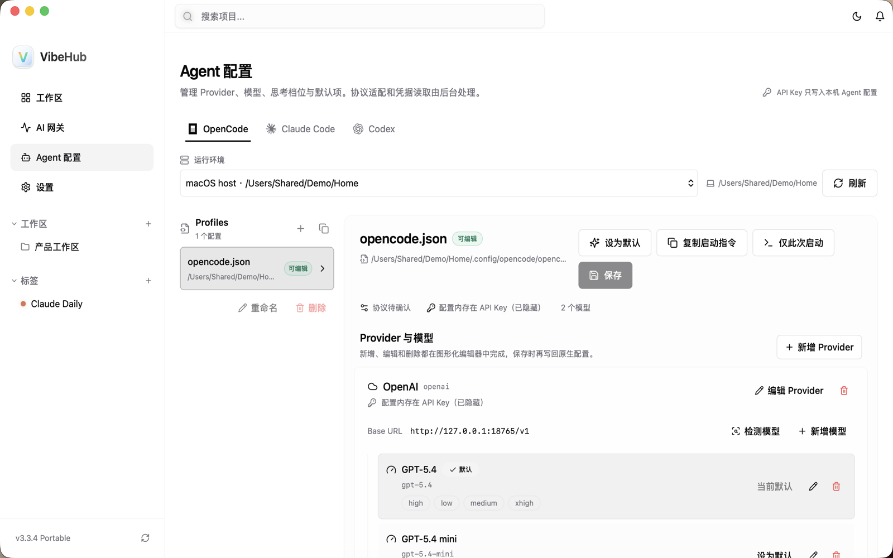

# VibeHub 3.3.4

## 用户可见变化

- Agent 配置页补齐 Claude Code 的子 Agent、小/快模型、模型别名、能力声明和 prompt caching 选项；未设置高级项时清晰回落到主模型。
- Task 列表、归档查询和 Git 双向溯源提供一致的 CLI/MCP 查询契约，支持从 commit hash 反查关联 Task，并明确区分历史缺失的 Git 证据。
- Workspace revision 冲突、Task/Session/Projection 完成真值和 Claude fallback/capability UI 的验证门禁已纳入发布候选。

## 验证边界

当前候选已通过前端构建、V3 contracts、MCP、Rust workspace 测试、CLI 构建和 macOS strict ad-hoc codesign。Windows 原生启动器、文件锁、升级/回滚与卸载验收仍需在真实 Windows 10/11 环境完成；CI 构建不替代该手测。

**Full Changelog**: https://github.com/ChenM0M/VibeHub/compare/v3.3.3...v3.3.4
