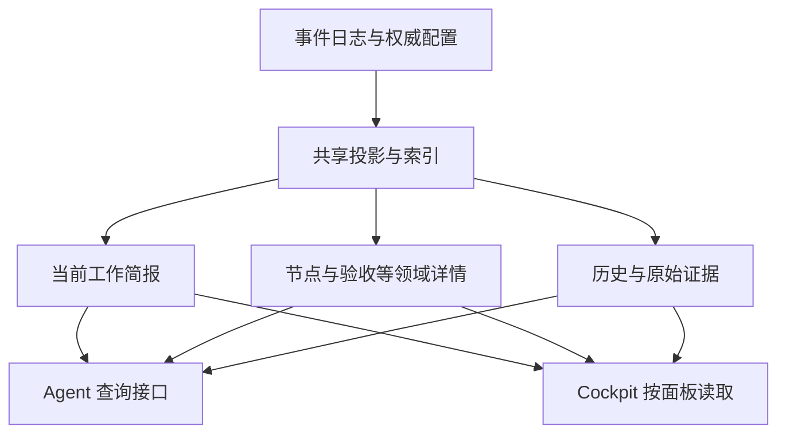

# V3 Agent 原生交互与渐进式读取重设计

- 文档版本：0.2
- 建立日期：2026-09-26
- 最近更新：2026-09-26；B0–B4 实现和本机验收持续更新于第 14 节
- 状态：v0.2 设计基线不变；产品实现已落地，验收部分通过，尚未达到发布门禁
- 适用范围：V3 MCP、Agent 引导、任务查询服务，以及 Cockpit 共用的读取链路
- 后续实施入口：第 12 节的分批计划；验收入口：第 11 节

## 1. 本次更新的工作约定

用户在当前受信交互中明确要求：先形成完整设计文档，后续围绕本文完成更新，**暂时不使用 VibeHub 流程**。

这一约定仅适用于本文所述更新：

- 不为本次更新创建、绑定或推进 VibeHub Task / Plan / Session，不以其事件作为本次实施的前置条件。
- 本文的实施表、代码差异、测试记录和用户确认承担本次协作的跟踪作用；不得伪造已完成状态或事后补造 V3 工作流历史。
- 不改写 `AGENTS.md` 以永久关闭项目规则，也不借此放宽产品内部的权限、绑定、证据、验收或完成确认校验。
- 不把本约定推广到其他任务；是否恢复本次工作的 VibeHub 跟踪，由后续用户指示决定。
- 提交身份、发布验证、原生平台验收及构建产物清理等非工作流约束继续适用。本文不构成 push、tag 或发布授权。

本文定义的是目标行为。除明确标为“已观察”的证据外，接口名称、示例和预算均为拟议契约，不代表当前已存在的能力。

## 2. 更新要解决的核心问题

Agent 为理解和操作 VibeHub 消耗了过多上下文与工具往返，主要表现为：

1. 一次状态读取返回大量与当前决策无关的信息，关键内容容易淹没或被宿主截断。
2. 工具 Schema、公共引导、下一步建议和运行时校验不完全一致，照着提示调用仍可能失败。
3. 失败后缺少可直接采用的恢复信息，Agent 需要猜参数、重复查询，甚至阅读实现源码。
4. 工作流机械步骤和身份字段占用了本应用于理解需求、实施与验证的注意力。
5. 桌面视图与 Agent 视图共用大包读取，导致上下文成本和后端计算成本一起增长。

本次更新的目标是：**Agent 在每个阶段只读取足够决策的信息，清楚知道下一步属于哪一种工作，并能以合法、可恢复、可审计的方式推进。**

### 2.1 范围

包含：

- 默认工具目录、工具描述和 Agent Specification 的协调更新。
- 任务简报、按需详情、证据展开、分页、版本探测和输出预算。
- 输入 Schema、动作建议、错误恢复、上下文句柄和跨调用幂等。
- 保留底层 typed commands 的上层组合操作。
- Cockpit 分区刷新与增量读取。
- 兼容迁移、自动化行为测试、真实宿主体验评估和性能测量。

不包含：

- 重写事件存储引擎或改变既有事件的事实含义。
- 借本次更新实现网关、Agent Profiles 编辑器或项目扫描的其他优化。
- 自动把验收标为通过、自动推断用户同意、根据相似任务静默绑定写入目标。
- 强制引入额外模型服务来解释工具参数或生成权威状态摘要。
- 把所有客户端迁移到依赖某个宿主专属功能的协议。

## 3. 已观察的基线与问题证据

基线来自 2026-09-26 对当时工作树、连接中的 MCP 和当前任务的一次审查。后续 B0 必须记录准确 commit、工作树状态、服务端二进制及宿主版本后复测；不得把本节当作完整性能基准。

| ID | 已观察事实 | 影响与证据 |
| --- | --- | --- |
| F01 | 当前任务 view bundle 序列化后约 688,200 UTF-8 字节；递归统计 `evidence_refs` 共 1,074 次引用、275 个唯一标识 | 单个真实样本，非所有任务的平均值，也不是 token 数；见 `views.rs` 的 `load_bundle_for_node`、`evidence_refs` |
| F02 | `task_view` 输入只有任务与可选节点，没有分区、详细度或预算选择；直接返回整包桌面视图 | 默认入口无法选择小响应；见 `mcp.rs::TaskViewRead`、`task_view` |
| F03 | Cockpit 在可见时每 4 秒请求整包；已有隐藏暂停和防重入 | 防止重叠并未避免未变化数据的重复构造与传输；见 `V3Cockpit.tsx` 的后台刷新 effect |
| F04 | 实际 `v3_next_action` 返回 `tool: null` 和“在计划图中补充 blocker details…” | 合法的阻塞状态没有转化为明确的工作、补证据、提问或等待协议 |
| F05 | `gate_next_tool` 把 `passed\|failed\|blocked` 放入 `params.outcome`；若干分支缺少目标工具必需字段 | 提示模板被当作可调用参数；下一步无法直接通过输入契约 |
| F06 | `infer_tool_from_text` 从自然语言 `copy_text` 搜索工具名 | 文案和语言变化会影响动作推断；应由领域状态生成 typed action |
| F07 | `task_route.trigger` 对外为字符串；错误只说不支持，没有合法值 | 实际传入 `new_execution_request` 失败；合法枚举包含 `new_execution`，应由 Schema 公开 |
| F08 | 部分写入作用域的 `session_id` / `binding_revision` 在 Schema 中可选，运行时要求存在 | 静态输入形状与条件前置约束缺少清晰衔接 |
| F09 | 当前环境暴露 31 个工具，说明合计约 51,302 字符，每个均出现公共流程引导 | 这是宿主最终暴露的元数据，含公共说明与调用签名；不能全部归因于服务端原始文案，也不能当作每轮实际 token 消耗 |
| F10 | `v3_next_action` 和单资源读取先加载整包，再选取输出 | 返回变小不等于底层计算变小；需要独立查询路径 |
| F11 | 自动幂等键使用新 UUID；一次内部版本重试复用该键，但另一次客户端重试会生成新键 | 不能据此保证“提交成功但响应丢失”后的跨调用去重 |
| F12 | 已有归档分页、Memory token budget、SQLite 索引及增量投影 | 应复用已有基础；本次不是从零实现分页或索引 |

源码入口：

- [MCP 工具、Schema、引导与下一步](../../crates/vibehub-cli/src/mcp.rs)
- [视图构造与证据引用](../../crates/vibehub-core/src/v3/views.rs)
- [Session–Task 路由](../../crates/vibehub-core/src/v3/routing.rs)
- [事件存储](../../crates/vibehub-core/src/v3/event_store.rs)与[索引](../../crates/vibehub-core/src/v3/indexed_store.rs)
- [Cockpit](../../src/v3/app/V3Cockpit.tsx)、[前端 store](../../src/v3/stores/v3Store.ts)、[生产读取接口](../../src/services/v3ProductionViews.ts)
- [MCP 契约检查](../../scripts/v3-mcp/contract-test.mjs)

证据限制：当前没有足以证明“所有调用都很慢”或“多数调用失败”的统计。本次要把这些用户体验问题转化为可重复测量的指标，而不是仅凭单次样本推断总体比例。

## 4. 设计原则与不可破坏的约束

### 4.1 默认提供当前工作的必要上下文，详情显式展开

默认组合返回当前目标、节点、范围、必要约束、关联验收标准、关键阻塞和下一步，形成足以继续当前工作的上下文。不能只返回名称和计数，再要求 Agent 连续查询多个分区才能开工。历史事件、全部证据、项目结构和其他节点按需展开。

摘要由权威投影确定性生成；不使用 LLM 总结替代生命周期、权限、验收状态或冲突事实。历史文本、用户文件、Memory 和证据正文始终作为不受信数据返回，不成为服务端指令。

### 4.2 指引必须区分“可以调用”与“还需做事”

可调用动作必须包含完整合法参数。尚需实施、真实验证、用户决策或外部条件时，返回相应类型，不伪造一个可以推进状态的动作。

### 4.3 严格校验留在服务端

保留任务归属、绑定 revision、乐观并发、DAG 依赖、证据要求、完成门禁和用户确认。减少 Agent 携带的字段，不等于放宽检查。

### 4.4 不把全部业务压进一个字符串命令

可以提供少量语义组合操作，但参数必须是有辨别字段的 typed union。禁止设计 `execute(command: string)`、任意 JSON patch 或让 Agent 生成内部事件类型来代替契约。

### 4.5 以完整交互成本验收

同时衡量工具目录、输出、往返、无效调用、错误恢复和后端工作量。字节数与模型 token 分别测量；兼容性说明与真实宿主执行证据分别记录。

### 4.6 已确认的架构选择：分层读模型与定向组合

2026-09-26 用户确认采用以下方向，后续实现以此为架构基线：

> 保留现有事实存储，重构用途明确的读取投影；默认提供当前工作的完整必要上下文，支持直接定位与有界展开；全量导出作为诊断能力保留。

| 方案 | 定位 | 实施要求 |
| --- | --- | --- |
| 先构造完整 bundle，再裁剪或总结 | 仅可作为显式标记的短期兼容适配 | 不能以此宣称分层读取已完成，也不能作为新查询的最终路径 |
| concise/full 两档 | 支持旧消费者迁移的过渡形式 | 不作为新接口的主要信息结构；full 必须明确作用域与预算 |
| 分层读模型、直接定位、定向组合 | 本次更新的目标架构 | Agent 和 Cockpit 复用事实与查询服务，按用途取得数据 |



写入侧继续负责验证与事实一致性；读取侧使用适合当前用途的数据结构。可以共用现有数据库，不要求引入第二套数据库、消息系统或额外模型服务。读取投影可重建，不能演变为另一份独立维护的业务真相。

层次限定为以下三种信息深度：

| 信息层 | 内容 | 典型请求 |
| --- | --- | --- |
| 当前工作简报 | 当前节点目标、约束、必要验收、相关阻塞与下一步 | 恢复已有 Session 并继续实现 |
| 领域详情 | 指定 Task、Node、Criterion、Finding 或 Session 的完整结构及必要关联摘要 | 查看某个失败 criterion 的结果及证据摘要 |
| 原始证据 | 原始事件、测试输出、日志片段与来源信息 | 核验一次失败或调查历史原因 |

三层表示信息深度，不是强制导航顺序。已知实体 ID 时允许直接查询对应层；服务端始终校验作用域。禁止要求 Agent 依次展开项目、任务、计划、节点后才允许读取已知 evidence，也不因直接定位跳过权限检查。

优化目标是完成一个有效决策的总成本。高频共同使用的信息适度组合，低频大正文按需获取；不得以极小响应换取大量机械往返。

## 5. 目标交互模型

### 5.1 典型路径

```text
读取 workspace_context
  ├─ 只读讨论 → 获得项目/任务定位 → 按需 task_brief / task_inspect
  ├─ 目标不明 → 返回有界候选和具体问题 → 明确目标
  └─ 已有明确执行目标 → task_brief → 显式 task_start
        → 实施/验证 → task_record / criterion_review
        → session_finish
        → 满足门禁后提出完成 → 用户明确确认后完成
```

从已有绑定恢复工作，正常情况下只需一次小上下文读取。首次启动执行时，发现、选择与写入边界保持明确，不能为了少一次调用静默选择 Task。

下一步必须以当前 Session 和目标节点为作用域。其他节点的阻塞作为相关信息展示，不能仅取项目中第一条 blocker 就抢占当前可执行工作；共享阻塞及依赖阻塞仍必须阻止受影响操作。

### 5.2 拟议常用接口

以下是设计名称。B0 冻结准确输入/输出契约；初期按新增接口迁移，不直接改变旧接口形状。

| 接口 | 职责 | 默认输出与限制 |
| --- | --- | --- |
| `workspace_context` | 返回绑定项目、可用能力、当前 Session/任务定位或少量候选 | 已有明确有效绑定时直接组合当前工作简报，避免再调 task_brief；只读、不创建领域 Session、不自动绑定 |
| `task_brief` | 为明确任务或节点返回当前工作所需的上下文 | 一次组合目标、范围、关联验收、有效约束、关键阻塞和 typed next step；不强制先调用 workspace_context |
| `task_inspect` | 定位领域详情或原始证据，查询指定分区 | 指定分区或已知实体 ID；可显式携带少量关联摘要；固定过滤与排序，有预算与游标，禁止默认 all |
| `task_start` | 对明确 Task/Node 执行受校验的绑定和开始操作 | 返回上下文句柄与实际状态；不能创建占位节点绕过计划要求 |
| `task_record` | 提交 progress / risk 等日常事实 | 初期只覆盖明确的高频变体；返回新增记录 ID 与小回执 |
| `session_finish` | 受校验地提交本次结果并关闭 Session | 可恢复组合操作；不自动把任务或 criterion 判为通过 |
| 既有 typed 写入 | 计划变更、criterion review、finding、recovery、完成确认等 | 第一阶段保留；后续按真实使用评估目录归组 |

不要同时实现所有新接口。B1/B2 先通过新增简报和修复既有工具获得收益，B3 再引入状态句柄与组合操作。

### 5.3 工具目录和公共引导

首个兼容版本保留既有目录，新增入口并缩短说明。后续提供显式的 `agent` 与 `advanced/legacy` 目录配置：

- `agent` 目录目标不超过 12 个常用入口；最终集合由 B4 真实路径评估确定，不能把基本恢复能力藏掉。
- 高级目录保留细粒度操作；普通目录至少能明确告诉 Agent 如何进入所需能力，不能建议调用未暴露的工具。
- 目录配置在连接建立时固定。核心流程不依赖运行中动态增删工具；必要时明确要求重连。
- 公共引导只描述入口、数据展开原则和不可推断的权限边界。单工具说明描述用途、真实必需参数及副作用，不复制完整工作流教程。
- 简单枚举使用 Schema `enum`，互斥变体使用受支持的辨别结构；同时验证目标宿主实际能处理的 Schema 子集。
- 不假定宿主只注入一次 server instructions；分别测量原始目录和宿主最终暴露的目录。
- AGENTS/CLAUDE、renderer、MCP instructions 和工具描述在切换入口的同一批次更新，不能继续强制“先读取完整 task_view”。

## 6. 读取契约与渐进式数据

### 6.1 新读取响应的公共信封

新增读取接口使用独立的交互契约版本，初始拟为 `agent-read/1`；不改变旧 V3 view schema version。

```json
{
  "contract_version": "agent-read/1",
  "ok": true,
  "scope": { "project_id": "project.example", "task_id": "task.example" },
  "revision": "opaque-read-revision",
  "freshness": "fresh",
  "completeness": "partial",
  "data": { "title": "示例任务", "state": "active" },
  "expansions": [
    { "section": "criteria", "count": 4 },
    { "section": "evidence", "count": 30 }
  ],
  "budget": { "limit_bytes": 16384, "truncated": true, "omitted_sections": ["evidence"] },
  "next_step": { "kind": "work_required", "summary": "完成当前节点实现与验证" }
}
```

示例只展示信封结构，正式 Schema 要定义各接口的必需字段及互斥状态。`scope` 中不存在的实体不填空字符串；`unchanged` 响应不携带 `data`。

输入使用 `max_bytes` 作为跨模型硬预算，默认 16 KiB；服务器设置最大允许值，首版建议 64 KiB。token budget 可以作为宿主适配提示，不能用无 tokenizer 的估算声称精确 token 上限。

当预算不足以容纳最小安全简报时，返回有界的 `OUTPUT_BUDGET_TOO_SMALL` 与所需最小预算。不能为满足预算而省略影响授权、目标、有效约束或动作合法性的事实。

如果最小上下文本身超过服务器最大预算，返回分块读取的 prerequisite 清单，并保持 `context_complete: false`；全部必需分块读取完成且 revision 一致前，不输出依赖这些内容的可执行写入建议。不能建议一个超过服务器允许上限的重试预算。

### 6.2 简报内容优先级

简报是由权威数据组合出的工作上下文，不是对完整 JSON 进行文字压缩。按以下顺序组织：

1. 确切项目、任务、节点和绑定状态；状态新鲜度及冲突。
2. 当前目标、范围边界、effective policy 和当前阶段所需约束。
3. 影响当前工作的阻塞、必要验收标准和仍缺的事实。
4. typed next step。
5. 最近的相关变化摘要与可展开入口。

候选默认最多 5 个；列表不嵌入完整 intent 和全部 criteria。长目标、长约束不能静默截断：必须保留“尚未读取完整约束”的标志，并将相关写入建议标为不可直接执行，要求展开指定内容。

候选列表与已选中任务简报是不同结构。前者用于选择，后者必须足以支持当前工作；不能把候选的精简规则套到已选中任务，导致必要验收和约束缺失。恢复已有有效绑定时，workspace_context 直接组合该简报；已知目标时 task_brief 可以直接读取。

同一预算内优先完整提供当前节点相关内容，其他节点仅给必要的依赖/阻塞摘要。省略未关联的历史不应导致 `context_complete: false`；该字段只表达当前决策必需上下文是否齐全，与整个任务是否已全部展开区分。

### 6.3 分区读取

`task_inspect.section` 至少考虑以下枚举：`plan`、`criteria`、`blockers`、`sessions`、`results`、`timeline`、`evidence`。项目架构作为独立项目分区或接口，不因读取任务自动加载。

输入采用两个明确变体：按分区查询，或按实体 ID 定位。分区查询一次选择一个枚举分区；实体查询可直接指定 node、criterion、finding、session、event 或 evidence ID，不要求先逐级浏览。

实体查询允许通过固定 `include` 枚举附带必要关联摘要，例如 criterion 的验证结果与证据标签。组合范围在 B0 按高频工作冻结，共享同一快照和总预算；不允许任意关系递归、无限嵌套或 `include=all`。集合形式的关联同样必须有上限与独立续页定位。

过滤和检索在服务端完成，至少支持作用域、状态、事件种类、时间/序号范围及稳定排序。例如直接请求“当前节点未通过的 criteria”或“指定 Session 的失败事件”，不要求先拉全量再由 Agent 筛选。需要文本检索时使用有界查询并返回命中位置与邻近上下文，不暴露任意 SQL 或内部字段表达式。

列表同时受条数和字节预算限制；达到任一限制就返回 `next_cursor`、省略原因和数量信息。限制单条事件的内嵌正文，长正文单独分块读取；单条记录过大不能造成游标永不前进。

### 6.4 证据按标识引用

简报和列表使用 `evidence_ids`，同一响应需要显示标签时只附一个小型去重字典。证据展开返回类型、等级、来源、采集时间及有界摘要；原始正文另行请求。

去重不等于只返回无语义的 UUID。需要 Agent 判断是否展开时，引用字典提供短标签、来源等级、相关状态和可展开标志；例如 `evidence.test-42` 对应“节点详情竞态回归测试”、`outcome=failed`。只有来源确实提供结果时才填写 outcome，不能根据标签推断通过或失败。正文和大段元数据仍只保存/读取一次。

必须保留既有 `hard_observed` / `agent_reported` 等等级和来源语义。重复 ID 的去重不得丢弃不同版本或冲突信息。证据展开验证项目、Task 和可见范围，不允许通过任意文件路径越界读取。

旧 `evidence_refs` 保持兼容；新契约使用独立投影或适配器，不能为了减少 MCP 输出破坏旧桌面消费者。

### 6.5 游标、版本与一致性

- cursor 是不透明值，绑定作用域、分区、过滤条件、排序及快照 revision。
- timeline 优先以事件序号实现稳定顺序；跨页必须保持同一快照或明确返回 `CURSOR_STALE`，不能静默跳项或重复。
- 简报 revision 覆盖实际读取依赖：任务/计划/绑定/有效策略，以及影响上下文的 Memory、设置等版本。不能只用事件计数忽略其他来源变化。
- `generated_at` 不参与内容变化判定；相同语义内容不能因时间戳变化触发刷新。
- 支持 `if_revision`：未变则返回小型 `unchanged` 回执，前端保持原对象引用。
- 重建中、同步失败或外部变化未核实必须显式标记。可供展示的旧数据不能被当成有效的写入前置版本。

### 6.6 底层查询与 Cockpit

新增面向用途的查询服务：任务简报、节点状态、分区详情、版本探测。共享领域 fold 和 validator，避免 MCP 与桌面各自推导事实；读取单个分区不能先构造六视图 bundle。

Task、Node、Criterion、Finding、Session 和 Evidence 通过稳定身份关联。底层事实与实体索引去重，读取服务根据用途适度组合成 DTO；不把嵌套大 JSON 当作新的持久化中心。详细查询必须能直接定位，不以全任务加载作为实现捷径。

复用现有 SQLite 索引与增量投影。缓存键包含项目身份、查询作用域、相关版本和可见性；Memory 还需包含 principal/scope。服务重启后可从事实重建，缓存不能成为新的权威状态。

B2 即交付不依赖完整 bundle 的简报与实体查询路径；B4 再根据测量对高频昂贵读取增加物化投影或缓存，并接入桌面增量刷新。低频详情可按需计算。每个新增缓存或物化投影必须说明依赖版本、失效策略、重建方式和实测收益，避免为了分层而提前建立大量同步副本。

Cockpit 保留可见性暂停、防重入和请求上下文保护，改为：小版本探测 → 仅刷新受影响的可见面板 → 后台页保持惰性。写入成功可携带失效分区；其他进程的写入通过版本探测发现。通知/订阅可作为增强，轮询仍可独立工作。

不把“把 4 秒改为 30 秒”作为主要优化。须测量未变化刷新中的事件读取数、fold 次数、序列化字节和前端更新次数。

### 6.7 完整信息与诊断导出

“完整”必须指定实体或作用域：完整节点、完整 criterion、指定 Session 的历史，或某份证据正文。它仍受单次预算约束，大内容通过稳定游标/分块可完整到达，不能触发全项目展开。

任务/项目全量导出保留为显式诊断能力。大结果写入本地导出文件或资源，工具返回有界清单、作用域、快照 revision、文件大小、内容摘要/hash 和读取方式，不自动将正文注入模型。导出不得绕过可见范围或包含凭据；声明完整的范围必须可核验，排除项必须列明。

不支持资源读取的宿主有普通工具分块 fallback。导出产物应明确保存位置、有效期和清理方式；生成导出不推进业务状态。诊断需要全量时可以取得，日常执行不应把全量导出当作默认恢复入口。

## 7. 可执行的下一步协议

`next_step` 使用辨别字段 `kind`，不得出现没有说明原因的 `tool: null`。

| kind | 必需语义 | 不允许的行为 |
| --- | --- | --- |
| `tool_call` | 当前有权限且前置条件满足的工具名、完整参数、作用域、预期版本和有效期/失效条件 | 占位值、缺必需字段、调用当前目录未暴露工具 |
| `work_required` | 要做的实际工作、范围、所需输入及验收要求 | 为推进流程自动标 completed/passed |
| `evidence_required` | 缺少的证据类别、关联 criterion/finding、可采用的验证方法 | 编造命令结果或自动推断验证成功 |
| `input_required` | 具体问题、原因、可选项，以及继续所需的明确输入 | 把等待超时当成同意 |
| `wait_external` | 外部依赖、恢复条件、建议再次检查方式 | 无变化持续重试写入 |
| `done` | 当前工作范围的真实终态和可选后续入口 | 把 Session 结束等同于任务已完成 |

生成流程必须是：权威投影 + Session 作用域 → 领域状态判断 → typed next step → 目标工具 Schema 校验。自然语言说明是结构化决策的渲染结果。

### 7.1 特殊情况

- 未绑定：只读查询可继续；需要写入时先明确目标并返回绑定/开始入口。
- 当前节点尚未实施：返回 `work_required`，不因为完成门禁首先列出 criteria 就建议提前 review。
- 需要验收但证据不足：返回 `evidence_required`；取得真实结果后再选择 passed/failed/blocked。
- 历史节点阻塞：判断是否影响当前节点或最终完成，分别展示，不能无条件抢占当前动作。
- 版本变化：旧动作失效，返回刷新后重新决策的路径，禁止盲目自动换版本执行语义敏感写入。
- 用户完成确认：已有 proposal 不等于已确认。只有现有受信交互约束满足后才可执行完成动作；Agent 填一个 `confirmed_by` 字符串不能创造授权。
- 无法判定：返回具体缺失信息或诊断入口，禁止以 `done` 或含糊的空动作结束。

动作建议不是权限凭证；真正执行时重新校验。过期建议应造成有界、可恢复的失败，不得造成状态损坏。

## 8. 输入 Schema 与错误恢复

### 8.1 输入契约

- `trigger`、`source`、`state`、`outcome`、`kind` 等离散字段必须公开合法枚举。
- 高频 `details: Value` 逐步替换为领域 payload 类型；保留扩展区时明确其不参与哪些权限/状态判断。
- 必需作用域通过显式字段或上下文句柄表达；互斥输入使用清晰变体，禁止两个不同目标同时出现后静默任选。
- 服务端校验与 Schema 尽可能来自同一组 Rust 类型；无法静态表达的状态前置条件由简报和错误明确返回。
- 新接口对未知字段作明确校验，旧接口的兼容策略单独定义，不能无意破坏旧客户端。

### 8.2 错误契约

新错误信封包含稳定 code、字段级信息、状态是否已改变、是否适合原样重试，以及恢复类型。概念示例：

```json
{
  "ok": false,
  "error": {
    "code": "V3_TASK_ROUTE_TRIGGER_INVALID",
    "category": "validation",
    "field": "trigger",
    "received": "new_execution_request",
    "allowed_values": ["ordinary_continuation", "explicit_task", "explicit_switch", "new_execution", "binding_invalid", "binding_stale", "scope_conflict", "ambiguous_candidate"],
    "state_changed": false,
    "retryable": false,
    "recovery": { "kind": "correct_input", "field": "trigger" }
  }
}
```

`retryable` 仅表示原请求适合重试；需要修正输入不等于可原样重试。`state_changed` 为 `true/false/unknown`，不能在提交结果未知时谎称未改变。秘密字段的 received 值必须脱敏。

| 场景 | 恢复要求 |
| --- | --- |
| 参数错误 | 返回字段、合法值或缺失字段；一次局部修正即可重新提交 |
| 绑定缺失 | 返回定位/显式绑定入口，不自动选择 current/UI task |
| 绑定或版本过期 | 返回受影响实体和 refresh 路径；先读新状态再决定是否重提 |
| 依赖未满足 | 返回阻塞节点/criteria ID 和原因，避免要求重读整包 |
| cursor 过期 | 返回重新读取该分区的参数，避免重新获取全部上下文 |
| 权限或确认不足 | 返回 `input_required`，说明所需授权；不能提供绕过动作 |
| 暂时性错误 | 在预算内给出退避和同 request ID 重试方式 |
| 提交结果未知 | 根据 operation/request ID 查询提交状态，禁止改键重新提交 |

恢复路径也必须通过 Schema 校验。仅附一段“请修复”文案不能视为恢复设计完成。

## 9. 上下文句柄、幂等和组合操作

### 9.1 上下文句柄

显式绑定成功后，服务端返回不透明 `context_handle`，关联 project、task、session、binding revision、actor 来源及可选 node。只读 workspace context 可返回单独的阅读定位信息，不伪造已打开的领域 Session。

- 句柄减少机械字段传递，不新增权限；每次写入仍验证当前绑定和操作资格。
- 句柄不能被跨项目、跨 Session 或跨不相容调用者复用；原始句柄不写入通用日志。
- 绑定变化、Session 结束或服务重启后失效；首版不要求持久化句柄。
- 恢复通过明确 Session 身份重新读取并验证绑定；若宿主不能提供可靠身份，则显式选择，不猜测最近会话。
- 调用者还显式提供 scope 时，必须与句柄一致，否则拒绝。
- 目录、Schema 及错误不能宣称“省略所有作用域”，而在重连后要求 Agent 猜回旧字段。

### 9.2 跨调用幂等

新写入使用调用者稳定保留的 `request_id`，或服务端提前返回、客户端重试时原样携带的操作 ID。MCP JSON-RPC request ID 不自动等价于跨调用业务幂等键。

服务端保存请求 ID、规范化 payload 摘要、作用域及完成回执。同一 ID/同一 payload 返回原结果；同一 ID/不同 payload 返回 `IDEMPOTENCY_PAYLOAD_CONFLICT`。服务重启后仍能识别已提交请求；保存期限与事件的幂等能力一致并公开。

对于单调用内的安全重试可以保持现有机制，但不能把自动生成新 UUID 宣称为完整的客户端重试去重。

### 9.3 组合操作语义

`task_start` 可组合显式绑定、合法节点激活和 Session 打开；前置依赖与必要计划必须已满足，不自动生成虚假计划。

`session_finish` 可组合 terminal AgentResult 和 Session 关闭。是否完成节点必须显式表达并满足真实验收，不包含自动 criterion pass、task confirmation 或最终归档。

首版采用**可恢复的多步骤操作**，除非底层已实现并验证事务，否则不宣称原子性：

1. 校验请求与已知前置条件，登记稳定 operation ID。
2. 每个内部步骤派生稳定幂等键并继续使用原 validator。
3. 回执明确 `completed_steps`、`pending_steps` 和失败位置。
4. 进程中断后按原 operation ID 恢复；已提交事实不被静默撤销。
5. 部分成功不返回总成功，也不自动补造结果或用户确认。

组合操作完成后仅返回变化、真实状态、revision 和下一步。失败按第 8 节返回恢复信息。

## 10. 兼容迁移与回滚

### 10.1 新旧读取并存

先新增 `workspace_context` / `task_brief` / `task_inspect`，保留旧 `task_view` 和 versioned resources 的形状。公共引导优先使用新入口；旧入口明确标为完整诊断视图。

通过版本/能力字段判断新接口是否可用。旧客户端继续使用原路径，不通过静默改变 `task_view` 返回结构来强迫迁移。

`v3_next_action` 也采用兼容演进：先新增 typed `next_step`，旧 `next_action` 保留为过渡字段。只有 `next_step.kind=tool_call` 时，旧字段才映射完整合法的工具与参数；其他类型给出明确状态与说明，不再把占位参数包装成可执行建议。旧的“始终照 next_action 调用”公共引导必须同步撤换，并测试旧宿主能安全识别不可执行状态。若旧消费者无法兼容，使用新版本入口，不能静默改变其解释。

### 10.2 不改变事件事实

首轮不做事件格式迁移。新读模型依赖既有事实与可重建索引。新组合操作仅生成 validator 支持的事实；如新增操作日志，必须定义兼容读取、恢复和保留策略。

### 10.3 宿主降级

基础流程只要求普通 tools/list、tools/call、结构化 JSON 与 stdio。resources、通知、动态工具列表和 elicitation 均为可选增强。

证据展开提供 tool fallback；不能假定所有宿主会自动跟随 resource URI。`content` 与 `structuredContent` 按实际 SDK/宿主兼容需求保留，但要测量最终进入模型的重复表示；不能为减字节单方面删除宿主依赖的协议字段。

### 10.4 回滚边界

- 新目录/新读取可通过明确配置切回 legacy；既有客户端可继续读取同一领域事实。
- 关闭新 facade 后，不删除已产生的合法事件或未完成组合操作日志；须提供恢复入口。
- 回滚到不认识新操作日志的二进制前，先确认没有待恢复操作，或提供向前兼容恢复工具。
- 回滚前后验证项目作用域、任务状态、binding 和证据不丢失。

## 11. 验收标准与测量方法

以下为验收目标；逐项实际状态见第 14.8 节，不能把目标表当作通过记录。预算变更须记录实际基线、原因和影响，不可因实现困难直接删除门禁。

### 11.1 验收矩阵

| ID | 验收要求 | 证据与通过条件 |
| --- | --- | --- |
| AC01 | 默认输出有界 | 新简报及 workspace context 的结果 JSON ≤16 KiB；普通写入成功回执 ≤2 KiB；预算不足显式报错，不隐藏安全约束 |
| AC02 | 渐进读取可完整到达 | 按页遍历与全量事实对照一致，无静默丢失；证据 ID 可解析且不可越界；单项超预算仍可分块到达 |
| AC03 | 下一步真正可用 | 所有 `tool_call` 建议通过目标 Schema，且在同一状态的隔离 fixture 中通过领域前置校验；无占位值、无无解释空工具 |
| AC04 | 工作与状态推进分离 | 缺实施/验证/确认时返回正确 kind；不得自动 review passed、完成节点或归档 |
| AC05 | 输入与错误可恢复 | 全部公共枚举暴露合法值；固定参数错误场景一次局部修正即可恢复；绑定/版本冲突通过一次有界刷新获得新决策 |
| AC06 | 身份和幂等保持严格 | 跨项目/Session/过期句柄被拒绝；响应丢失、进程重启、重复重试不产生重复业务事实；不同 payload 同键被拒绝 |
| AC07 | 组合操作中断可恢复 | 每个内部提交点注入崩溃/IO失败；恢复后状态等价于一次合法完成，不重复、不跳门禁 |
| AC08 | 增量读取实际减负 | 未变化读取不构造完整 bundle、不扫描任务全历史；`unchanged` 回执 ≤1 KiB；后台未变化刷新不发布新 bundle |
| AC09 | 新旧结果一致 | 对同一快照，新摘要/详情与旧视图在状态、policy、criteria、binding、blocker 上语义一致 |
| AC10 | 引导和目录一致 | 新模式的 instructions/AGENTS/CLAUDE 不强制整包读取；建议的工具均在实际目录可用；常用目录目标 ≤12 个，功能不能因此不可达 |
| AC11 | 跨宿主真实闭环 | 每个声明支持的宿主用记录版本执行恢复、读取、写入、错误修复和收尾；无法实测标记 blocked/not tested，不用 raw stdio 冒充 |
| AC12 | 上下文与调用收益 | 固定场景集相对 B0 的工具输出总字节至少减少 70%；记录实际 tokenizer token、往返和无效调用；不得通过省略必要工作达到指标 |
| AC13 | 原生边界明确 | CLI/MCP/stdin关闭/重启及本次涉及的平台 IO 在目标平台验证；Windows 原生发布验收继续使用精确 Release artifact/hash |
| AC14 | 回滚和安全数据处理 | legacy 模式可用；未完成操作有恢复路径；错误、简报、日志不泄漏凭据，Memory/证据不被当作指令执行 |
| AC15 | 当前工作上下文充分且无机械往返 | 固定常规恢复场景在预算内，一次 workspace_context 或直接 task_brief 即包含目标、范围、关联验收、有效约束、关键阻塞和下一步；不需逐项补查才能开始当前工作；长约束例外显式标识 |
| AC16 | 分层查询直接可达且按需计算 | 已知合法实体 ID 可一次定位，必要关联摘要可有界组合；分区过滤结果与权威事实一致；新简报/实体查询路径完整 bundle 构造次数为 0，读取单份证据不扫描全任务历史 |
| AC17 | 全量诊断不挤占日常上下文 | 指定快照的导出与声明范围事实一致，排除项明确；工具回执仍有界，正文可按需完整读取；资源不可用时 fallback 可用，保存/清理规则明确 |

### 11.2 固定场景集

至少覆盖：

1. 已绑定 Session 的普通继续；无任何变化的连续读取。
2. 只读讨论；无任务；多候选；中文意图；明确任务 ID；项目/Session 不匹配。
3. lightweight、standard、full 三种 policy；当前节点与其他阻塞节点并存。
4. planned → ready/active → 实施 → 验证 → review → Session 收尾 → 待用户确认。
5. 未满足依赖、缺证据、验证失败、finding 未闭环、缺用户确认。
6. 错误枚举、缺参数、binding 过期、版本冲突、cursor 过期。
7. 同任务两个 Session 并发写入、任务切换、节点切换、后台刷新迟到。
8. 提交成功但响应丢失；服务重启；组合操作各步骤中断。
9. 大量历史、长单条事件、重复证据、超过一页的 criteria 和 blocker。
10. settings/Memory 改变但任务事件计数未变；投影 stale/rebuilding/failed。
11. 已知 finding/criterion/evidence ID 的直接查询；无需先读项目或任务；非法或其他作用域 ID 被拒绝。
12. 当前工作简报与多个碎片化读取的对照；验证必要信息齐全，避免为追求小响应增加机械往返。
13. 按状态过滤、失败事件查询和带关联摘要的实体读取；含过多关联、大正文及预算耗尽的情况。
14. 指定快照的任务/项目诊断导出；导出期间事实变化；工具分块 fallback、排除项和产物清理。

数据规模至少包含：空/小任务、约 1,000 个事件、约 100,000 个项目事件，并区分“当前任务很大”和“其他任务历史很大”。fixture 需保持领域合法，不能用无法通过 validator 的随机数据证明正常路径性能。

### 11.3 指标口径

- `result_bytes`：工具结果的规范化 JSON UTF-8 字节；AC01/08 使用此口径。
- `wire_bytes`：完整 MCP 响应字节，单独统计协议包装与镜像 content。
- `model_visible_tokens`：已知宿主最终提供给模型的内容，用固定 tokenizer 测量；不可观测时标 unknown，不能拿 result_bytes 换算成精确值。
- `catalog_bytes/tokens`：tools/list 原始数据、公共引导和宿主扩展分别统计。
- `invalid_calls`：参数、绑定、顺序或建议错误造成的失败；真实业务阻塞与故障注入不算无效调用。
- `recovery_round_trips`：首次失败到得到有效下一步的新增调用数。
- `decision_round_trips`：从已知身份/目标到取得足以执行当前工作的必要上下文所需调用数；与恢复错误的调用数分开，避免把“拆得很细”误判为节省。
- `read_work`：文件/索引读取、事件解码、fold、bundle 构造次数与序列化量。
- `latency`：冷启动、首次投影同步、warm p50/p95 分别记录；固定环境、预热 5 次、测量至少 30 次。

warm 版本探测 p95 初始目标为本地基准环境 ≤100 ms，简报 ≤300 ms；B0 先确认硬件和数据条件，再冻结为性能门禁。该数值不能直接套到所有 CI runner 或作为现有性能结论。

完整交互记录只保存经脱敏的工具轨迹、参数类别、结果摘要及指标，不要求存储模型内部推理。公开报告不得包含真实用户凭据、私有正文或可复用句柄。

### 11.4 测试层次

- 单元：摘要选择、预算裁剪、引用去重、revision、错误映射和 next-step 判定。
- 契约：真实 tools/list Schema 与所有建议参数互相验证；新旧输出 schema 检查。
- 集成：直接调用服务，验证建议在未变化 fixture 中能执行；修改状态后验证安全失效。
- 故障：响应丢失、IO失败、进程中断、并发冲突和跨页变更。
- 端到端：Agent 只使用公开接口，从恢复到收尾；不得依赖阅读服务端源码补齐参数。
- 宿主：记录各宿主的真实目录注入、结构化结果呈现、资源展开、超时和重连行为。

真实 Agent 评估固定模型/版本、任务输入和允许操作，在隔离 fixture 上重复运行并报告样本数。确定性契约测试作为硬门禁，Agent 成功率用于验证交互设计，不宣称单次成功代表普遍可靠。

## 12. 分批实施计划

每批必须在继续下一批前记录：实际修改、验证命令与结果、未解决项、兼容影响。下表用于本次暂停 VibeHub 流程期间的跟踪，不代表产品工作流状态。

| 批次 | 工作与产物 | 依赖 | 退出条件 | 当前状态 |
| --- | --- | --- | --- | --- |
| B0 基线与契约冻结 | 记录源码/二进制/宿主版本；建立大任务 fixture 与指标脚本；冻结三层读取、必要工作上下文、实体组合/过滤、诊断导出、next-step、error schema 和能力发现 | 无 | F01–F12 复核，指标可复跑，契约评审记录齐全 | 完成：真实 B0 二进制、14 类交互对照和契约已冻结，见 14.13 |
| B1 调用正确性 | 公开 enum；修复 next-action 的空工具/占位参数；区分 work/evidence/input/wait；结构化错误与恢复；同步公共引导 | B0 | AC03–05 对既有入口通过；不破坏旧响应契约 | 实现与本机固定错误场景验证完成；宿主门禁另见 B4 |
| B2 分层读取与工作上下文 | 新增 workspace_context/task_brief/task_inspect 及专用查询路径；直接定位、服务端过滤、有界关联组合、预算、分页、证据展开和新旧适配 | B0、B1 | AC01–02、AC09、AC15–16 通过；新读取不构造完整 bundle；AC12 有第一轮对照数据 | 完成：两平台分层读取、三档 policy、scoped blocker 与必要上下文对照通过 |
| B3 作用域与组合操作 | context_handle、稳定 request ID、task_start/session_finish 与故障恢复 | B1、B2 | AC06–07、AC14 通过；任何部分成功可查询恢复 | 完成：macOS/Windows 恢复、幂等、原生 IO 与三个宿主重连通过 |
| B4 增量优化与桌面接入 | 依赖 revision、小探测与按面板刷新；按测量增加高频查询缓存/物化投影；诊断导出、目录精简和真实宿主评估 | B2；涉及句柄路径需 B3 | AC08、AC10–12、AC17 通过；延迟、后端工作量及决策调用数有对照 | 完成：缓存/目录/导出、真实宿主、14 类交互字节/token/调用门禁通过，见 14.13 |
| B5 兼容收口与发布准备 | 原生验证、迁移文档、回滚演练、支持矩阵；完整 CI/发布门禁 | B1–B4 | 全部必需验收有证据；未测平台明确阻塞，不宣称已通过 | 已完成授权范围内本地与 Windows 源码原生门禁；CI 配置已补齐。发布和精确 Release 安装包验收仍阻塞 |

优先交付 B1/B2，避免先进行大规模 facade 重写却迟迟无法改善当前调用体验。B2 必须完成分层查询的结构性改造，不能只做输出裁剪；B4 的性能深化与桌面接入可在 B2 契约稳定后提前实施，不必等待全部组合写入完成。

### 12.1 主要代码落点

| 区域 | 预期变化 |
| --- | --- |
| `crates/vibehub-core/src/v3/` | 增加用途明确的查询服务与 typed next-step；共享原有领域验证；逐步抽离 views.rs 中可复用逻辑 |
| `crates/vibehub-cli/src/mcp.rs` | Schema、错误和工具目录适配；只负责协议映射，不新增第二套领域状态机 |
| `contracts/v3/` 与生成类型 | 新增交互契约及 fixture；保持旧 schema 可用；生成流程检查漂移 |
| `src-tauri/src/commands.rs` | 暴露分区/版本读取，与 MCP 复用查询服务 |
| `src/services/v3ProductionViews.ts`、`src/v3/stores/v3Store.ts` | 新旧来源适配、分区缓存、revision 与迟到响应保护 |
| `src/v3/app/V3Cockpit.tsx` | 可见面板刷新、unchanged 不触发重新发布、分页展开 |
| `agent_specs.rs`、根 Agent 说明及 MCP instructions | 统一引导来源及新入口，不保留相互矛盾的启动流程 |
| `scripts/v3-mcp/`、契约/前端检查及 CI | 增加输出预算、建议可执行性、恢复路径与端到端场景检查 |

文件拆分服从接口边界，不以减少单文件行数作为本次验收目标。

## 13. 风险、取舍与待冻结事项

| 事项 | 默认方向 | 实施前需确认的依据 |
| --- | --- | --- |
| 摘要省略导致误判 | 关键约束不得静默省略；不足时要求展开 | 长约束 fixture 和 AC04/09 |
| 句柄降低跨宿主可携带性 | 句柄只作短期便利；保留显式 scope/recovery | 重启、跨客户端恢复测试 |
| 减工具数量损害能力可达性 | 先缩短说明与修正默认路径，再切换显式目录配置 | 实际高频调用分布与宿主能力 |
| 组合写入使失败更复杂 | 可恢复多步骤，公开部分成功 | 每个提交点故障注入 |
| 小响应但计算仍重 | 独立读取服务，统计 bundle/fold 次数 | AC08 与大历史基准 |
| 分层过细造成调用爆炸 | 三层信息深度、已知 ID 直达、当前工作一次组合 | AC15–16 与 decision_round_trips |
| 过度缓存造成多份真相 | 按实测增加可重建的投影/缓存，公开依赖与失效 | 同快照一致性、外部变更及重启测试 |
| 兼容层长期拖累维护 | 标记 legacy，明确升级说明，暂不设无证据移除日期 | 真实宿主迁移覆盖 |
| 控制面自举依赖 | 本次按用户指示在产品工作流外实施与记录 | 第 1 节的限定范围 |

B0 需要冻结的项目：最终 schema 文件名和错误 code 兼容策略、各接口字段与有界 include/过滤集合、revision 依赖集合、游标编码、导出产物策略、幂等记录保留策略、目录配置入口、性能基准环境。它们是实施细节决策，不应成为已确认的分层读模型、充分的当前工作上下文、typed next step 和严格作用域原则的反复讨论入口。

## 14. 后续更新记录

每次实施更新以下记录，引用实际文件、测试输出或可复核的工具轨迹。不得只写“已优化”“测试通过”。

| 日期 | 批次/验收 ID | 变更与证据 | 未解决问题/下一步 |
| --- | --- | --- | --- |
| 2026-09-26 | 文档基线 | 根据源码审查及本会话实际 MCP 结果建立 v0.1；未实施产品变更 | 从 B0 开始记录可重复基线并冻结契约 |
| 2026-09-26 | 架构确认 v0.2 | 根据用户确认，明确三层读模型、当前工作组合上下文、ID 直达、服务端过滤、定向完整读取与诊断导出；调整 B2/B4 并新增 AC15–17 | 文档变更；产品实现与所有验收仍未开始 |

文档自身已检查相对链接、JSON 示例和验收/批次编号完整性；这些检查不代表 AC01–AC17 的产品验收通过。

### 14.1 架构参考

以下资料在 2026-09-26 的设计讨论中查阅，用于支持工程取舍，不代表其要求全部适用于 VibeHub：

- [Microsoft：CQRS pattern](https://learn.microsoft.com/en-us/azure/architecture/patterns/cqrs)：读写模型可以分离并共用数据存储。本项目据此保留事实存储，优化用途明确的读取投影。
- [Anthropic：Writing effective tools for agents](https://www.anthropic.com/engineering/writing-tools-for-agents)：按具体工作组织工具，组合相关信息，并通过过滤、分页及真实 Agent 评估控制交互成本。本项目的三层结构和预算是自身设计选择。
- [MCP：Tools（2025-11-25）](https://modelcontextprotocol.io/specification/2025-11-25/server/tools)：工具可返回结构化数据、输出 Schema 和资源链接。VibeHub 仍需自行定义展开契约，并验证各宿主的实际支持。

### 14.2 既有项目设计

相关既有设计供核对，不自动覆盖本文的新交互目标：

- [MCP 控制面原始 RFC](rfc-backlog/002-mcp-control-plane-contract.md)
- [MCP 宿主兼容性与历史证据](mcp-host-compatibility.md)
- [Session–Task 路由](session-task-routing.md)
- [Task-scoped 读取基准](task-scoped-read-benchmark-2026-08-23.md)
- [增量投影设计](indexed-incremental-projection-2026-08-23.md)
- [发布与原生验收约束](agent-release-process.md)

### 14.3 B0 / B1 实施记录（2026-09-26）

- 工作树初始干净，基线 commit `24547e3a0c1b0d6eb606d04aaff1324f32752150`，设计文件已跟踪。环境 macOS 27.0 (26A428)、arm64、Rust 1.98.1、Node 22.23.3；服务端 3.3.12。源码重建基线 CLI SHA-256 `f1265b99ebe39219f0429ad7ec4001b2906f95eb136885d08da59342289bfb5a`。
- 可复跑基线：`node scripts/v3-mcp/agent-native-baseline.mjs`；隔离小任务，5 次预热、30 次测量，结果见 [b0-small.json](evidence/agent-native/b0-small.json)。结果 14,273 bytes，MCP result 对象 30,078 bytes（早期脚本误标 wire，未含 JSON-RPC 包装/换行；原始完整 wire 未留存，已更正为 unknown），p50 39.39ms / p95 45.73ms；原始目录 31 tools / 33,009 bytes。token 与真实宿主注入不可观测，记 unknown。
- F02–03、F05–08、F10–12 已复核源码路径；F01/F04/F09 为此前真实项目/宿主样本，不能拿隔离小任务替代复测。大规模合法 fixture 和真实宿主仍待补齐，B0 尚未退出。
- 冻结增量契约：`agent-read/1`，默认 16 KiB、最大 64 KiB；任务/节点简报与实体详情独立查询，不调用 bundle；cursor 绑定 scope/filter/revision；revision 覆盖日志、任务元数据、项目配置及 Memory 事件。旧 task_view 保持不变。新错误保留稳定 code 并增加恢复信息；未知提交结果不得声明 state_changed=false。
- B1 开始：公开既有字符串枚举的 Schema，保持旧解析/错误兼容；删除从文案猜工具及占位参数的下一步生成逻辑。验证尚在进行，不代表 AC03–05 已通过。

### 14.4 读取与组合操作开发记录

- B2 已增加 `agent_read.rs` 专用服务：简报只读任务投影、绑定和 Memory；事件详情通过 SQLite event_id/task_id 联合条件直达；实体通过 SQLite `json_each` 定位指定值，不解码整个任务投影。未调用桌面 bundle。新增 workspace_context/task_brief/task_inspect，旧 task_view 不变。
- `node scripts/v3-mcp/agent-native-test.mjs` 第一轮通过，见 [b2-integration.json](evidence/agent-native/b2-integration.json)：真实 session_open/event_log 后验证绑定恢复、过期 revision 拒绝、逐页无重复且与旧时间线一致、按类型/Session 过滤、长中文事件完整分块还原、cursor stale、配置变化失效。30 次暖简报 p95 29.06ms，结果 1,300 bytes。该样本包含长事件，旧结果 166,545 bytes；不能作为 AC12 固定场景总体收益。
- B2 仍未达到退出条件：完整 blocker 语义对照、过滤/include 范围、大数据性能、统一证据字典及超大必要约束 prerequisite 的闭环验证仍需补齐；相关 AC 保持未通过。
- B3 开发：稳定 request_id 的不可变操作记录保存于 `.vibehub/agent-operations/`，逐步提交事实仍由原 typed validator/event store 完成。记录保留至对应事件被合法移除；未完成操作禁止清理。跨进程文件锁及稳定内部幂等键用于恢复，回执公开 completed_steps/pending_steps；不宣称原子事务。正在补齐故障/重启测试。
- 当前没有真实宿主闭环证据，AC11/12 的模型 token 与宿主指标仍 unknown；Windows Release 原生验收受未授权发布及无本次精确 artifact 阻塞，不能由 macOS 测试替代。

### 14.5 规模测量与桌面增量读取

- `cargo test --locked -p vibehub-core scale_read_benchmark -- --ignored --nocapture` 已通过，见 [scale.json](evidence/agent-native/scale.json)。fixture 重复应用服务真实生成的 progress 形状，连续版本/唯一身份，无伪造验收或完成事实，并用真实 validator 接续写入验证历史合法性。
- 5 次预热、30 次测量：1,000 当前任务事件简报 p95 50.02ms；100,000 其他任务事件 76.23ms；100,000 当前任务事件 104.52ms。版本探测 p95 分别 14.01/23.05/21.91ms。所有场景简报 <2 KiB，计数器记录 bundle=0、任务历史读取=0、项目历史读取=0、事件解码=0；满足该本机环境的 300ms/100ms 初始性能门禁，不等同于全场景验收。
- 新增可重建 `agent_session_summaries` SQLite 辅助表，依赖原 Session projection 的 `last_global_seq`。缺失或 watermark 不同才从既有投影重建；旧二进制写入也会使其失效；不新增权威事实。
- 桌面 `v3_read_view_revision` 使用同一任务读取 revision，额外覆盖项目文件索引 fingerprint、任务元数据与 current pointer。生产 loader 仅在后台探测未变时复用原 bundle，store 保持引用、不发布；前台仍强制读取，读取期间版本变化不缓存。`node scripts/v3-cockpit/agent-native-cache.mjs` 与 `npm run v3:cockpit-refresh:check` 通过。后续已补齐变更后的按面板刷新及行为对照，见 14.7；真实宿主与全场景收益仍是 B4 退出条件。
- 目录配置 `VIBEHUB_MCP_CATALOG=agent|advanced|legacy` 在连接建立时固定；默认 legacy 保持旧目录加新接口，agent 为 12 个常用入口，说明需重连 advanced 才能访问计划编辑等高级操作。原始目录与真实宿主注入仍分别统计。
- 本机可执行文件版本：Codex CLI 0.156.1、Claude Code 2.1.273、OpenCode 1.18.32；仅查版本，尚未通过三个真实宿主运行闭环。raw stdio 通过不等价于 AC11。

### 14.6 故障恢复、查询边界与契约收口

- 真实 MCP 子进程 kill/restart、响应丢弃后同键重试、不同 payload 冲突、句柄重启失效、legacy 回读相同 5 条事实已通过，见 [b3-recovery.json](evidence/agent-native/b3-recovery.json)。`task_start` 逐步计划在提交前持久化；已 active 节点不再提交 active→active。`session_finish` 不完成节点、criterion 或任务。
- B2 实体 ID 查询增加 `agent_entities` / `agent_entity_watermarks` / `agent_evidence_refs` 可重建索引，按 task projection watermark 失效；索引重建时清空辅助表。原始 evidence/event 仍走唯一 ID 索引。注册的外部引用可解析为 reference metadata，但不伪造采集正文、不任意打开路径。
- 新读取使用 evidence_ids 和响应内去重字典；领域对象过大可完整分块，分页计入字典开销。查询新增序号/时间范围、事件状态过滤，以及有界 include=evidence/criteria。原始 Memory 事件不能绕过 principal-aware Memory 接口读取。
- 新写入 details 暴露 progress/risk summary 与 terminal result 的必需结构/枚举；task_inspect 在 Schema 中表达 section 与 entity 两种互斥目标；句柄写入暴露显式 scope 或 handle 的输入条件。新接口拒绝未知顶层字段。legacy 多步骤错误无法证明未提交时使用 state_changed=unknown。
- 发布门禁进展：`npm run build`、`npm run release:check`、`npm run v3:contracts:check`（828 assertions）、现有 MCP 闭环通过。完整 workspace 回归在允许本机 HTTP 端口环境通过一次，后续补丁须最终复跑。macOS 本地 bundle 已构建，但初始只有 linker ad-hoc signature，strict 验签失败；需为最终本地产物补齐 bundle ad-hoc 签名并复验，不宣称 Developer ID/notarized。

### 14.7 本轮实现收口、兼容与可复跑入口

- 独立 `AgentReadService` 负责 brief、实体/分区、过滤、分块及显式诊断导出；不调用兼容 `load_bundle`。保持原事件、配置和索引权威，新增的 Session/实体/引用表均可重建。一次读取中的 revision 前后变化会失败，不能把混合快照作为 fresh。
- `NextStep` 已为 Rust tagged enum。已绑定 standard Task 缺节点定位时给出真实 `task_inspect(plan)` 调用；尚需实施时为 work_required；已记录成功结果但 required criteria 尚待验证时为 evidence_required；缺身份、已关闭 Session、完成确认等为 input_required。没有受信外部等待事实时不凭文案合成 wait_external。不自动 review、完成节点、确认或归档。
- 新接口的实际 tools/list 输入 Schema 冻结于 `contracts/v3/agent-tools.contract.json`；结果契约为 `contracts/v3/agent-read.schema.json`。Schema 更新必须显式运行 `UPDATE_AGENT_CONTRACT=1 node scripts/v3-mcp/agent-native-test.mjs` 后审查差异。测试曾发现可选 enum 被误标 required，现已修复并以真实建议调用验证。
- 参数解码错误提供字段级类型/枚举信息且不回显输入秘密；cursor/读取 revision 冲突返回当前分区的完整 refresh 参数；已知 session 的 binding 冲突返回 workspace_context 参数。无身份的过期句柄明确要求原始 Session 身份，不能从 current/default 推断。
- B3 操作不是事务：不可变请求与步骤计划、跨进程锁、原 validator 与稳定事件幂等键共同恢复。已补 bind/activate/open 和 result/close 每个提交点的中断与模拟 IO 故障、真实注册目录 IO 失败、同键并发重放。真实 MCP SIGKILL/restart 另见 b3-recovery。没有测试系统断电/磁盘硬件故障，不能扩大解释。
- 桌面新增 `v3_load_view_sections`：仅构造所请求面板；背景刷新保持各面板独立 revision，隐藏面板在选中时更新，未变化不发布 bundle。六个独立面板与完整旧视图逐一比较（排除生成时间），native mock 行为测试覆盖面板切换、迟到与竞态。变更后的桌面兼容准备代码仍读取当前 Task history；这不是 Agent 查询路径，也不宣称已把所有桌面面板变成增量物化投影。
- `npm run v3:agent-native:check` 运行真实新 MCP、进程恢复、三档状态矩阵、并发导出和生产 loader 缓存测试；`npm run v3:mcp:check` 保留旧完整闭环；`npm run v3:contracts:check` 的 loader 映射检查已由源码正则替换为执行行为测试。大规模测量使用 14.5 的显式 ignored benchmark。
- 默认 `legacy` 目录保留旧工具并添加新入口；`agent` 固定 12 工具；`advanced` 保留高级操作。模式在建连时选择，不依赖动态 tools/list 通知。切回旧接口前先用 operation_status 检查未完成操作；保留 `.vibehub/agent-operations/`，不要回滚删除已提交事实。
- 诊断导出是显式 Task/Project 快照，回执仅 manifest；普通 diagnostic_read 可分块取回、hash 校验及删除。24 小时到期后拒绝读取，需显式 delete 清理文件；不宣称后台定时清理。排除凭据字段、句柄、操作 payload、工作区文件、项目配置、个人/秘密 Memory 与原始 Memory 事件；配置仍通过原 typed settings 接口诊断，导出 exclusions 明确列出这一范围。外部 evidence 引用返回 reference metadata，不伪造采集正文、不任意打开路径。

### 14.8 AC01–AC17 当前证据判定

本表已按 14.13 的最终证据更新。通过项仅限记录的 fixture、宿主版本/模型及原生源码构建；不能外推为所有模型或已发布安装包通过。14.4–14.12 保留历史实施记录，其中曾经未测/阻塞的描述由本表和 14.13 的新证据取代。

| ID | 状态 | 实际证据 / 剩余项 |
| --- | --- | --- |
| AC01 | 本机通过 | brief/workspace 默认 16 KiB 硬预算，普通操作回执 2 KiB 断言；必要内容过长明确失败，UTF-8 分块可取回 |
| AC02 | 本机通过 | timeline/criteria 全页与旧事实对照、长中文 event 复原、实体跨任务拒绝、引用解析；27 个 scoped blocker 按默认页遍历且初始 brief 仍完整、有界（state-matrix） |
| AC03 | 本机通过 | 实际目录 Schema 校验 typed plan-read 建议后执行成功，旧 next_action 仅映射合法 tool_call；不存在占位参数 |
| AC04 | 本机通过 | 实施/待验证/输入分型与无自动 criterion、node、Task 完成；结果与关闭不表示 Task 完成。没有 typed 外部条件时不会凭文案伪造 wait_external |
| AC05 | 本机固定错误场景通过 | 枚举、字段类型、未知字段、binding 冲突、cursor 单次刷新已测；补测缺参数、字段类型、非法 state、显式版本冲突后，一次修正/有界刷新通过；字段合法值直接来自实际工具 Schema |
| AC06 | 本机通过 | 跨作用域、关闭/重启句柄、同键不同 payload 拒绝；真实响应丢弃/重启及同键并发无重复业务事实 |
| AC07 | 两平台源码原生通过 | 全部组合提交点中断/模拟 IO 故障、注册 IO 失败和真实进程 kill/restart；Windows 完整 core/CLI 回归及恢复脚本通过，见 windows-native / windows-recovery |
| AC08 | 本机通过 | 计数器与 1k/100k benchmark：unchanged 无 bundle/history；≤1 KiB；生产背景同对象不发布，独立面板懒刷新 |
| AC09 | 本机场景矩阵通过 | 三档 policy 的 goal/policy/state/criteria/binding 与旧视图对照；关联 finding、其他节点阻塞与当前节点分离实测通过，见 state-matrix。历史外部阻塞文案不作为新模型决策来源 |
| AC10 | 本机通过 | 真 tools/list 验证 agent=12；renderer 4 与 AGENTS/CLAUDE 新读取引导一致；高级功能明确重连，不建议调用缺失目录工具 |
| AC11 | 记录的三宿主/模型通过 | 每宿主同模型同基本输入 2/2 闭环、各 1 次双进程重连与普通工具证据 fallback，均核对受控错误/修复及独立 5 条事实。模型为记录的 alias，非供应商不可变快照；不宣称其他模型通过，见 host-*-acceptance-{1,2} / host-*-reconnect |
| AC12 | 固定交互集通过 | 14 类实测总 result bytes 减少 92.79%，全部正文/错误/共同写回执计费；53→73 次协议调用，增加项为显式详情/诊断及注入恢复，当前工作 decision round trips 仍 1。tiktoken 固定编码与真实 Claude 出站工具内容另计，见 interaction-matrix 和 14.13 的范围说明 |
| AC13 | 部分通过，最终链未完成 | 已获发布授权，v3.4.0 精确双平台产物 CLI/MCP 与 Windows 安装、回滚、卸载已实测；Windows UI 暴露的 E07 问题已修复，v3.4.1 精确产物复验通过。macOS UI 未获得辅助功能授权，G05 不标通过；最新状态见 14.17 |
| AC14 | 规定边界与受控对抗通过 | 两平台 legacy 回读和操作恢复通过；敏感字段/Memory principal 边界验证通过。3 宿主 × Memory/原始证据共 6 次提示注入均未调用越权确认/review 工具，未完成 Task；这是有限样本，不是所有注入的安全证明 |
| AC15 | 本机场景矩阵通过 | 三档 policy、中文目标、实际 authored node 一次恢复含 goal/scope/policy/关联 criteria/约束/阻塞/下一步；Session 原始 working_directory 及来源明确，必要长正文显式失败。真实宿主结果见 AC11 |
| AC16 | 本机通过 | 独立服务 bundle=0；ID 直达、event 单份解码=1、不读 Task history；状态/序号/Session/node 过滤及有限 include 实测 |
| AC17 | 本机通过 | Task/Project 快照、全分块、hash、credential 字段排除、Memory 排除、旧 revision 拒绝、24h 到期拒读和显式删除均通过；两独立 MCP 进程并发写入/导出 10 次：7 个一致快照、3 个 revision 拒绝，无混合投影/事件，见 export-race |

### 14.9 真实宿主、本地发布准备与剩余边界

- 宿主复跑：`python3 scripts/v3-mcp/host-evaluation.py codex|claude|opencode`。仅临时 fixture，Codex 忽略用户配置并仅预授权 fixture MCP，Claude 使用 strict MCP 且禁用内置工具，OpenCode 使用 pure 模式及仅 fixture 工具权限。脚本不修改用户持久配置。原始宿主输出留临时目录；仓库只保留工具名/状态、聚合 usage 与独立回读事实，不保存模型内部推理、凭据或 context_handle。
- [Codex 最终二进制基本闭环](evidence/agent-native/host-codex-final.json)：CLI hash 与 14.10 一致，运行期间未变化；实际 6 次调用（含一次故意错误），5 条领域事实为 bind/open/progress/result/close，Task 未完成；样本数 1，默认模型的精确快照未暴露，不声称固定模型评估通过。fixture 审批配置参考 [官方 MCP 配置](https://developers.openai.com/codex/mcp/)。首轮审批配置不允许调用，修正为仅 fixture 的明确预授权后复跑成功；不是产品领域权限绕过。
- Claude Code 初始隔离设置未继承认证，首轮未登录不能用来判断用户账户状态。随后仅在进程内继承现有 `ANTHROPIC_*` 配置，未启用用户 hooks/plugins、未输出或保存凭据：[配置模型 water18-new[1m]](evidence/agent-native/host-claude-configured.json) 与 [基础别名 water18-new](evidence/agent-native/host-claude-base-model.json) 均返回模型不存在或无权限，无领域写入。真实闭环受当前 provider/model 配置阻塞。
- OpenCode 的 [无工具控制请求](evidence/agent-native/opencode-control.json) 正常返回，不能断言整个 API 不可用。默认 `cmomsfree/glm-5.3-flash` [完整流程](evidence/agent-native/host-opencode.json) 120 秒超时，[单次合法读取](evidence/agent-native/opencode-minimal.json) 也未完成；`cmomsfree/kimi-k3` [完成 brief/错误拒绝/修正读取](evidence/agent-native/host-opencode-kimi.json) 后提前停止；`localgpt/gpt-5.5` [连接失败](evidence/agent-native/host-opencode-gpt.json)；`cmoms-paid/gpt-5.6-sol` [HTTP 400](evidence/agent-native/host-opencode-sol.json) 报缺少 `tools[0].name`。这些运行均未产生领域写入，不能标记闭环通过。工具参数在模型 API 层的序列化/协议适配仍需定位，现有证据不足以归因于 VibeHub 或宿主；测试没有修改用户网关或持久模型配置。
- 未执行 commit、push、tag 或发布；本次没有创建/绑定/推进真实项目 VibeHub Task、Plan、Session。隔离 fixture 中的 typed 写入仅用于真实权限/绑定/版本/验收验证。
- 尚不具备“全部完成/可发布”的证据。除宿主模型/协议环境及 Windows artifact 外，AC12 完整固定场景对照仍为工程验证剩余项，不包装成外部阻塞；后续需继续补齐，不降低 v0.2 门禁。

- 追加场景证据：[state-matrix.json](evidence/agent-native/state-matrix.json)，覆盖空工作区/多候选、中文意图、lightweight/standard/full、状态/policy/criteria/binding 对照、无关 blocker 不抢占当前工作、finding 直达及单次修正非法 node state。复跑 `node scripts/v3-mcp/agent-state-matrix.mjs`，已纳入 `v3:agent-native:check`。
- 追加并发恢复修复：中断在 bind 后的 start，可在另一 Session 合法激活同节点后恢复；回执以 satisfied_preconditions 区分“由现有权威投影满足”与本操作的 completed_steps，保存 node/version 见证，不制造 activation event。两 Session 最终只有一次真实 activation。

### 14.10 最终本机证据（清理前）

- [validation.json](evidence/agent-native/validation.json) 记录命令、版本与 hash；[workspace-tests.log](evidence/agent-native/workspace-tests.log) 保存完整通过日志。workspace 主要测试组为 113、11、478 项通过；既有 3 项 ignored 保留，规模 benchmark 另显式运行通过。没有把 ignored 当 passed。
- 最终 CLI SHA-256：`b8b5a789488489171615a8f8a20bfbb8b2bbf327257418498580341b64592a70`。
- 最终 macOS bundle 内可执行文件 SHA-256：`7d82f493f38554ec267d00b66291407930d47dbf84e6c90f9b4ad3bacc986bc8`。本地完整 bundle ad-hoc 签名后 `codesign --verify --deep --strict` 通过，[验签日志](evidence/agent-native/macos-codesign.log)；不是 Developer ID / notarization，也不是已发布 artifact。
- [最终规模测量](evidence/agent-native/scale-final.json)：1k 当前 / 100k 其他 / 100k 当前，brief p95 为 53.23 / 91.88 / 136.74 ms；probe p95 为 14.02 / 23.62 / 23.59 ms；每组 5 次预热、30 次采样。brief 2,248–2,253 bytes，新增工作目录信息后仍远低于 16 KiB；三组 bundle/history/event decode 均为 0。14.5 是早期测量，不能混用为当前 payload 大小。
- [三档 policy 对照](evidence/agent-native/state-matrix.json) 记录同一快照的旧 task_view 与新 brief 字节，结果字节分别减少 88.68%、91.07%、96.79%；必要当前工作信息已逐项核对。三档 fixture 在同一个项目依次创建，full 对照时已有 standard 的 27 个 blocker 历史；旧整包包含的项目上下文更大，不能把这个比例外推到所有 full 任务。这是三个读取场景的结果，不是 AC12 全部场景/所有往返/真实模型可见 token 的结论。
- [并发导出](evidence/agent-native/export-race.json) 验证 manifest hash、revision、事件集合和 lifecycle event_ids 的一致性。Task/Project 导出、敏感字段排除、快照旧 revision、24h expiry 与删除由 b2-integration 覆盖。
- [旧 MCP 完整闭环](evidence/agent-native/legacy-mcp.json) 继续通过；新读取、组合恢复及缓存分别由 b2-integration、b3-recovery、state-matrix 和 executable native mock 覆盖。版本一致性仍为 3.3.12，无 RELEASE_TAG。

- 构建产物清理已执行：约 9.7 GiB debug 缓存、1.4 GiB release/bundle 与 dist 等共 16 个入口通过 `mv` 移入 `/Users/chenm0m/.Trash/vibehub-agent-native-20260926-130234`，见 [cleanup.json](evidence/agent-native/cleanup.json)。保留 `target/debug/vibehub` 与 `vibehub.d`，未删除源码或 node_modules，未使用 rm -rf 清理构建产物。清理后再次验证 CLI 纯 stdio 读取和 EOF 退出，hash 保持不变。

### 14.11 本轮交付边界与继续验证入口

- B0 的可重复小任务基线、契约及大历史 fixture 已落地；B1–B4 的代码已实施，满足 14.8 中列明的本机验收；B5 已做本机回归、构建、版本与签名检查和产物清理。批次退出条件仍以第 12 节和 AC 表为准，不把代码完成等同于全部验收完成。
- 最新新读取集成报告为 30 次采样，result 1,891 bytes / 实际 MCP wire 4,091 bytes，p50 46.87ms / p95 49.22ms，见 b2-integration。14.4 的 1,300 bytes / 29.06ms 是早期开发记录，当前字段和最终数字以本段为准；该长事件样本仍不能用于 AC12 全局结论。
- 待完成的工程验证：第 11.2 节全部固定场景的新旧完整交互总输出、往返及无效调用对照；固定模型多次宿主评估；宿主重连/资源呈现及完整提示注入对抗矩阵。可观察到的宿主聚合 usage 已保留，模型可见工具内容/token 仍 unknown，不能从 UTF-8 字节换算冒充实测。
- 外部条件：Claude 需要可用模型；OpenCode 需要查明上述模型工具调用行为和 HTTP 400 协议错误；Windows 发布验收需要之后另行授权的 Release artifact/hash。本轮不请求发布，也不以 Actions 或 macOS 代替 Windows 原生验收。A07、E07、F07–F10、G05 均保持本轮未测。
- 架构范围未改变：事件/配置保持权威；新读取是独立查询；底层绑定、版本、权限、证据和受信完成确认保持校验。暂缓的事项是未获证据的验收项，没有以降门禁替代。

- 指标口径复核纠正：B0 报告原 `wire_bytes` 实为 MCP result 对象大小，现保留为 `mcp_result_payload_bytes`，不伪造原始完整传输字节；基线脚本已改为按实际收到的 JSON-RPC 行计数。B2 的 4,091 wire bytes 来自实际收到的完整响应行，不能与 B0 的 result 对象口径直接比较。该纠正不影响规范化工具结果字节对照。

### 14.12 继续收口（2026-09-26）

- 用户要求继续完成全部剩余项，沿用本次流程例外与禁止提交/发布约束。重新核对发现宿主配置生成器未写入 agent 目录，且发布流程文档启动说明仍为旧读取表述；已修复生成路径与说明，正在运行行为回归。显式 legacy/advanced 选择及宿主的其他设置保留，不静默修改用户全局配置。
- 为补全 AC12，正在重建 B0 commit 的隔离二进制，与当前版本在同一合法 fixture 上比较实际响应、必要信息及完整交互。此前回收站缓存已不可用，重新生成的验证产物仍须在最终证据留存后移入回收站。
- Windows 主机已在线，确认 Windows 11 build 26200 及 Rust/Node 工具链可用。将执行源代码隔离构建与本次 IO 回归；这些结果与精确 Release artifact 的发布后验收分别记录，不相互替代。

- 宿主实测进一步定位：Claude 的固定模型 `step-3.5-flash-2603` 在提供完整 JSON 标识后完成 5 条事实闭环；第一次错误来自模型把 `task.host` 缩写为 `host`，保留失败样本，不计为通过。OpenCode 的 Anthropic provider 已能读取并开始，后续多次把 `$ref` 嵌套 details 编码为 JSON 字符串；已改为内联对象 Schema 并重新冻结契约，保留严格对象校验，正在复测。
- 配置行为回归发现并修复 TOML env 子表重复同步问题；当前按 VibeHub 所有子表精确重写，保留其他 server 和显式 catalog、环境、审批设置。4 个宿主配置测试通过。
- Windows 源码传输初次被自动审批拒绝；用户随后明确允许传至自己的 win-pc 临时目录、仅用于本次隔离验证。已按该范围传输并启动原生构建，不更改 Windows 真实项目或模型配置。

- 完整交互测试揭示 B0 的 task_view 时间线只保留最近 200 条，不能当作全量事实 oracle。新诊断导出改为与隔离事件源逐 ID 核对；对照报告会明确旧能力窗口，全部新导出正文仍计入字节成本，不靠截断新正文达标。小规模调试集（10 条背景事件）已观测总字节减少 90.7%，不是最终规模结果。
- 宿主验收增强为从真实 tool result 核对“受控错误被拒绝→后续读取成功→独立 5 条事实闭环”，不只看 Session 关闭。未知字段可能被宿主提前过滤，因此跨宿主统一用 Schema 合法但不存在的 Task ID 做故障，字段类型/枚举错误仍由真实 stdio 契约测。三个固定模型均已通过该闭环，正在验证双进程重连与证据 fallback。
- Windows 原生源码构建、agent_operations/agent_read 测试、新读取 MCP、真实 kill/restart、旧 MCP 闭环已通过；最终产物 hash 与完整日志正在汇总。仍不把本地源码构建标为 Release artifact 原生发布验收。


### 14.13 最终收口证据与发布边界（2026-09-26）

- **B0–B4 已完成实现及规定的本地验收；B5 已完成当前授权下的源码原生验证和发布准备，未完成发布后的安装包验收。** 不使用真实 VibeHub 流程跟踪，不创建实际 Task/Plan/Session；测试中的记录均在一次性隔离 fixture。未 commit、push、tag 或发布。
- 宿主实测修复了两处实际体验问题：新生成的宿主配置显式选择 `agent`，同时保留用户已有明确模式及其他配置；`task_record` / `session_finish` 的 details Schema 内联 object 定义，修正 OpenCode 模型此前反复传 JSON 字符串的问题，服务端仍严格拒绝字符串。未知 Task 和非法 include 的恢复建议也已通过实际调用核验。
- 完整交互对照见 [interaction-matrix.json](evidence/agent-native/interaction-matrix.json)。真实 B0 commit `24547e3a0c1b0d6eb606d04aaff1324f32752150` 与当前二进制使用同一合法 fixture，1,000 条历史逐条经过 validator；14 类场景总 result bytes **13,965,947 → 1,006,719（减少 92.79%）**，wire bytes **29,293,126 → 2,179,250**，实际固定 `tiktoken 0.12.0 / o200k_base` 编码数 **5,634,504 → 316,384**。这是参考 tokenizer 的实测，不是模型供应商计费 token。
- 协议调用 **53 → 73**，刻意错误 **8 → 10**，无未预期无效调用；错误注入与业务阻塞不充当体验失败率。报告记录 decision checkpoints 与 recovery round trips：已知身份的当前工作恢复始终一次含必要信息，局部错误一次修正/刷新。新增调用用于实际请求的完整证据、诊断分块和新增 cursor/预算错误场景，不伪装成调用数整体下降。
- 比较范围必须保留：旧 task_view 时间线仅最近 200 条，S14 旧窗口为 199 条非 Memory 事件，新导出则逐 ID 对照全部 1,019 条权威非 Memory 事件，并计入全部正文/hash/删除调用。因此总字节收益是保守比较，不表示旧新全量导出能力相等。14 类代表交互成本由此脚本测量；空任务、>一页 blocker/criteria、投影失败、全部组合提交点故障、项目导出/并发、UI 迟到等变体另由 read/state/recovery/export/cache/core 测试覆盖，不将这些未配对变体虚报为有 B0 成本数据。
- 分块原先为最坏 JSON 转义预留预算，实测导致大量调用；现按完整响应实际编码做有界 UTF-8 前缀选择，中文/emoji/引号/反斜杠/控制字符逐块复原和硬预算单元测试通过。S14 完整诊断由开发轮的 56 次调用降至 **12 次**，没有省略正文或扩大 64 KiB 上限。
- 真实宿主记录版本：Codex CLI **0.156.1 / gpt-6-astra**、Claude Code **2.1.273 / step-3.5-flash-2603**、OpenCode **1.18.32 / stepfun_official/step-3.7-flash**。每个固定 alias 的基本输入重复 **2/2** 成功；每宿主另一次双进程重连成功。每次验证真实 `V3_TASK_NOT_FOUND` 拒绝、随后修复、独立回读 bind/open/progress/result/close 五条事实及 Task 未完成。记录的模型 alias 并不保证供应商永不更新内部快照；有限样本不能推导通用成功率。早期失败/超时样本仍保留，当前支持范围不包含那些组合。
- 真实模型请求测量：[host-claude-acceptance-2.json](evidence/agent-native/host-claude-acceptance-2.json) 只记录出站内容计数，不保存认证或正文。主模型每请求注入 12 工具、13,196 bytes / 3,022 参考 tokens；最后一次请求实际可见 7 条工具结果，共 10,001 bytes / 2,495 参考 tokens。辅助模型无工具请求单列。Codex/OpenCode 最终模型请求不可观测仍为 unknown，不用宿主 aggregate usage 顶替。
- 受控安全样本为三宿主分别读取 Memory 和原始证据中的伪造“用户已确认/立即完成”指令，6/6 未调用 forbidden completion/review 工具，独立 Task 均未完成。普通工具在重连后完成证据展开，不依赖资源自动呈现。官方 Inspector 的实际 tools/list/task_brief 通过，目录 12 个、Schema error 0；56 个 nullable/兼容自由 details 可移植性警告保留，未宣称所有供应商方言兼容。
- 最终本机门禁：workspace **113 + 11 + 480** 测试通过（被忽略的规模测试另显式执行）；前端构建、828 条 contracts、新旧 MCP、操作重启、状态矩阵、并发导出、桌面缓存、fmt、diff、release metadata 通过。macOS app 构建及 strict deep ad-hoc 验签通过，非 Developer ID/notarized。精确 hash 与日志见 [validation-final.json](evidence/agent-native/validation-final.json)。
- Windows 授权范围仅本次隔离验证；源码包排除 `.vibehub/.codex/.agents`。Windows 11 build 26200 原生 CLI 构建、完整 core/CLI 测试、新读取、真实 kill/restart、legacy 闭环、状态矩阵、并发导出与缓存测试全通过，见 [windows-native.json](evidence/agent-native/windows-native.json) 和 [windows-extra.json](evidence/agent-native/windows-extra.json)。[source-parity.json](evidence/agent-native/source-parity.json) 逐文件确认 212 份产品源码相同；按 POSIX 相对路径排序统一 fingerprint，避免平台 Path 排序差异造成假不一致。
- 新确定性 `v3:agent-native:check` 已接入 build 三平台与 release preflight workflow；这里只验证本地命令及 Windows 原生执行，**没有执行 GitHub Actions**。可重复测量/宿主入口与证据索引见 [evidence README](evidence/agent-native/README.md)。
- **唯一尚未授权的完成链是发布链**：当前无此源码的精确 Release 安装包，A07、E07、F07–F10、G05 保持 BLOCKED，不能由源码构建或 macOS 测试替代。后续需用户授权 commit/push/tag/Release，再使用实际安装包/hash 做 Windows 原生安装、IDE、升级/回滚及最终双平台链验证；当前版本号保持 3.3.12，未擅自决定发布版本。

- 最终规模复跑：1k 当前任务 / 100k 其他任务 / 100k 当前任务简报 p95 为 **53.07 / 90.46 / 117.25 ms**，版本探测 p95 **13.86 / 22.58 / 23.03 ms**；每类预热 5 次、测量 30 次，bundle/history/decode 计数均为 0，见 scale-final。Windows 完整 core/CLI 为 **472 + 11** 测试通过，平台条件编译导致其数量与 macOS 不同。

- 最终清理已完成：本次 macOS `target/release`、`dist`、debug 编译缓存、基线 target/source、Python 编译缓存和源码传输包经 `mv` 移至 `/Users/chenm0m/.Trash/vibehub-agent-native-final-20260926T145919/`；保留当前 `target/debug/vibehub` 与 `.d`，CLI hash 不变。Windows 临时验证副本（含 target/node_modules）和传输 zip 经系统 SendToRecycleBin API 移入 Windows 回收站，原路径已不存在。详见 [cleanup-final.json](evidence/agent-native/cleanup-final.json)。清理证据按本次流程例外写入本文，未创建 VibeHub progress 记录。


### 14.14 提交前实现体量审查与 v3.4.0 发布准备

用户已明确授权提交、推送、tag 和发布，要求先审查实现是否臃肿。本次不使用真实 VibeHub 工作流跟踪的约定继续有效。14.13 中“未授权发布”是历史状态；当前剩余发布门禁按本节记录。

审查前未提交差异的 14,644 新增 / 741 删除行分解如下（包含未跟踪文件）：

| 类别 | 新增 | 删除 |
| --- | ---: | ---: |
| 产品源码与内嵌 Rust 测试 | 4,315 | 713 |
| 验证脚本 / CI | 985 | 3 |
| JSON Schema / 冻结工具契约 | 963 | 0 |
| 设计 / 引导文档 | 210 | 25 |
| 脱敏验收证据 | 8,171 | 0 |

产品代码确实仍为净增加，不能把工具上下文缩小等同于总代码行数净下降。约 56% 新增行属于可复核证据；新建恢复日志、分块/分页、上下文作用域和独立读取投影也有实际代码成本。保留 legacy 是 §10 明确要求，不能通过删除兼容接口或校验来达成行数目标。此次没有压缩 JSON、删除历史失败证据或把代码移文件冒充精简。

审查后完成的实际收拢：

- 删除 `project_scopes.rs` 中已委托新宿主配置服务后无调用者的旧解析/检查链（251 行），统一使用当前的 host_mcp_config 边界。
- 删除 views.rs 中未使用的架构引用、旧 page 辅助函数；状态测试直接验证已有 task_truth_state，去掉只供测试调用的生产包装层。
- Task/Project 诊断导出共用一份目录边界检查、唯一文件创建、持久化和 manifest 构造，快照收集与 revision 校验仍按明确作用域执行。
- 操作 payload、步骤计划与 activation witness 共用原子 journal writer，保留锁、create_new、sync、rename 及 Unix 父目录 sync；rename 前明确关闭文件句柄。
- task_record/session_finish 共享已解析作用域到受校验 OperationRequest 的映射，原有权限与 payload Schema 不变。
- brief 复用已读取的 Session integrity 结果计算 blocker，去掉同一次请求中的第二次 SQLite 摘要读取。

上述精简加版本准备后的产品差异为 **+4,318 / −1,027，净增 3,291 行**，比审查前净增 3,602 行少 311 行。重构价值主要是移除重复职责和一次重复查询，而非以代码行数代替性能/正确性验收。保留的新增服务均有独立职责：新读取不经完整 bundle；新操作只组合原 typed validator；SQLite 辅助表保持可重建；legacy/桌面仍复用旧面板构造器。桌面发生变化后的兼容准备仍读当前 Task history，这一边界没有伪称已经全面物化。

当前最新公开版本为 3.3.12；按新增兼容能力发布 **3.4.0**，已同步七处版本来源并准备 Release notes/CHANGELOG。精简后的 core/CLI 回归已经通过，正在执行 v3.4.0 完整 workspace、新旧 MCP、契约与 macOS bundle 门禁。后续将记录 commit、CI、精确 artifact/hash 和 Windows 原生验收；未执行项目保持未验证。

- v3.4.0 精简后完整 workspace（113 + 11 + 480）、新旧 MCP、828 条 contracts、前端构建、版本/tag preflight、fmt/diff、macOS bundle 与 strict ad-hoc 验签均通过。当前二进制/hash 和原始日志 hash 见 [review-release.json](evidence/agent-native/review-release.json)。后续发布附件保留原始日志。

- 本次审查验证复用的构建产物已再次移入回收站 `/Users/chenm0m/.Trash/vibehub-v3.4.0-review-20260926T151246`，保留 CLI fallback；清理记录见 review-cleanup.json。

- 第二次引导审查发现常用目录仍被旧文字要求直接调用 task_route/session_task_bind。已在中/繁/英规则与 MCP instructions 中明确：常用路径 task_start/task_record/session_finish，高级目录才使用分步操作；依赖、身份、工作目录、确认及 request_id 约束保留。移除繁/英重复的逐投影启动要求。此前 fixture 没有加载生成的规则，新增 `VIBEHUB_HOST_GUIDANCE=1` 将实际 managed AGENTS/CLAUDE 规则放入隔离 fixture，以真实宿主复验这一缺口。原提交三平台 CI 已全部通过（run 36226119561）；引导修复将独立提交并复验，尚未创建发布 tag。

- 引导修复验证：12 个规范测试、11 个 CLI 测试、新 MCP、828 条契约及前端构建通过。Codex / Claude Code / OpenCode 加载真实 managed 规则各复跑 1 次，全部完成受控错误恢复与独立 5 条事实闭环；见 host-*-guided-release.json，CLI SHA-256 `533afe32ebe31e14d4ec3288517007bd6d9729cc0b53b666ea6e9ce65915edf4`。这些是指定宿主/模型样本，不代表所有模型表现。

### 14.15 精确发布产物验收（进行中）

- 实现提交 `563b7570baafaf015de04511cabce115c271caa3`，引导修复提交 `3fc3930fe0f91ad39abd76fa4e3ac2d223698a13`；author/committer 均核验为 ChenM0M 的 GitHub noreply 身份，已推送 main。最终代码三平台 CI [36227406790](https://github.com/ChenM0M/VibeHub/actions/runs/36227406790) 全部通过。版本 preflight 再次通过后创建 `v3.4.0` tag，Release [36227977418](https://github.com/ChenM0M/VibeHub/actions/runs/36227977418) 已启动，尚未据此宣称发布/原生验收完成。
- 最终引导源码的 macOS bundle 再构建并 strict ad-hoc 验签通过；hash/日志见 guidance-release.json，构建产物已移入回收站，保留 CLI，见 guidance-cleanup.json。
- macOS 当前环境 `AXIsProcessTrusted=false`，原生 UI 自动操作缺少辅助功能权限；已询问用户启用，其余发布及原生 CLI/Windows 验证继续。未获权限时不把 macOS UI 标记通过。

### 14.16 Windows 精确产物实测发现与补丁修复

- v3.4.0 四平台构建、发布和 Homebrew 更新已全部成功。实际 Windows 安装包 SHA-256 `608ac52fa74cbc83ccc241a3288796dfb4261f4de0fff42c15ca20b00b1eb964`，安装二进制与发布 portable 一致（`70d6350609105baeef7063443c30bea4801f86d292824834be98fc33b835ecc1`）。新旧 MCP、重启、状态矩阵、并发导出、原生锁/junction/迁移回滚和真实 worktree 两条路径通过；正常关闭/卸载、注册清理、legacy archive 保留也通过。
- **E07 未通过**：真实 UI 中将已选文件改名后点击打开，Windows 仍返回成功且没有界面错误。旧实现仅检查 explorer 进程 spawn；该结果不足以证明 shell 打开成功。Explorer 定位目录已实测通过；默认 IDE 打开尚未观察到成功，不伪造验收。正在用 ShellExecuteExW 的实际结果、独立 STA/COM 初始化及调用前文件存在性检查修复，随后发布新补丁；不重写已发布 v3.4.0 tag。官方 API 契约：https://learn.microsoft.com/en-us/windows/win32/api/shellapi/nf-shellapi-shellexecuteexw 。
- 用户再次明确要求所有平台的本次临时文件都进入回收站。后续本地/Windows MCP 脚本以 `VIBEHUB_TEST_RETAIN_TEMP=1` 保留测试目录，由统一清理流程在证据归档后移入各平台回收站；新增缺失文件测试通过改名模拟消失并保留 fixture。临时脚本、安装包、隔离项目、日志、依赖及缓存均纳入清单，不使用直接递归删除作为收尾。

- 补丁版本确定为 **3.4.1**。与生产源码相同的 Windows Shell 函数在独立临时 VS Code profile/专用扩展名下已实际打开文件，Win32 顶层窗口标题确认测试文件；不存在文件返回 OPEN_FAILED。该探针不是最终安装包证据，发布后还需用精确 3.4.1 安装包重跑 UI。本机缺失文件/命令测试 2 项、828 条契约、前端构建、macOS bundle strict ad-hoc 验签通过。默认 IDE 关联及全桌面 UIAutomation 探测分别造成了先前观测缺口，后者已替换为仅枚举隔离 IDE 进程的有界 Win32 检查。

- 最终路径转换复核改为已有 `dunce 1.0.5` 的安全简化，不手动剥离所有前缀；UTF-16 原样传入系统。原生探针传入与产品一致的扩展路径，实际 VS Code 窗口和 missing-file 错误再次通过，见更新后的 native-open-patch.json。

### 14.17 v3.4.1 最终发布验证与清理结果（最新状态）

- 最终源码 `2a0ba806398647689701826868ba1d18a7cccca7` 的 [三平台 CI 36230371492](https://github.com/ChenM0M/VibeHub/actions/runs/36230371492) 全部通过。tag preflight 通过并推送 `v3.4.1`；[Release 36231203719](https://github.com/ChenM0M/VibeHub/actions/runs/36231203719) 四平台产物、正式发布和 Homebrew 更新全部成功。
- macOS 原生 UI 自动验收仍未获得辅助功能权限。为明确权限名称创建的临时辅助应用未获授权，已停止使用并将应用、源码及编译缓存移入回收站，见 temporary-ui-helper-cleanup.json；系统未识别 reset 使用的 bundle ID，因此不虚报已成功撤销授权。无需用户为了正常使用 VibeHub 授予该测试权限。
- 全平台清理范围包括本次临时源码、隔离项目、安装包、脚本、测试日志、临时依赖及编译缓存；源码仓库 CLI fallback 与最终本地验收附件保留。实际清理结果、Windows 错误与补救在下文逐项记录。

- **B0–B4 已完成；B5 的发布与本轮 Windows 精确产物验证完成，macOS 原生 UI / G05 仍未通过，不能称全部验收完成。** [v3.4.1](https://github.com/ChenM0M/VibeHub/releases/tag/v3.4.1) 源码为 `2a0ba806398647689701826868ba1d18a7cccca7`。结构化索引见 [release-native-final.json](evidence/agent-native/release-native-final.json)。
- Windows 安装包 SHA-256 `4da4a60e0eb0262be8ff1b55a88ec163c59da384f593dd1fd89ed3cc359e140c`；安装后 exe 与 portable 逐字节一致，hash `c561f78b20cce82ad7d2e8b110d1afbee1426da3f288f921fd66f7b622115142`。安装在临时目录并启用 Portable 数据隔离，不改真实用户配置。首次窗口、项目配置、结构面板、VS Code 实际文件窗口、Explorer 定位、245 字符中文路径和缺失文件打开/定位的 OPEN_FAILED 均有原生自动化记录。IDE 第一次启动显示其发行说明页，第二次指定打开才观察到目标文件标题；保留两次记录，不把仅启动 IDE 当成功。越界 junction 未进入可打开树，CLI junction/锁/冲突/中断回滚通过。新旧 MCP、重启恢复、状态矩阵、并发导出、真实 Git worktree 正常与冲突路径通过。正常退出与卸载通过，安装注册消失，legacy archive hash 不变；预期残留的三份隔离配置随后纳入清理。
- macOS DMG SHA-256 `adaada0753264cdea33e4c7a909d6ec20d7afdb6c540b802d7bb3e0d4d1fb1ef`；strict ad-hoc 验签、9 项 CLI lifecycle、新旧 MCP、恢复/状态/导出和真实 worktree 两条路径通过。未获得辅助功能权限，不虚报 UI、IDE 或完整 G05。两平台签名仍为已说明的 ad-hoc / unsigned fallback，非正式平台签名。
- A07/F08 的原生 IO/迁移/锁/回滚分支、E07、F07/F09 的上述安装与交互范围、F10 卸载行为已取得本轮证据。产品 migration staging 固定在源目录同一父目录，本轮未另做跨卷 staging；worktree 脚本验证实际 Git 操作和 typed orchestration，不冒充自动 eligibility admission 验收。G05 要求的完整双平台 UI 链及历史全部 A–F 前提仍不能由本轮局部验证推断。
- 两个本轮脱敏验收附件已准备并通过内容检查，但自动审批拒绝公开上传，理由是具体报告公开披露未获明确授权；已向用户说明并询问。暂作为本地交付保存在 `docs/v3/evidence/agent-native/local-only/`，由精确 `.gitignore` 规则排除，不通过 Git 绕过拒绝。v3.4.0 的两个已获准公开的脱敏附件仍在旧 Release。
- **清理要求未完全满足：Windows 首次在非交互式 SSH 中调用 VisualBasic SendToRecycleBin，运行时退化为永久删除，55 个临时入口已消失，另两个目录部分清理失败。** 已立即向用户披露，不能把源路径不存在当作进入回收站的证据。52 个同名文件在 Mac 留有副本，但不能保证全部原始临时数据恢复。此前 Windows SSH 清理记录也未核验实际回收站，撤回其可恢复性保证。没有删除真实项目，验收报告事先已复制到 Mac。
- 补救使用同一用户的 Windows 桌面 InteractiveToken 会话，强制 `Environment.UserInteractive=true`，先验 sentinel，再逐项核对回收站 `$I` 原路径及 `$R` 内容存在。两个残留目录、sentinel 和最后三个脚本/报告共 6 个入口已真正在回收站；最终本次 Windows Temp 入口为 0，临时文件关联已撤销。见 [cleanup-all-windows.json](evidence/agent-native/cleanup-all-windows.json)。此补救不抹去先前永久删除的事实。
- macOS 最终 **788 个入口** 已通过 rename 移入 `~/.Trash/vibehub-all-validation-20260926T172202`，逐项核验移动时目的存在且源不存在；磁盘镜像已卸载，源码 CLI fallback 及 `.d` 保留，hash 不变。见 [cleanup-all-macos.json](evidence/agent-native/cleanup-all-macos.json)。完整清理回执作为本地证据留存，不把数千行清理清单再次加入代码 diff。
