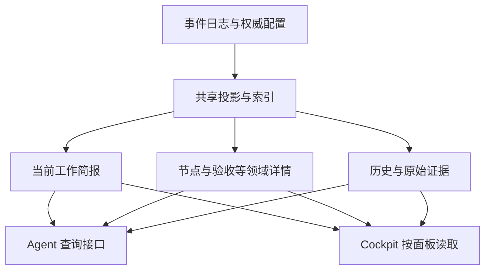

# V3 Agent 原生交互与渐进式读取重设计

- 文档版本：0.2
- 建立日期：2026-09-26
- 最近更新：2026-09-26；已确认分层读模型与当前工作上下文策略
- 状态：实施设计基线；产品改动尚未实施，验收尚未执行
- 适用范围：V3 MCP、Agent 引导、任务查询服务，以及 Cockpit 共用的读取链路
- 后续实施入口：第 12 节的分批计划；验收入口：第 11 节

## 1. 本次更新的工作约定

用户在当前受信交互中明确要求：先形成完整设计文档，后续围绕本文完成更新，**暂时不使用 VibeHub 流程**。

这一约定仅适用于本文所述更新：

- 不为本次更新创建、绑定或推进 VibeHub Task / Plan / Session，不以其事件作为本次实施的前置条件。
- 本文的实施表、代码差异、测试记录和用户确认承担本次协作的跟踪作用；不得伪造已完成状态或事后补造 V3 工作流历史。
- 不改写 `AGENTS.md` 以永久关闭项目规则，也不借此放宽产品内部的权限、绑定、证据、验收或完成确认校验。
- 不把本约定推广到其他任务；是否恢复本次工作的 VibeHub 跟踪，由后续用户指示决定。
- 提交身份、发布验证、原生平台验收及构建产物清理等非工作流约束继续适用。本文不构成 push、tag 或发布授权。

本文定义的是目标行为。除明确标为“已观察”的证据外，接口名称、示例和预算均为拟议契约，不代表当前已存在的能力。

## 2. 更新要解决的核心问题

Agent 为理解和操作 VibeHub 消耗了过多上下文与工具往返，主要表现为：

1. 一次状态读取返回大量与当前决策无关的信息，关键内容容易淹没或被宿主截断。
2. 工具 Schema、公共引导、下一步建议和运行时校验不完全一致，照着提示调用仍可能失败。
3. 失败后缺少可直接采用的恢复信息，Agent 需要猜参数、重复查询，甚至阅读实现源码。
4. 工作流机械步骤和身份字段占用了本应用于理解需求、实施与验证的注意力。
5. 桌面视图与 Agent 视图共用大包读取，导致上下文成本和后端计算成本一起增长。

本次更新的目标是：**Agent 在每个阶段只读取足够决策的信息，清楚知道下一步属于哪一种工作，并能以合法、可恢复、可审计的方式推进。**

### 2.1 范围

包含：

- 默认工具目录、工具描述和 Agent Specification 的协调更新。
- 任务简报、按需详情、证据展开、分页、版本探测和输出预算。
- 输入 Schema、动作建议、错误恢复、上下文句柄和跨调用幂等。
- 保留底层 typed commands 的上层组合操作。
- Cockpit 分区刷新与增量读取。
- 兼容迁移、自动化行为测试、真实宿主体验评估和性能测量。

不包含：

- 重写事件存储引擎或改变既有事件的事实含义。
- 借本次更新实现网关、Agent Profiles 编辑器或项目扫描的其他优化。
- 自动把验收标为通过、自动推断用户同意、根据相似任务静默绑定写入目标。
- 强制引入额外模型服务来解释工具参数或生成权威状态摘要。
- 把所有客户端迁移到依赖某个宿主专属功能的协议。

## 3. 已观察的基线与问题证据

基线来自 2026-09-26 对当时工作树、连接中的 MCP 和当前任务的一次审查。后续 B0 必须记录准确 commit、工作树状态、服务端二进制及宿主版本后复测；不得把本节当作完整性能基准。

| ID | 已观察事实 | 影响与证据 |
| --- | --- | --- |
| F01 | 当前任务 view bundle 序列化后约 688,200 UTF-8 字节；递归统计 `evidence_refs` 共 1,074 次引用、275 个唯一标识 | 单个真实样本，非所有任务的平均值，也不是 token 数；见 `views.rs` 的 `load_bundle_for_node`、`evidence_refs` |
| F02 | `task_view` 输入只有任务与可选节点，没有分区、详细度或预算选择；直接返回整包桌面视图 | 默认入口无法选择小响应；见 `mcp.rs::TaskViewRead`、`task_view` |
| F03 | Cockpit 在可见时每 4 秒请求整包；已有隐藏暂停和防重入 | 防止重叠并未避免未变化数据的重复构造与传输；见 `V3Cockpit.tsx` 的后台刷新 effect |
| F04 | 实际 `v3_next_action` 返回 `tool: null` 和“在计划图中补充 blocker details…” | 合法的阻塞状态没有转化为明确的工作、补证据、提问或等待协议 |
| F05 | `gate_next_tool` 把 `passed\|failed\|blocked` 放入 `params.outcome`；若干分支缺少目标工具必需字段 | 提示模板被当作可调用参数；下一步无法直接通过输入契约 |
| F06 | `infer_tool_from_text` 从自然语言 `copy_text` 搜索工具名 | 文案和语言变化会影响动作推断；应由领域状态生成 typed action |
| F07 | `task_route.trigger` 对外为字符串；错误只说不支持，没有合法值 | 实际传入 `new_execution_request` 失败；合法枚举包含 `new_execution`，应由 Schema 公开 |
| F08 | 部分写入作用域的 `session_id` / `binding_revision` 在 Schema 中可选，运行时要求存在 | 静态输入形状与条件前置约束缺少清晰衔接 |
| F09 | 当前环境暴露 31 个工具，说明合计约 51,302 字符，每个均出现公共流程引导 | 这是宿主最终暴露的元数据，含公共说明与调用签名；不能全部归因于服务端原始文案，也不能当作每轮实际 token 消耗 |
| F10 | `v3_next_action` 和单资源读取先加载整包，再选取输出 | 返回变小不等于底层计算变小；需要独立查询路径 |
| F11 | 自动幂等键使用新 UUID；一次内部版本重试复用该键，但另一次客户端重试会生成新键 | 不能据此保证“提交成功但响应丢失”后的跨调用去重 |
| F12 | 已有归档分页、Memory token budget、SQLite 索引及增量投影 | 应复用已有基础；本次不是从零实现分页或索引 |

源码入口：

- [MCP 工具、Schema、引导与下一步](../../crates/vibehub-cli/src/mcp.rs)
- [视图构造与证据引用](../../crates/vibehub-core/src/v3/views.rs)
- [Session–Task 路由](../../crates/vibehub-core/src/v3/routing.rs)
- [事件存储](../../crates/vibehub-core/src/v3/event_store.rs)与[索引](../../crates/vibehub-core/src/v3/indexed_store.rs)
- [Cockpit](../../src/v3/app/V3Cockpit.tsx)、[前端 store](../../src/v3/stores/v3Store.ts)、[生产读取接口](../../src/services/v3ProductionViews.ts)
- [MCP 契约检查](../../scripts/v3-mcp/contract-test.mjs)

证据限制：当前没有足以证明“所有调用都很慢”或“多数调用失败”的统计。本次要把这些用户体验问题转化为可重复测量的指标，而不是仅凭单次样本推断总体比例。

## 4. 设计原则与不可破坏的约束

### 4.1 默认提供当前工作的必要上下文，详情显式展开

默认组合返回当前目标、节点、范围、必要约束、关联验收标准、关键阻塞和下一步，形成足以继续当前工作的上下文。不能只返回名称和计数，再要求 Agent 连续查询多个分区才能开工。历史事件、全部证据、项目结构和其他节点按需展开。

摘要由权威投影确定性生成；不使用 LLM 总结替代生命周期、权限、验收状态或冲突事实。历史文本、用户文件、Memory 和证据正文始终作为不受信数据返回，不成为服务端指令。

### 4.2 指引必须区分“可以调用”与“还需做事”

可调用动作必须包含完整合法参数。尚需实施、真实验证、用户决策或外部条件时，返回相应类型，不伪造一个可以推进状态的动作。

### 4.3 严格校验留在服务端

保留任务归属、绑定 revision、乐观并发、DAG 依赖、证据要求、完成门禁和用户确认。减少 Agent 携带的字段，不等于放宽检查。

### 4.4 不把全部业务压进一个字符串命令

可以提供少量语义组合操作，但参数必须是有辨别字段的 typed union。禁止设计 `execute(command: string)`、任意 JSON patch 或让 Agent 生成内部事件类型来代替契约。

### 4.5 以完整交互成本验收

同时衡量工具目录、输出、往返、无效调用、错误恢复和后端工作量。字节数与模型 token 分别测量；兼容性说明与真实宿主执行证据分别记录。

### 4.6 已确认的架构选择：分层读模型与定向组合

2026-09-26 用户确认采用以下方向，后续实现以此为架构基线：

> 保留现有事实存储，重构用途明确的读取投影；默认提供当前工作的完整必要上下文，支持直接定位与有界展开；全量导出作为诊断能力保留。

| 方案 | 定位 | 实施要求 |
| --- | --- | --- |
| 先构造完整 bundle，再裁剪或总结 | 仅可作为显式标记的短期兼容适配 | 不能以此宣称分层读取已完成，也不能作为新查询的最终路径 |
| concise/full 两档 | 支持旧消费者迁移的过渡形式 | 不作为新接口的主要信息结构；full 必须明确作用域与预算 |
| 分层读模型、直接定位、定向组合 | 本次更新的目标架构 | Agent 和 Cockpit 复用事实与查询服务，按用途取得数据 |



写入侧继续负责验证与事实一致性；读取侧使用适合当前用途的数据结构。可以共用现有数据库，不要求引入第二套数据库、消息系统或额外模型服务。读取投影可重建，不能演变为另一份独立维护的业务真相。

层次限定为以下三种信息深度：

| 信息层 | 内容 | 典型请求 |
| --- | --- | --- |
| 当前工作简报 | 当前节点目标、约束、必要验收、相关阻塞与下一步 | 恢复已有 Session 并继续实现 |
| 领域详情 | 指定 Task、Node、Criterion、Finding 或 Session 的完整结构及必要关联摘要 | 查看某个失败 criterion 的结果及证据摘要 |
| 原始证据 | 原始事件、测试输出、日志片段与来源信息 | 核验一次失败或调查历史原因 |

三层表示信息深度，不是强制导航顺序。已知实体 ID 时允许直接查询对应层；服务端始终校验作用域。禁止要求 Agent 依次展开项目、任务、计划、节点后才允许读取已知 evidence，也不因直接定位跳过权限检查。

优化目标是完成一个有效决策的总成本。高频共同使用的信息适度组合，低频大正文按需获取；不得以极小响应换取大量机械往返。

## 5. 目标交互模型

### 5.1 典型路径

```text
读取 workspace_context
  ├─ 只读讨论 → 获得项目/任务定位 → 按需 task_brief / task_inspect
  ├─ 目标不明 → 返回有界候选和具体问题 → 明确目标
  └─ 已有明确执行目标 → task_brief → 显式 task_start
        → 实施/验证 → task_record / criterion_review
        → session_finish
        → 满足门禁后提出完成 → 用户明确确认后完成
```

从已有绑定恢复工作，正常情况下只需一次小上下文读取。首次启动执行时，发现、选择与写入边界保持明确，不能为了少一次调用静默选择 Task。

下一步必须以当前 Session 和目标节点为作用域。其他节点的阻塞作为相关信息展示，不能仅取项目中第一条 blocker 就抢占当前可执行工作；共享阻塞及依赖阻塞仍必须阻止受影响操作。

### 5.2 拟议常用接口

以下是设计名称。B0 冻结准确输入/输出契约；初期按新增接口迁移，不直接改变旧接口形状。

| 接口 | 职责 | 默认输出与限制 |
| --- | --- | --- |
| `workspace_context` | 返回绑定项目、可用能力、当前 Session/任务定位或少量候选 | 已有明确有效绑定时直接组合当前工作简报，避免再调 task_brief；只读、不创建领域 Session、不自动绑定 |
| `task_brief` | 为明确任务或节点返回当前工作所需的上下文 | 一次组合目标、范围、关联验收、有效约束、关键阻塞和 typed next step；不强制先调用 workspace_context |
| `task_inspect` | 定位领域详情或原始证据，查询指定分区 | 指定分区或已知实体 ID；可显式携带少量关联摘要；固定过滤与排序，有预算与游标，禁止默认 all |
| `task_start` | 对明确 Task/Node 执行受校验的绑定和开始操作 | 返回上下文句柄与实际状态；不能创建占位节点绕过计划要求 |
| `task_record` | 提交 progress / risk 等日常事实 | 初期只覆盖明确的高频变体；返回新增记录 ID 与小回执 |
| `session_finish` | 受校验地提交本次结果并关闭 Session | 可恢复组合操作；不自动把任务或 criterion 判为通过 |
| 既有 typed 写入 | 计划变更、criterion review、finding、recovery、完成确认等 | 第一阶段保留；后续按真实使用评估目录归组 |

不要同时实现所有新接口。B1/B2 先通过新增简报和修复既有工具获得收益，B3 再引入状态句柄与组合操作。

### 5.3 工具目录和公共引导

首个兼容版本保留既有目录，新增入口并缩短说明。后续提供显式的 `agent` 与 `advanced/legacy` 目录配置：

- `agent` 目录目标不超过 12 个常用入口；最终集合由 B4 真实路径评估确定，不能把基本恢复能力藏掉。
- 高级目录保留细粒度操作；普通目录至少能明确告诉 Agent 如何进入所需能力，不能建议调用未暴露的工具。
- 目录配置在连接建立时固定。核心流程不依赖运行中动态增删工具；必要时明确要求重连。
- 公共引导只描述入口、数据展开原则和不可推断的权限边界。单工具说明描述用途、真实必需参数及副作用，不复制完整工作流教程。
- 简单枚举使用 Schema `enum`，互斥变体使用受支持的辨别结构；同时验证目标宿主实际能处理的 Schema 子集。
- 不假定宿主只注入一次 server instructions；分别测量原始目录和宿主最终暴露的目录。
- AGENTS/CLAUDE、renderer、MCP instructions 和工具描述在切换入口的同一批次更新，不能继续强制“先读取完整 task_view”。

## 6. 读取契约与渐进式数据

### 6.1 新读取响应的公共信封

新增读取接口使用独立的交互契约版本，初始拟为 `agent-read/1`；不改变旧 V3 view schema version。

```json
{
  "contract_version": "agent-read/1",
  "ok": true,
  "scope": { "project_id": "project.example", "task_id": "task.example" },
  "revision": "opaque-read-revision",
  "freshness": "fresh",
  "completeness": "partial",
  "data": { "title": "示例任务", "state": "active" },
  "expansions": [
    { "section": "criteria", "count": 4 },
    { "section": "evidence", "count": 30 }
  ],
  "budget": { "limit_bytes": 16384, "truncated": true, "omitted_sections": ["evidence"] },
  "next_step": { "kind": "work_required", "summary": "完成当前节点实现与验证" }
}
```

示例只展示信封结构，正式 Schema 要定义各接口的必需字段及互斥状态。`scope` 中不存在的实体不填空字符串；`unchanged` 响应不携带 `data`。

输入使用 `max_bytes` 作为跨模型硬预算，默认 16 KiB；服务器设置最大允许值，首版建议 64 KiB。token budget 可以作为宿主适配提示，不能用无 tokenizer 的估算声称精确 token 上限。

当预算不足以容纳最小安全简报时，返回有界的 `OUTPUT_BUDGET_TOO_SMALL` 与所需最小预算。不能为满足预算而省略影响授权、目标、有效约束或动作合法性的事实。

如果最小上下文本身超过服务器最大预算，返回分块读取的 prerequisite 清单，并保持 `context_complete: false`；全部必需分块读取完成且 revision 一致前，不输出依赖这些内容的可执行写入建议。不能建议一个超过服务器允许上限的重试预算。

### 6.2 简报内容优先级

简报是由权威数据组合出的工作上下文，不是对完整 JSON 进行文字压缩。按以下顺序组织：

1. 确切项目、任务、节点和绑定状态；状态新鲜度及冲突。
2. 当前目标、范围边界、effective policy 和当前阶段所需约束。
3. 影响当前工作的阻塞、必要验收标准和仍缺的事实。
4. typed next step。
5. 最近的相关变化摘要与可展开入口。

候选默认最多 5 个；列表不嵌入完整 intent 和全部 criteria。长目标、长约束不能静默截断：必须保留“尚未读取完整约束”的标志，并将相关写入建议标为不可直接执行，要求展开指定内容。

候选列表与已选中任务简报是不同结构。前者用于选择，后者必须足以支持当前工作；不能把候选的精简规则套到已选中任务，导致必要验收和约束缺失。恢复已有有效绑定时，workspace_context 直接组合该简报；已知目标时 task_brief 可以直接读取。

同一预算内优先完整提供当前节点相关内容，其他节点仅给必要的依赖/阻塞摘要。省略未关联的历史不应导致 `context_complete: false`；该字段只表达当前决策必需上下文是否齐全，与整个任务是否已全部展开区分。

### 6.3 分区读取

`task_inspect.section` 至少考虑以下枚举：`plan`、`criteria`、`blockers`、`sessions`、`results`、`timeline`、`evidence`。项目架构作为独立项目分区或接口，不因读取任务自动加载。

输入采用两个明确变体：按分区查询，或按实体 ID 定位。分区查询一次选择一个枚举分区；实体查询可直接指定 node、criterion、finding、session、event 或 evidence ID，不要求先逐级浏览。

实体查询允许通过固定 `include` 枚举附带必要关联摘要，例如 criterion 的验证结果与证据标签。组合范围在 B0 按高频工作冻结，共享同一快照和总预算；不允许任意关系递归、无限嵌套或 `include=all`。集合形式的关联同样必须有上限与独立续页定位。

过滤和检索在服务端完成，至少支持作用域、状态、事件种类、时间/序号范围及稳定排序。例如直接请求“当前节点未通过的 criteria”或“指定 Session 的失败事件”，不要求先拉全量再由 Agent 筛选。需要文本检索时使用有界查询并返回命中位置与邻近上下文，不暴露任意 SQL 或内部字段表达式。

列表同时受条数和字节预算限制；达到任一限制就返回 `next_cursor`、省略原因和数量信息。限制单条事件的内嵌正文，长正文单独分块读取；单条记录过大不能造成游标永不前进。

### 6.4 证据按标识引用

简报和列表使用 `evidence_ids`，同一响应需要显示标签时只附一个小型去重字典。证据展开返回类型、等级、来源、采集时间及有界摘要；原始正文另行请求。

去重不等于只返回无语义的 UUID。需要 Agent 判断是否展开时，引用字典提供短标签、来源等级、相关状态和可展开标志；例如 `evidence.test-42` 对应“节点详情竞态回归测试”、`outcome=failed`。只有来源确实提供结果时才填写 outcome，不能根据标签推断通过或失败。正文和大段元数据仍只保存/读取一次。

必须保留既有 `hard_observed` / `agent_reported` 等等级和来源语义。重复 ID 的去重不得丢弃不同版本或冲突信息。证据展开验证项目、Task 和可见范围，不允许通过任意文件路径越界读取。

旧 `evidence_refs` 保持兼容；新契约使用独立投影或适配器，不能为了减少 MCP 输出破坏旧桌面消费者。

### 6.5 游标、版本与一致性

- cursor 是不透明值，绑定作用域、分区、过滤条件、排序及快照 revision。
- timeline 优先以事件序号实现稳定顺序；跨页必须保持同一快照或明确返回 `CURSOR_STALE`，不能静默跳项或重复。
- 简报 revision 覆盖实际读取依赖：任务/计划/绑定/有效策略，以及影响上下文的 Memory、设置等版本。不能只用事件计数忽略其他来源变化。
- `generated_at` 不参与内容变化判定；相同语义内容不能因时间戳变化触发刷新。
- 支持 `if_revision`：未变则返回小型 `unchanged` 回执，前端保持原对象引用。
- 重建中、同步失败或外部变化未核实必须显式标记。可供展示的旧数据不能被当成有效的写入前置版本。

### 6.6 底层查询与 Cockpit

新增面向用途的查询服务：任务简报、节点状态、分区详情、版本探测。共享领域 fold 和 validator，避免 MCP 与桌面各自推导事实；读取单个分区不能先构造六视图 bundle。

Task、Node、Criterion、Finding、Session 和 Evidence 通过稳定身份关联。底层事实与实体索引去重，读取服务根据用途适度组合成 DTO；不把嵌套大 JSON 当作新的持久化中心。详细查询必须能直接定位，不以全任务加载作为实现捷径。

复用现有 SQLite 索引与增量投影。缓存键包含项目身份、查询作用域、相关版本和可见性；Memory 还需包含 principal/scope。服务重启后可从事实重建，缓存不能成为新的权威状态。

B2 即交付不依赖完整 bundle 的简报与实体查询路径；B4 再根据测量对高频昂贵读取增加物化投影或缓存，并接入桌面增量刷新。低频详情可按需计算。每个新增缓存或物化投影必须说明依赖版本、失效策略、重建方式和实测收益，避免为了分层而提前建立大量同步副本。

Cockpit 保留可见性暂停、防重入和请求上下文保护，改为：小版本探测 → 仅刷新受影响的可见面板 → 后台页保持惰性。写入成功可携带失效分区；其他进程的写入通过版本探测发现。通知/订阅可作为增强，轮询仍可独立工作。

不把“把 4 秒改为 30 秒”作为主要优化。须测量未变化刷新中的事件读取数、fold 次数、序列化字节和前端更新次数。

### 6.7 完整信息与诊断导出

“完整”必须指定实体或作用域：完整节点、完整 criterion、指定 Session 的历史，或某份证据正文。它仍受单次预算约束，大内容通过稳定游标/分块可完整到达，不能触发全项目展开。

任务/项目全量导出保留为显式诊断能力。大结果写入本地导出文件或资源，工具返回有界清单、作用域、快照 revision、文件大小、内容摘要/hash 和读取方式，不自动将正文注入模型。导出不得绕过可见范围或包含凭据；声明完整的范围必须可核验，排除项必须列明。

不支持资源读取的宿主有普通工具分块 fallback。导出产物应明确保存位置、有效期和清理方式；生成导出不推进业务状态。诊断需要全量时可以取得，日常执行不应把全量导出当作默认恢复入口。

## 7. 可执行的下一步协议

`next_step` 使用辨别字段 `kind`，不得出现没有说明原因的 `tool: null`。

| kind | 必需语义 | 不允许的行为 |
| --- | --- | --- |
| `tool_call` | 当前有权限且前置条件满足的工具名、完整参数、作用域、预期版本和有效期/失效条件 | 占位值、缺必需字段、调用当前目录未暴露工具 |
| `work_required` | 要做的实际工作、范围、所需输入及验收要求 | 为推进流程自动标 completed/passed |
| `evidence_required` | 缺少的证据类别、关联 criterion/finding、可采用的验证方法 | 编造命令结果或自动推断验证成功 |
| `input_required` | 具体问题、原因、可选项，以及继续所需的明确输入 | 把等待超时当成同意 |
| `wait_external` | 外部依赖、恢复条件、建议再次检查方式 | 无变化持续重试写入 |
| `done` | 当前工作范围的真实终态和可选后续入口 | 把 Session 结束等同于任务已完成 |

生成流程必须是：权威投影 + Session 作用域 → 领域状态判断 → typed next step → 目标工具 Schema 校验。自然语言说明是结构化决策的渲染结果。

### 7.1 特殊情况

- 未绑定：只读查询可继续；需要写入时先明确目标并返回绑定/开始入口。
- 当前节点尚未实施：返回 `work_required`，不因为完成门禁首先列出 criteria 就建议提前 review。
- 需要验收但证据不足：返回 `evidence_required`；取得真实结果后再选择 passed/failed/blocked。
- 历史节点阻塞：判断是否影响当前节点或最终完成，分别展示，不能无条件抢占当前动作。
- 版本变化：旧动作失效，返回刷新后重新决策的路径，禁止盲目自动换版本执行语义敏感写入。
- 用户完成确认：已有 proposal 不等于已确认。只有现有受信交互约束满足后才可执行完成动作；Agent 填一个 `confirmed_by` 字符串不能创造授权。
- 无法判定：返回具体缺失信息或诊断入口，禁止以 `done` 或含糊的空动作结束。

动作建议不是权限凭证；真正执行时重新校验。过期建议应造成有界、可恢复的失败，不得造成状态损坏。

## 8. 输入 Schema 与错误恢复

### 8.1 输入契约

- `trigger`、`source`、`state`、`outcome`、`kind` 等离散字段必须公开合法枚举。
- 高频 `details: Value` 逐步替换为领域 payload 类型；保留扩展区时明确其不参与哪些权限/状态判断。
- 必需作用域通过显式字段或上下文句柄表达；互斥输入使用清晰变体，禁止两个不同目标同时出现后静默任选。
- 服务端校验与 Schema 尽可能来自同一组 Rust 类型；无法静态表达的状态前置条件由简报和错误明确返回。
- 新接口对未知字段作明确校验，旧接口的兼容策略单独定义，不能无意破坏旧客户端。

### 8.2 错误契约

新错误信封包含稳定 code、字段级信息、状态是否已改变、是否适合原样重试，以及恢复类型。概念示例：

```json
{
  "ok": false,
  "error": {
    "code": "V3_TASK_ROUTE_TRIGGER_INVALID",
    "category": "validation",
    "field": "trigger",
    "received": "new_execution_request",
    "allowed_values": ["ordinary_continuation", "explicit_task", "explicit_switch", "new_execution", "binding_invalid", "binding_stale", "scope_conflict", "ambiguous_candidate"],
    "state_changed": false,
    "retryable": false,
    "recovery": { "kind": "correct_input", "field": "trigger" }
  }
}
```

`retryable` 仅表示原请求适合重试；需要修正输入不等于可原样重试。`state_changed` 为 `true/false/unknown`，不能在提交结果未知时谎称未改变。秘密字段的 received 值必须脱敏。

| 场景 | 恢复要求 |
| --- | --- |
| 参数错误 | 返回字段、合法值或缺失字段；一次局部修正即可重新提交 |
| 绑定缺失 | 返回定位/显式绑定入口，不自动选择 current/UI task |
| 绑定或版本过期 | 返回受影响实体和 refresh 路径；先读新状态再决定是否重提 |
| 依赖未满足 | 返回阻塞节点/criteria ID 和原因，避免要求重读整包 |
| cursor 过期 | 返回重新读取该分区的参数，避免重新获取全部上下文 |
| 权限或确认不足 | 返回 `input_required`，说明所需授权；不能提供绕过动作 |
| 暂时性错误 | 在预算内给出退避和同 request ID 重试方式 |
| 提交结果未知 | 根据 operation/request ID 查询提交状态，禁止改键重新提交 |

恢复路径也必须通过 Schema 校验。仅附一段“请修复”文案不能视为恢复设计完成。

## 9. 上下文句柄、幂等和组合操作

### 9.1 上下文句柄

显式绑定成功后，服务端返回不透明 `context_handle`，关联 project、task、session、binding revision、actor 来源及可选 node。只读 workspace context 可返回单独的阅读定位信息，不伪造已打开的领域 Session。

- 句柄减少机械字段传递，不新增权限；每次写入仍验证当前绑定和操作资格。
- 句柄不能被跨项目、跨 Session 或跨不相容调用者复用；原始句柄不写入通用日志。
- 绑定变化、Session 结束或服务重启后失效；首版不要求持久化句柄。
- 恢复通过明确 Session 身份重新读取并验证绑定；若宿主不能提供可靠身份，则显式选择，不猜测最近会话。
- 调用者还显式提供 scope 时，必须与句柄一致，否则拒绝。
- 目录、Schema 及错误不能宣称“省略所有作用域”，而在重连后要求 Agent 猜回旧字段。

### 9.2 跨调用幂等

新写入使用调用者稳定保留的 `request_id`，或服务端提前返回、客户端重试时原样携带的操作 ID。MCP JSON-RPC request ID 不自动等价于跨调用业务幂等键。

服务端保存请求 ID、规范化 payload 摘要、作用域及完成回执。同一 ID/同一 payload 返回原结果；同一 ID/不同 payload 返回 `IDEMPOTENCY_PAYLOAD_CONFLICT`。服务重启后仍能识别已提交请求；保存期限与事件的幂等能力一致并公开。

对于单调用内的安全重试可以保持现有机制，但不能把自动生成新 UUID 宣称为完整的客户端重试去重。

### 9.3 组合操作语义

`task_start` 可组合显式绑定、合法节点激活和 Session 打开；前置依赖与必要计划必须已满足，不自动生成虚假计划。

`session_finish` 可组合 terminal AgentResult 和 Session 关闭。是否完成节点必须显式表达并满足真实验收，不包含自动 criterion pass、task confirmation 或最终归档。

首版采用**可恢复的多步骤操作**，除非底层已实现并验证事务，否则不宣称原子性：

1. 校验请求与已知前置条件，登记稳定 operation ID。
2. 每个内部步骤派生稳定幂等键并继续使用原 validator。
3. 回执明确 `completed_steps`、`pending_steps` 和失败位置。
4. 进程中断后按原 operation ID 恢复；已提交事实不被静默撤销。
5. 部分成功不返回总成功，也不自动补造结果或用户确认。

组合操作完成后仅返回变化、真实状态、revision 和下一步。失败按第 8 节返回恢复信息。

## 10. 兼容迁移与回滚

### 10.1 新旧读取并存

先新增 `workspace_context` / `task_brief` / `task_inspect`，保留旧 `task_view` 和 versioned resources 的形状。公共引导优先使用新入口；旧入口明确标为完整诊断视图。

通过版本/能力字段判断新接口是否可用。旧客户端继续使用原路径，不通过静默改变 `task_view` 返回结构来强迫迁移。

`v3_next_action` 也采用兼容演进：先新增 typed `next_step`，旧 `next_action` 保留为过渡字段。只有 `next_step.kind=tool_call` 时，旧字段才映射完整合法的工具与参数；其他类型给出明确状态与说明，不再把占位参数包装成可执行建议。旧的“始终照 next_action 调用”公共引导必须同步撤换，并测试旧宿主能安全识别不可执行状态。若旧消费者无法兼容，使用新版本入口，不能静默改变其解释。

### 10.2 不改变事件事实

首轮不做事件格式迁移。新读模型依赖既有事实与可重建索引。新组合操作仅生成 validator 支持的事实；如新增操作日志，必须定义兼容读取、恢复和保留策略。

### 10.3 宿主降级

基础流程只要求普通 tools/list、tools/call、结构化 JSON 与 stdio。resources、通知、动态工具列表和 elicitation 均为可选增强。

证据展开提供 tool fallback；不能假定所有宿主会自动跟随 resource URI。`content` 与 `structuredContent` 按实际 SDK/宿主兼容需求保留，但要测量最终进入模型的重复表示；不能为减字节单方面删除宿主依赖的协议字段。

### 10.4 回滚边界

- 新目录/新读取可通过明确配置切回 legacy；既有客户端可继续读取同一领域事实。
- 关闭新 facade 后，不删除已产生的合法事件或未完成组合操作日志；须提供恢复入口。
- 回滚到不认识新操作日志的二进制前，先确认没有待恢复操作，或提供向前兼容恢复工具。
- 回滚前后验证项目作用域、任务状态、binding 和证据不丢失。

## 11. 验收标准与测量方法

以下为目标，当前全部**未验收**。预算变更须记录实际基线、原因和影响，不可因实现困难直接删除门禁。

### 11.1 验收矩阵

| ID | 验收要求 | 证据与通过条件 |
| --- | --- | --- |
| AC01 | 默认输出有界 | 新简报及 workspace context 的结果 JSON ≤16 KiB；普通写入成功回执 ≤2 KiB；预算不足显式报错，不隐藏安全约束 |
| AC02 | 渐进读取可完整到达 | 按页遍历与全量事实对照一致，无静默丢失；证据 ID 可解析且不可越界；单项超预算仍可分块到达 |
| AC03 | 下一步真正可用 | 所有 `tool_call` 建议通过目标 Schema，且在同一状态的隔离 fixture 中通过领域前置校验；无占位值、无无解释空工具 |
| AC04 | 工作与状态推进分离 | 缺实施/验证/确认时返回正确 kind；不得自动 review passed、完成节点或归档 |
| AC05 | 输入与错误可恢复 | 全部公共枚举暴露合法值；固定参数错误场景一次局部修正即可恢复；绑定/版本冲突通过一次有界刷新获得新决策 |
| AC06 | 身份和幂等保持严格 | 跨项目/Session/过期句柄被拒绝；响应丢失、进程重启、重复重试不产生重复业务事实；不同 payload 同键被拒绝 |
| AC07 | 组合操作中断可恢复 | 每个内部提交点注入崩溃/IO失败；恢复后状态等价于一次合法完成，不重复、不跳门禁 |
| AC08 | 增量读取实际减负 | 未变化读取不构造完整 bundle、不扫描任务全历史；`unchanged` 回执 ≤1 KiB；后台未变化刷新不发布新 bundle |
| AC09 | 新旧结果一致 | 对同一快照，新摘要/详情与旧视图在状态、policy、criteria、binding、blocker 上语义一致 |
| AC10 | 引导和目录一致 | 新模式的 instructions/AGENTS/CLAUDE 不强制整包读取；建议的工具均在实际目录可用；常用目录目标 ≤12 个，功能不能因此不可达 |
| AC11 | 跨宿主真实闭环 | 每个声明支持的宿主用记录版本执行恢复、读取、写入、错误修复和收尾；无法实测标记 blocked/not tested，不用 raw stdio 冒充 |
| AC12 | 上下文与调用收益 | 固定场景集相对 B0 的工具输出总字节至少减少 70%；记录实际 tokenizer token、往返和无效调用；不得通过省略必要工作达到指标 |
| AC13 | 原生边界明确 | CLI/MCP/stdin关闭/重启及本次涉及的平台 IO 在目标平台验证；Windows 原生发布验收继续使用精确 Release artifact/hash |
| AC14 | 回滚和安全数据处理 | legacy 模式可用；未完成操作有恢复路径；错误、简报、日志不泄漏凭据，Memory/证据不被当作指令执行 |
| AC15 | 当前工作上下文充分且无机械往返 | 固定常规恢复场景在预算内，一次 workspace_context 或直接 task_brief 即包含目标、范围、关联验收、有效约束、关键阻塞和下一步；不需逐项补查才能开始当前工作；长约束例外显式标识 |
| AC16 | 分层查询直接可达且按需计算 | 已知合法实体 ID 可一次定位，必要关联摘要可有界组合；分区过滤结果与权威事实一致；新简报/实体查询路径完整 bundle 构造次数为 0，读取单份证据不扫描全任务历史 |
| AC17 | 全量诊断不挤占日常上下文 | 指定快照的导出与声明范围事实一致，排除项明确；工具回执仍有界，正文可按需完整读取；资源不可用时 fallback 可用，保存/清理规则明确 |

### 11.2 固定场景集

至少覆盖：

1. 已绑定 Session 的普通继续；无任何变化的连续读取。
2. 只读讨论；无任务；多候选；中文意图；明确任务 ID；项目/Session 不匹配。
3. lightweight、standard、full 三种 policy；当前节点与其他阻塞节点并存。
4. planned → ready/active → 实施 → 验证 → review → Session 收尾 → 待用户确认。
5. 未满足依赖、缺证据、验证失败、finding 未闭环、缺用户确认。
6. 错误枚举、缺参数、binding 过期、版本冲突、cursor 过期。
7. 同任务两个 Session 并发写入、任务切换、节点切换、后台刷新迟到。
8. 提交成功但响应丢失；服务重启；组合操作各步骤中断。
9. 大量历史、长单条事件、重复证据、超过一页的 criteria 和 blocker。
10. settings/Memory 改变但任务事件计数未变；投影 stale/rebuilding/failed。
11. 已知 finding/criterion/evidence ID 的直接查询；无需先读项目或任务；非法或其他作用域 ID 被拒绝。
12. 当前工作简报与多个碎片化读取的对照；验证必要信息齐全，避免为追求小响应增加机械往返。
13. 按状态过滤、失败事件查询和带关联摘要的实体读取；含过多关联、大正文及预算耗尽的情况。
14. 指定快照的任务/项目诊断导出；导出期间事实变化；工具分块 fallback、排除项和产物清理。

数据规模至少包含：空/小任务、约 1,000 个事件、约 100,000 个项目事件，并区分“当前任务很大”和“其他任务历史很大”。fixture 需保持领域合法，不能用无法通过 validator 的随机数据证明正常路径性能。

### 11.3 指标口径

- `result_bytes`：工具结果的规范化 JSON UTF-8 字节；AC01/08 使用此口径。
- `wire_bytes`：完整 MCP 响应字节，单独统计协议包装与镜像 content。
- `model_visible_tokens`：已知宿主最终提供给模型的内容，用固定 tokenizer 测量；不可观测时标 unknown，不能拿 result_bytes 换算成精确值。
- `catalog_bytes/tokens`：tools/list 原始数据、公共引导和宿主扩展分别统计。
- `invalid_calls`：参数、绑定、顺序或建议错误造成的失败；真实业务阻塞与故障注入不算无效调用。
- `recovery_round_trips`：首次失败到得到有效下一步的新增调用数。
- `decision_round_trips`：从已知身份/目标到取得足以执行当前工作的必要上下文所需调用数；与恢复错误的调用数分开，避免把“拆得很细”误判为节省。
- `read_work`：文件/索引读取、事件解码、fold、bundle 构造次数与序列化量。
- `latency`：冷启动、首次投影同步、warm p50/p95 分别记录；固定环境、预热 5 次、测量至少 30 次。

warm 版本探测 p95 初始目标为本地基准环境 ≤100 ms，简报 ≤300 ms；B0 先确认硬件和数据条件，再冻结为性能门禁。该数值不能直接套到所有 CI runner 或作为现有性能结论。

完整交互记录只保存经脱敏的工具轨迹、参数类别、结果摘要及指标，不要求存储模型内部推理。公开报告不得包含真实用户凭据、私有正文或可复用句柄。

### 11.4 测试层次

- 单元：摘要选择、预算裁剪、引用去重、revision、错误映射和 next-step 判定。
- 契约：真实 tools/list Schema 与所有建议参数互相验证；新旧输出 schema 检查。
- 集成：直接调用服务，验证建议在未变化 fixture 中能执行；修改状态后验证安全失效。
- 故障：响应丢失、IO失败、进程中断、并发冲突和跨页变更。
- 端到端：Agent 只使用公开接口，从恢复到收尾；不得依赖阅读服务端源码补齐参数。
- 宿主：记录各宿主的真实目录注入、结构化结果呈现、资源展开、超时和重连行为。

真实 Agent 评估固定模型/版本、任务输入和允许操作，在隔离 fixture 上重复运行并报告样本数。确定性契约测试作为硬门禁，Agent 成功率用于验证交互设计，不宣称单次成功代表普遍可靠。

## 12. 分批实施计划

每批必须在继续下一批前记录：实际修改、验证命令与结果、未解决项、兼容影响。下表用于本次暂停 VibeHub 流程期间的跟踪，不代表产品工作流状态。

| 批次 | 工作与产物 | 依赖 | 退出条件 | 当前状态 |
| --- | --- | --- | --- | --- |
| B0 基线与契约冻结 | 记录源码/二进制/宿主版本；建立大任务 fixture 与指标脚本；冻结三层读取、必要工作上下文、实体组合/过滤、诊断导出、next-step、error schema 和能力发现 | 无 | F01–F12 复核，指标可复跑，契约评审记录齐全 | 未开始 |
| B1 调用正确性 | 公开 enum；修复 next-action 的空工具/占位参数；区分 work/evidence/input/wait；结构化错误与恢复；同步公共引导 | B0 | AC03–05 对既有入口通过；不破坏旧响应契约 | 未开始 |
| B2 分层读取与工作上下文 | 新增 workspace_context/task_brief/task_inspect 及专用查询路径；直接定位、服务端过滤、有界关联组合、预算、分页、证据展开和新旧适配 | B0、B1 | AC01–02、AC09、AC15–16 通过；新读取不构造完整 bundle；AC12 有第一轮对照数据 | 未开始 |
| B3 作用域与组合操作 | context_handle、稳定 request ID、task_start/session_finish 与故障恢复 | B1、B2 | AC06–07、AC14 通过；任何部分成功可查询恢复 | 未开始 |
| B4 增量优化与桌面接入 | 依赖 revision、小探测与按面板刷新；按测量增加高频查询缓存/物化投影；诊断导出、目录精简和真实宿主评估 | B2；涉及句柄路径需 B3 | AC08、AC10–12、AC17 通过；延迟、后端工作量及决策调用数有对照 | 未开始 |
| B5 兼容收口与发布准备 | 原生验证、迁移文档、回滚演练、支持矩阵；完整 CI/发布门禁 | B1–B4 | 全部必需验收有证据；未测平台明确阻塞，不宣称已通过 | 未开始 |

优先交付 B1/B2，避免先进行大规模 facade 重写却迟迟无法改善当前调用体验。B2 必须完成分层查询的结构性改造，不能只做输出裁剪；B4 的性能深化与桌面接入可在 B2 契约稳定后提前实施，不必等待全部组合写入完成。

### 12.1 主要代码落点

| 区域 | 预期变化 |
| --- | --- |
| `crates/vibehub-core/src/v3/` | 增加用途明确的查询服务与 typed next-step；共享原有领域验证；逐步抽离 views.rs 中可复用逻辑 |
| `crates/vibehub-cli/src/mcp.rs` | Schema、错误和工具目录适配；只负责协议映射，不新增第二套领域状态机 |
| `contracts/v3/` 与生成类型 | 新增交互契约及 fixture；保持旧 schema 可用；生成流程检查漂移 |
| `src-tauri/src/commands.rs` | 暴露分区/版本读取，与 MCP 复用查询服务 |
| `src/services/v3ProductionViews.ts`、`src/v3/stores/v3Store.ts` | 新旧来源适配、分区缓存、revision 与迟到响应保护 |
| `src/v3/app/V3Cockpit.tsx` | 可见面板刷新、unchanged 不触发重新发布、分页展开 |
| `agent_specs.rs`、根 Agent 说明及 MCP instructions | 统一引导来源及新入口，不保留相互矛盾的启动流程 |
| `scripts/v3-mcp/`、契约/前端检查及 CI | 增加输出预算、建议可执行性、恢复路径与端到端场景检查 |

文件拆分服从接口边界，不以减少单文件行数作为本次验收目标。

## 13. 风险、取舍与待冻结事项

| 事项 | 默认方向 | 实施前需确认的依据 |
| --- | --- | --- |
| 摘要省略导致误判 | 关键约束不得静默省略；不足时要求展开 | 长约束 fixture 和 AC04/09 |
| 句柄降低跨宿主可携带性 | 句柄只作短期便利；保留显式 scope/recovery | 重启、跨客户端恢复测试 |
| 减工具数量损害能力可达性 | 先缩短说明与修正默认路径，再切换显式目录配置 | 实际高频调用分布与宿主能力 |
| 组合写入使失败更复杂 | 可恢复多步骤，公开部分成功 | 每个提交点故障注入 |
| 小响应但计算仍重 | 独立读取服务，统计 bundle/fold 次数 | AC08 与大历史基准 |
| 分层过细造成调用爆炸 | 三层信息深度、已知 ID 直达、当前工作一次组合 | AC15–16 与 decision_round_trips |
| 过度缓存造成多份真相 | 按实测增加可重建的投影/缓存，公开依赖与失效 | 同快照一致性、外部变更及重启测试 |
| 兼容层长期拖累维护 | 标记 legacy，明确升级说明，暂不设无证据移除日期 | 真实宿主迁移覆盖 |
| 控制面自举依赖 | 本次按用户指示在产品工作流外实施与记录 | 第 1 节的限定范围 |

B0 需要冻结的项目：最终 schema 文件名和错误 code 兼容策略、各接口字段与有界 include/过滤集合、revision 依赖集合、游标编码、导出产物策略、幂等记录保留策略、目录配置入口、性能基准环境。它们是实施细节决策，不应成为已确认的分层读模型、充分的当前工作上下文、typed next step 和严格作用域原则的反复讨论入口。

## 14. 后续更新记录

每次实施更新以下记录，引用实际文件、测试输出或可复核的工具轨迹。不得只写“已优化”“测试通过”。

| 日期 | 批次/验收 ID | 变更与证据 | 未解决问题/下一步 |
| --- | --- | --- | --- |
| 2026-09-26 | 文档基线 | 根据源码审查及本会话实际 MCP 结果建立 v0.1；未实施产品变更 | 从 B0 开始记录可重复基线并冻结契约 |
| 2026-09-26 | 架构确认 v0.2 | 根据用户确认，明确三层读模型、当前工作组合上下文、ID 直达、服务端过滤、定向完整读取与诊断导出；调整 B2/B4 并新增 AC15–17 | 文档变更；产品实现与所有验收仍未开始 |

文档自身已检查相对链接、JSON 示例和验收/批次编号完整性；这些检查不代表 AC01–AC17 的产品验收通过。

### 14.1 架构参考

以下资料在 2026-09-26 的设计讨论中查阅，用于支持工程取舍，不代表其要求全部适用于 VibeHub：

- [Microsoft：CQRS pattern](https://learn.microsoft.com/en-us/azure/architecture/patterns/cqrs)：读写模型可以分离并共用数据存储。本项目据此保留事实存储，优化用途明确的读取投影。
- [Anthropic：Writing effective tools for agents](https://www.anthropic.com/engineering/writing-tools-for-agents)：按具体工作组织工具，组合相关信息，并通过过滤、分页及真实 Agent 评估控制交互成本。本项目的三层结构和预算是自身设计选择。
- [MCP：Tools（2025-11-25）](https://modelcontextprotocol.io/specification/2025-11-25/server/tools)：工具可返回结构化数据、输出 Schema 和资源链接。VibeHub 仍需自行定义展开契约，并验证各宿主的实际支持。

### 14.2 既有项目设计

相关既有设计供核对，不自动覆盖本文的新交互目标：

- [MCP 控制面原始 RFC](rfc-backlog/002-mcp-control-plane-contract.md)
- [MCP 宿主兼容性与历史证据](mcp-host-compatibility.md)
- [Session–Task 路由](session-task-routing.md)
- [Task-scoped 读取基准](task-scoped-read-benchmark-2026-08-23.md)
- [增量投影设计](indexed-incremental-projection-2026-08-23.md)
- [发布与原生验收约束](agent-release-process.md)
